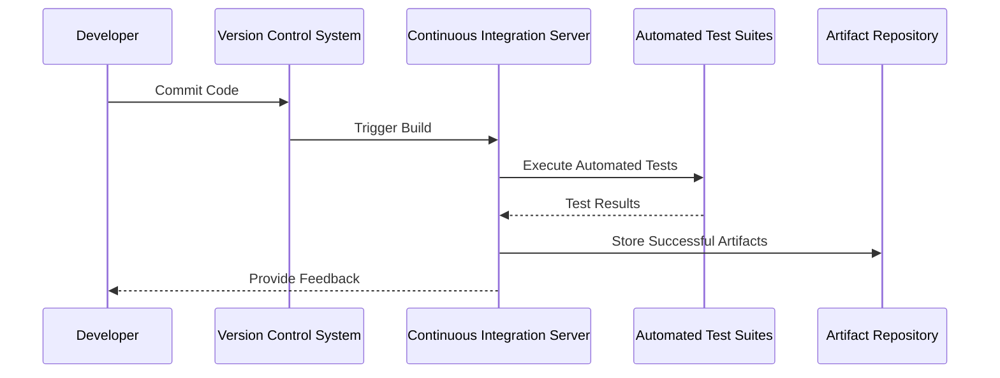

Automated Testing Integration is a crucial component of modern DevOps practices, where testing is embedded deeply into the software delivery pipeline. This approach ensures that code changes are continuously and automatically tested, leading to faster, more reliable software releases. In this guide, we'll dive deep into the Automated Testing Integration pattern, detailing its significance, implementation strategies, example workflows, and tools.

## Key Concepts

### Design Pattern Overview

Automated Testing Integration is the practice of incorporating automated testing processes into a Continuous Integration/Continuous Deployment (CI/CD) pipeline. With this integration, code is automatically tested at various stages of the pipeline, covering unit tests, integration tests, system tests, and acceptance tests.

### Benefits

- **Immediate Feedback**: Developers receive quick feedback about code changes, thus reducing the cycle time for fixing defects.
- **Consistency**: Automated testing ensures consistent test execution, reducing human errors.
- **Scalability**: As codebases grow, manual testing becomes infeasible. Automated tests can scale with the application's complexity.
- **Cost Efficiency**: Automating repeatable tests reduces the overall cost in the long run by minimizing manual testing efforts.

## Architectural Approach

The architecture of an Automated Testing Integration pattern in a cloud environment typically involves the following components:

1. **Version Control System (VCS)**: Acts as the source of truth for code changes. Common choices include GitHub, GitLab, and Bitbucket.
2. **Build Server**: Tools like Jenkins, Travis CI, or CircleCI that trigger builds and run tests upon detecting changes in the VCS.
3. **Test Suites**: Collections of automated tests that cover different aspects of the application.
4. **Artifact Repository**: Stores successful build artifacts for subsequent deployment phases.
5. **Deployment Automation**: Uses infrastructure as code to automate deployment to staging and production environments.

### Workflow

The typical workflow for Automated Testing Integration involves:

1. **Code Commit**: Developers push changes to the VCS.
2. **Build Trigger**: The build server detects changes and triggers the build process.
3. **Test Execution**: Automated tests are executed as part of the build. This includes:
   - **Unit Tests**: For individual components.
   - **Integration Tests**: For interactions between components.
   - **Functional Tests**: For end-to-end scenarios.
   - **Performance Tests**: To ensure non-functional requirements are met.
4. **Feedback Loop**: Results from the tests are reported back to developers, allowing for rapid iterations.

## Example Code and Tools

```yaml
pipeline {
    agent any
    stages {
        stage('Build') {
            steps {
                script {
                    echo 'Building application...'
                    sh 'mvn clean install'
                }
            }
        }
        stage('Test') {
            steps {
                script {
                    echo 'Running tests...'
                    sh 'mvn test'
                }
            }
        }
        stage('Deploy') {
            steps {
                script {
                    echo 'Deploying application...'
                    sh 'deploy.sh'
                }
            }
        }
    }
    post {
        always {
            junit 'target/*.xml'
        }
    }
}
```

## Diagrams

### Sequence Diagram Example



## Related Patterns

- **Continuous Deployment (CD)**: Extending CI with automated deployment to production.
- **Infrastructure as Code (IaC)**: Managing infrastructure using code, instrumental in automation stability.
- **Microservices Architecture**: Benefits from automated testing for isolated services.

## Additional Resources

- [Continuous Integration Tools: A Review](https://www.example.com/ci-tools)
- [Automated Testing Strategies for Microservices](https://www.example.com/testing-microservices)

## Summary

Automated Testing Integration is an indispensable practice for achieving efficient, reliable, and rapid software delivery. By embedding testing into your CI/CD pipelines, you enable immediate feedback, enhance reliability, and support continuous innovation without compromising quality. This design pattern is foundational in realizing the goals of DevOps and cloud-native application deployment.
