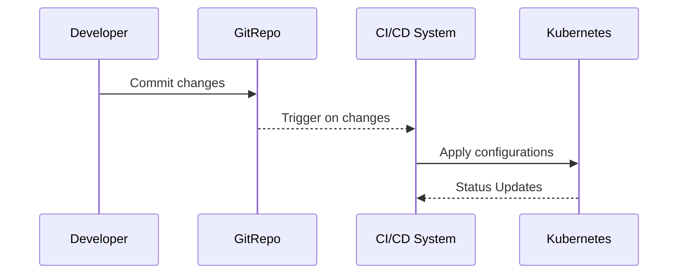

In the rapidly evolving landscape of cloud computing, managing infrastructure and application deployment with reliability and consistency is crucial. GitOps is a modern approach that brings DevOps practices to cloud management by using Git as the single source of truth for declarative infrastructure and application deployment. This pattern enables more reliable system operations by leveraging existing tools and ecosystem integrations, such as Kubernetes.

## Detailed Explanation

GitOps is a set of practices that utilize Git pull requests to manage infrastructure and application deployments. By leveraging Git as a version control system, you can manage the entire lifecycle of an application, from code to production environments, using a Git repository. It allows teams to manage infrastructure the same way they manage application code.

### Key Principles of GitOps

- **Declarative Descriptions**: Infrastructure and applications are described declaratively. This means defining the desired state of the system using code.
- **Version Control**: The entire state of your system is versioned in Git, providing a single source of truth.
- **Automatic Synchronization**: Agents automatically pull the desired resource state from Git and apply it to the system.
- **Continuous Reconciliation**: System state is continuously monitored and reconciled to the declared state stored in Git.

### Architectural Approach

The architecture of a GitOps implementation typically involves:

1. **Version Control System (VCS)**: Git repositories hold declarative configurations of application and infrastructure resources.
2. **Integration with CI/CD Pipelines**: Tools like Jenkins, GitLab CI, or GitHub Actions trigger automations based on repository events, such as pull requests and merges.
3. **Kubernetes Operators and Automation Tools**: Use of operators such as ArgoCD, Flux, or Jenkins X to dynamically reconcile the state of the cluster.
4. **Monitoring and Observability**: Tools to ensure that the system consistently reflects the desired state, leveraging observability stacks like Prometheus and Grafana.

### Best Practices

- **Keep Configuration Files DRY**: Avoid repetition in configuration files for scalability and maintenance.
- **Use Branching Strategies**: Establish clear branching strategies and use pull requests to implement changes.
- **Implement Comprehensive Testing**: Test configurations and deployments thoroughly using integrated CI/CD pipelines.
- **Automate Rollbacks**: Prepare automatic rollback mechanisms to counter errors swiftly.

### Example Code

Below is a basic example of a Kubernetes deployment managed using GitOps principles:

```yaml
apiVersion: apps/v1
kind: Deployment
metadata:
  name: nginx-deployment
spec:
  replicas: 3
  selector:
    matchLabels:
      app: nginx
  template:
    metadata:
      labels:
        app: nginx
    spec:
      containers:
      - name: nginx
        image: nginx:1.14.2
        ports:
        - containerPort: 80
```

The deployment configuration above can be stored in a Git repository, from which tools like ArgoCD will automatically apply changes to the Kubernetes cluster.

### Diagram



### Related Patterns

- **Infrastructure as Code (IaC)**: GitOps complements IaC by providing a practice and culture around using version control for configuration.
- **Immutable Infrastructure**: Ensures that all changes are applied immutatively, promoting stability and predictability.
- **Continuous Delivery**: GitOps acts as a driver for continuous deployment, thus closely aligning with continuous delivery practices.

### Additional Resources

- [GitOps on GitHub](https://github.com/topics/gitops)
- [ArgoCD Documentation](https://argo-cd.readthedocs.io/en/stable/)
- [Flux GitOps Toolkit](https://fluxcd.io/)

## Summary

GitOps practices empower organizations by integrating infrastructure management with development workflows using Git. By adopting GitOps, teams can achieve rapid, reliable deployments and maintain infrastructure consistency. Leveraging tools like Kubernetes operators brings automation and resilience to cloud operations, fostering an environment where changes are traceable, reversible, and easily auditable. This paradigm shift in cloud computing promotes a unified approach to managing applications and infrastructure, bridging the gap between development and operations.
