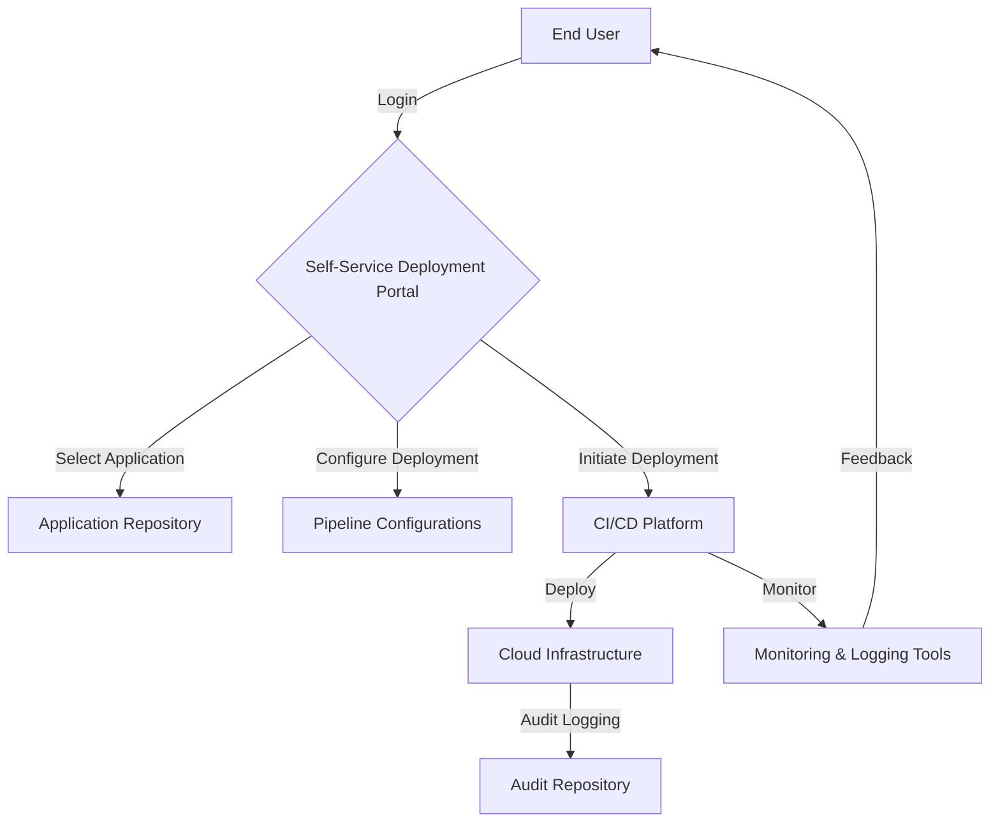

## Introduction

In modern software development environments, agility and rapid iteration are crucial. **Self-Service Deployment Portals** are a strategic pattern within DevOps and CI/CD frameworks that empower development, QA, and operations teams to deploy their applications independently in a controlled and auditable manner. This pattern minimizes bottlenecks, fosters innovation, and enhances the overall agility of an organization by reducing the dependency on centralized operations teams for deployment tasks.

## Context and Problem

Traditional deployment processes often rely heavily on operations teams, creating a bottleneck and slowing down the pace at which applications can be iterated and improved. This issue is exacerbated in large organizations where:
- Numerous teams work on multiple projects concurrently.
- Deployment processes are complex and can vary between environments.
- Time-to-market pressure requires more frequent releases.

The need for a standardized, yet flexible deployment interface that teams can use without deep operations knowledge is apparent. Enterprises require a way to safely distribute deployment responsibilities while maintaining governance and control.

## Solution

A **Self-Service Deployment Portal** provides teams with the tools and interfaces necessary to deploy and manage applications across environments seamlessly. This portal should include:
- **User-friendly interfaces** that abstract underlying complexities.
- **Access control mechanisms** to ensure only authorized personnel can deploy applications.
- **Pre-defined deployment pipelines** that enforce best practices and organizational compliance.
- **Real-time monitoring and feedback** to ensure successful deployments and quick identification of any issues.
- **Audit logs** for tracking deployments and changes for regulatory compliance.

### Architectural Diagram



## Example Implementation

Here is an outline for a simplified setup using popular DevOps tools:

```yaml
version: "2.1"
jobs:
  deploy:
    docker:
      - image: circleci/node:14
    steps:
      - checkout
      - run:
          name: Install Dependencies
          command: yarn install
      - run:
          name: Test Application
          command: yarn test
      - run:
          name: Deploy to Staging
          command: ./deploy.sh --environment staging
      - run:
          name: Notify Success
          command: curl -X POST -H "Content-Type: application/json" -d '{"status":"success"}' https://webhook.example.com/status
```

In this example, a CI/CD platform like CircleCI orchestrates the deployment process, allowing teams to trigger deployment jobs independently while following a standardized pipeline.

## Best Practices

- **Standardize Deployment Pipelines**: Use infrastructure as code and pipeline as code to ensure consistency across deployments.
- **Implement Fine-Grained Access Control**: Use role-based access control (RBAC) to dictate who can deploy what and where.
- **Emphasize Observability**: Integrate monitoring and logging early in the development cycle to detect errors promptly during deployments.
- **Provide Comprehensive Documentation and Training**: Empower teams with the necessary resources to use deployment portals effectively.
- **Regularly Review and Update Pipelines**: Adapt pipelines to accommodate new technologies, tools, or changing business needs.

## Related Patterns

- **Blue-Green Deployment**: Minimizes downtime during deployment by switching traffic between two identical environments.
- **Canary Release**: Allows for deploying to a small subset of users to test for issues before a full-scale rollout.
- **Infrastructure as Code (IaC)**: Automates infrastructure setup to align closely with application deployment processes.

## Additional Resources

- [The Phoenix Project by Gene Kim et al.](https://www.amazon.com/Phoenix-Project-DevOps-Helping-Business/dp/0988262592)
- [Kubernetes Documentation on Self-Service Deployments](https://kubernetes.io/docs/tasks/run-application/horizontal-pod-autoscale/)
- [AWS DevOps Best Practices](https://aws.amazon.com/devops/)

## Summary

Self-Service Deployment Portals represent a transformative approach in the DevOps toolkit that decentralizes and democratizes the deployment process. By empowering teams to deploy autonomously, organizations can significantly enhance their agility, respond quicker to market demands, and innovate rapidly while maintaining necessary controls and auditing capabilities. This pattern considerably reduces operational overhead and aligns closely with objectives in modern cloud-native environments.
