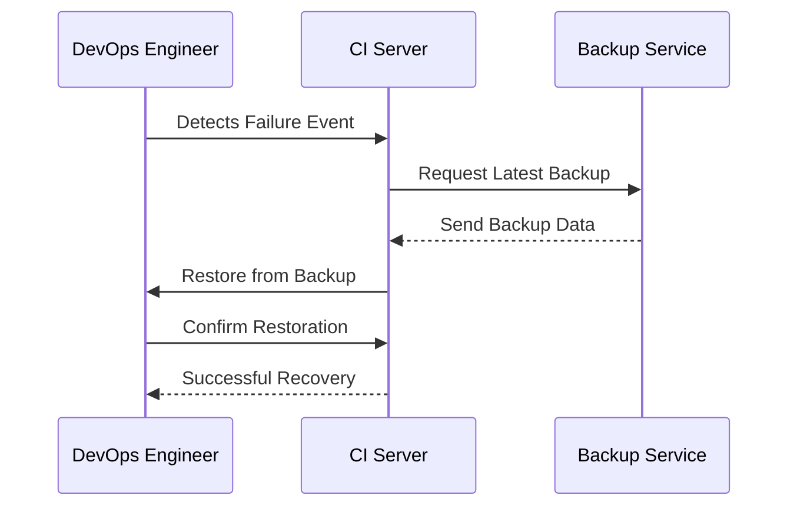

## Introduction

In the ever-evolving landscape of cloud computing, CI/CD (Continuous Integration/Continuous Deployment) pipelines are pivotal for rapid software delivery. However, these pipelines can be vulnerable to failures and outages, making disaster recovery (DR) an essential aspect of their design. This article explores the design pattern for implementing disaster recovery within CI/CD processes to ensure resilience, continuity, and efficiency.

## Detailed Explanation

### Design Pattern Overview

The Disaster Recovery in CI/CD pattern involves strategically planning for unexpected events that can disrupt the deployment pipeline. This pattern ensures that CI/CD systems can recover quickly from incidents such as data loss, configuration errors, or complete site failures, minimizing downtime and data corruption.

### Architectural Approaches

1. **Data Backup and Restoration**:
   - Regularly back up pipeline configurations, scripts, and environment states.
   - Utilize cloud storage solutions like Amazon S3, Google Cloud Storage, or Azure Blob Storage for secure and scalable backup management.

2. **Automated Recovery Scripts**:
   - Implement scripts that automate the recovery of CI/CD services from backups, ensuring that the latest configurations are restored with minimal intervention.

3. **Multi-Region Deployment**:
   - Distribute CI/CD services across multiple geographical regions to avoid single points of failure and leverage cloud providers' multi-region capabilities for redundancy.

4. **Immutable Infrastructure**:
   - Employ infrastructure as code (IaC) tools like Terraform or AWS CloudFormation to quickly reproduce environments in disaster scenarios, ensuring infrastructure consistency and rapid provision.

5. **Versioning and Configuration Management**:
   - Use version control systems (e.g., Git) to manage changes to pipeline configurations, allowing for historical recovery and rollback to known good states.

6. **Disaster Recovery Drills**:
   - Regularly conduct drills to test disaster recovery procedures and ensure that the team is prepared to respond efficiently to real incidents.

### Paradigms and Best Practices

- **Redundancy**: Implement redundant systems to failover in the event of a disruption.
- **Monitoring and Alerts**: Integrate monitoring tools to promptly detect failures and trigger alerts, enabling swift recovery actions.
- **Documentation and Training**: Maintain comprehensive documentation of recovery processes and provide training to ensure team readiness.

### Example Code

Here's an example Terraform script snippet for setting up a basic multi-region CI/CD environment:

```hcl
provider "aws" {
  region = var.region_primary
}

module "cicd_pipeline_primary" {
  source = "./modules/cicd_pipeline"
  region = var.region_primary
}

provider "aws" {
  alias  = "secondary"
  region = var.region_secondary
}

module "cicd_pipeline_secondary" {
  source = "./modules/cicd_pipeline"
  providers = {
    aws = aws.secondary
  }
}
```

### Diagrams

Below is a basic sequence diagram that illustrates an automated CI/CD recovery workflow:



### Related Patterns

- **Blue-Green Deployment**: Minimizes downtime and risk by running two identical environments.
- **Canary Deployment**: Progressive deployment strategy, limiting the impact of potential failures.

### Additional Resources

- [AWS Disaster Recovery Strategies](https://aws.amazon.com/whitepapers/disaster-recovery/)
- [Google Cloud Site Reliability Engineering (SRE) Practices](https://sre.google/)
- [Azure DevOps Best Practices for CI/CD](https://docs.microsoft.com/en-us/azure/devops/?view=azure-devops)

## Summary

Disaster Recovery in CI/CD is crucial for maintaining business continuity and ensuring that software delivery remains resilient in the face of disruptions. By integrating robust recovery strategies within CI/CD pipelines, organizations can mitigate risks, minimize downtime, and ensure that deployments are reliable, consistent, and secure. Implementing this pattern involves adopting strategic approaches, best practices, and leveraging automation and cloud-native capabilities to build a solid defense against potential disasters.
