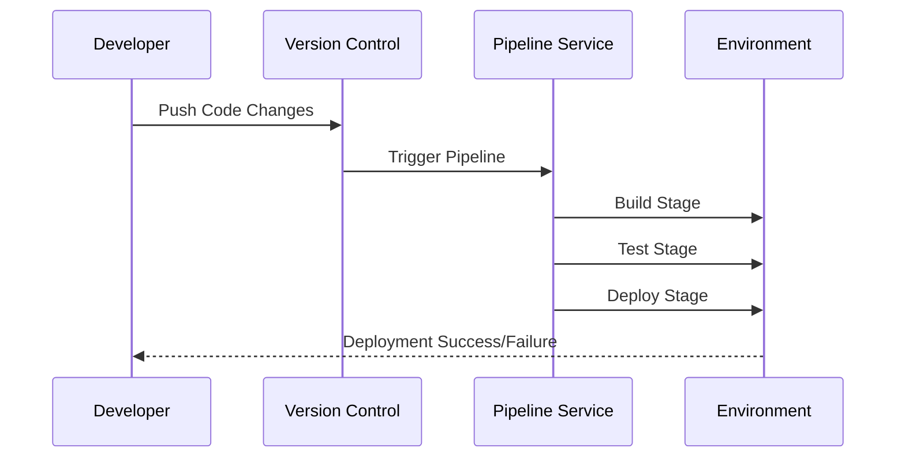

The **Pipeline as Code** design pattern is a fundamental approach to automating the implementation of CI/CD processes by defining a system's build, test, and deployment pipelines through code. This pattern promotes the adoption of best practices in version control, transparency, and reproducibility of the software delivery process. Employed within the context of cloud computing and DevOps, this pattern enables seamless, automated software delivery while maintaining consistent quality.

## Detailed Explanation

### Core Concepts

1. **Version Control**: The pipeline's configuration, written in code, is stored in a version control system (VCS). This ensures that all changes to the pipeline are trackable, auditable, and reversible.

2. **Automation**: Automates the execution of tasks such as compiling code, running tests, and deploying to production environments. This reduces manual intervention and increases efficiency.

3. **Idempotency**: Every execution of the pipeline yields the same result regardless of the state of the previous executions, as long as the inputs remain the same.

4. **Visibility and Feedback**: Provides immediate feedback to developers through build statuses and logs. This transparency helps in identifying and resolving issues quickly.

5. **Consistency**: Ensures that every code commit that changes how the application behaves can be tracked through the pipeline, maintaining consistency across environments.

### Architectural Approaches

- **Declarative vs Imperative Pipeline**: 
  - **Declarative Pipeline**: Involves defining the desired pipeline stages and steps in a declarative format (e.g., YAML or JSON). Tools like Jenkins and GitLab CI/CD support this approach.
  - **Imperative Pipeline**: Involves scripting each build process command using a specific programming or scripting language like Groovy in Jenkins Scripted Pipeline.

- **Pipeline Templates for Reuse**: By creating reusable pipeline templates, teams can avoid redundancy and standardize their CI/CD practices across different projects.

### Best Practices

- **Leverage Modular Pipelines**: Break down complex pipelines into manageable, reusable modules to encourage reuse and simplify maintenance.
  
- **Maintain Clean and Readable Code**: Ensure that the pipeline code is easy to understand and maintain by following coding standards and documentation practices.

- **Integrate with Cloud Services**: Utilize cloud-native CI/CD services such as AWS CodePipeline, Azure Pipelines, or Google Cloud Build to enhance scalability and security.

- **Implement Security and Compliance**: Incorporate security checks and compliance validations into the pipeline stages to catch issues early in the development cycle.

### Example Code

Here is a simple example of a declarative pipeline using Jenkins:

```groovy
pipeline {
    agent any
    stages {
        stage('Build') {
            steps {
                script {
                    sh 'mvn clean install'
                }
            }
        }
        stage('Test') {
            steps {
                script {
                    sh 'mvn test'
                }
            }
        }
        stage('Deploy') {
            steps {
                script {
                    sh 'kubectl apply -f deployment.yaml'
                }
            }
        }
    }
    post {
        always {
            script {
                archiveArtifacts artifacts: '**/target/*.jar', fingerprint: true
                junit 'target/surefire-reports/**/*.xml'
            }
        }
    }
}
```

### Diagrams

Here is diagram representing the Pipeline as Code workflow:



### Related Patterns

- **Infrastructure as Code (IaC)**: This pattern can be used alongside Pipeline as Code to manage infrastructure with configuration files, ensuring consistency and repeatability.
  
- **Continuous Deployment**: An extension of continuous integration where changes are automatically released to production environments, enabled effectively by Pipeline as Code.

- **Blue-Green Deployment**: A deployment strategy that enables quick rollbacks and zero-downtime releases, which can be orchestrated effectively through a coded pipeline.

### Additional Resources

- [Jenkins Documentation for Pipeline as Code](https://www.jenkins.io/doc/book/pipeline/)
- [GitLab CI/CD Pipelines](https://docs.gitlab.com/ee/ci/pipelines/)
- [AWS CodePipeline](https://aws.amazon.com/codepipeline/)
- [Google Cloud Build](https://cloud.google.com/cloud-build)
- [Azure Pipelines](https://azure.microsoft.com/en-us/services/devops/pipelines/)

### Final Summary

The Pipeline as Code pattern revolutionizes software delivery by encoding CI/CD process definitions as part of the codebase, allowing organizations to deliver high-quality software quicker and with greater reliability. By version controlling the infrastructure and code, teams can maintain agility, transparency, and accountability throughout the software development lifecycle in cloud environments. This approach aligns closely with DevOps practices, driving cultural and technical advancements in software engineering.
