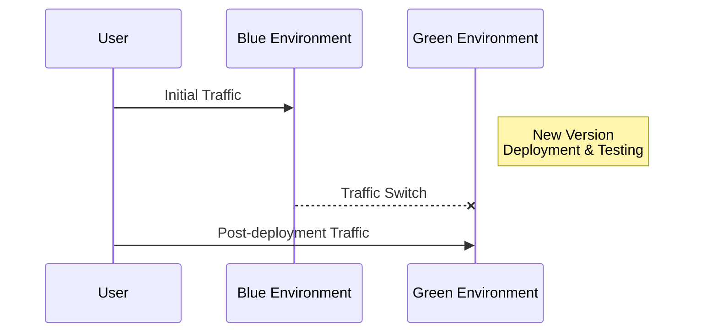
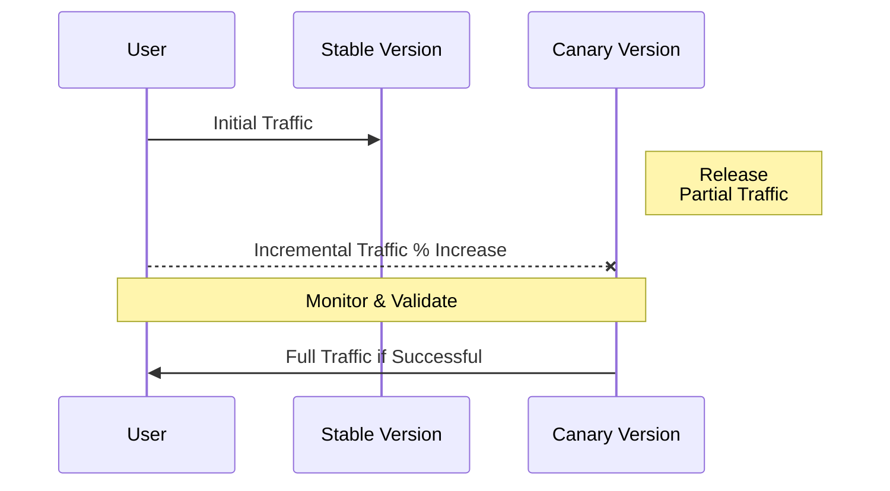

---

linkTitle: "Deployment Strategies (Blue-Green, Canary)"
title: "Deployment Strategies (Blue-Green, Canary): Ensuring Smooth Transitions in Application Updates"
category: "DevOps and Continuous Integration/Continuous Deployment (CI/CD) in Cloud"
series: "Cloud Computing: Essential Patterns & Practices"
description: "An overview of Blue-Green and Canary deployment strategies to facilitate seamless application upgrades while minimizing downtime and risk."
categories:
- Cloud Computing
- DevOps
- Continuous Deployment
- Software Engineering
tags:
- Blue-Green Deployment
- Canary Deployment
- DevOps Practices
- CI/CD
- Cloud Architecture
date: 2024-07-07
type: docs

canonical: "https://softwarepatternslexicon.com/18/11/5"
license: "© 2024 Tokenizer Inc. CC BY-NC-SA 4.0"
---

## Overview

When managing applications in the cloud, especially in large-scale distributed systems, updating software can be a daunting process. Two popular deployment strategies that aim to minimize downtime and reduce the risks associated with deploying new software versions are *Blue-Green Deployment* and *Canary Deployment*. Both strategies enable controlled deployment, allowing teams to address issues before they impact the entire user base.

### Blue-Green Deployment

**Description:**  
The Blue-Green deployment strategy involves setting up two identical production environments, referred to as Blue and Green. At any given time, one of these environments (let's say Blue) serves all traffic, while the other (Green) stands by. When a new version of software needs to be deployed, it is installed in the Green environment. Once the software is verified and tested in Green, traffic is switched from Blue to Green. This technique offers zero-downtime releases and an uncomplicated rollback process, simply switching back to the Blue environment if issues arise.

**Example Code:**

Here is a conceptual representation using a pseudo-cloud orchestration tool:

```yaml
environments:
  blue: [active]
  green: [standby]

steps:
  - deploy: green
    version: v2.0.0
  - test: green
  - switch_traffic: green
    from: blue
```

### Canary Deployment

**Description:**  
Canary Deployment is a strategy that incrementally rolls out a new software version to a small subset of users. You start routing only a small percentage of users to the updated version, monitoring success metrics, and gradually increasing the user base if the deployment is successful. This strategy enables detailed monitoring and error detection on a small scale, thus mitigating risks before wider release.

**Example Code:**

Consider this example using Kubernetes:

```yaml
apiVersion: apps/v1
kind: Deployment
metadata:
  name: myapp-canary
spec:
  replicas: 2
  selector:
    matchLabels:
      app: myapp
      track: canary
  template:
    metadata:
      labels:
        app: myapp
        track: canary
    spec:
      containers:
      - name: myapp
        image: myapp:v2.0.0

apiVersion: v1
kind: Service
metadata:
  name: myapp-service
spec:
  selector:
    app: myapp
  weightedTraffic:
    - weight: 90
      labelSelector:
        track: stable
    - weight: 10
      labelSelector:
        track: canary
```

### Diagrams

#### Blue-Green Deployment Flow



#### Canary Deployment Flow



### Related Patterns

1. **Rolling Update:** A strategy where the deployment happens incrementally by replacing the older version with the new version across all servers.
2. **Feature Toggle:** Using feature flags to turn new functionalities on and off without deploying new code.

### Best Practices

- Automate testing and deployment pipelines to streamline the process and reduce human error.
- Implement robust logging and monitoring to quickly detect and resolve issues during deployment.
- Maintain comprehensive rollback plans to handle unforeseen deployment failures.

### Additional Resources

- [Kubernetes Blue-Green Deployments](https://kubernetes.io/docs/concepts/services-networking/service/)
- [Canary Deployments on AWS](https://aws.amazon.com/devops/continuous-delivery/deployment/)
- [Google Cloud Deployment Manager](https://cloud.google.com/deployment-manager)

### Summary

By adopting Blue-Green and Canary deployment strategies, development teams can achieve reduced downtime, increased reliability, and safer application releases. These approaches are critical for modern DevOps culture, aligning well with the goals of continuous integration and continuous deployment. They provide the mechanism not only for testing new releases in real-world scenarios but also for efficiently rolling back in case of any failures. As businesses increasingly rely on cloud solutions and services, mastering these deployment patterns becomes integral to maintaining a competitive edge and ensuring seamless user experiences.
