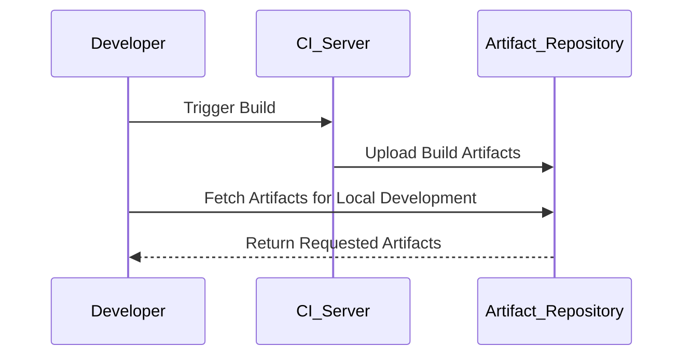
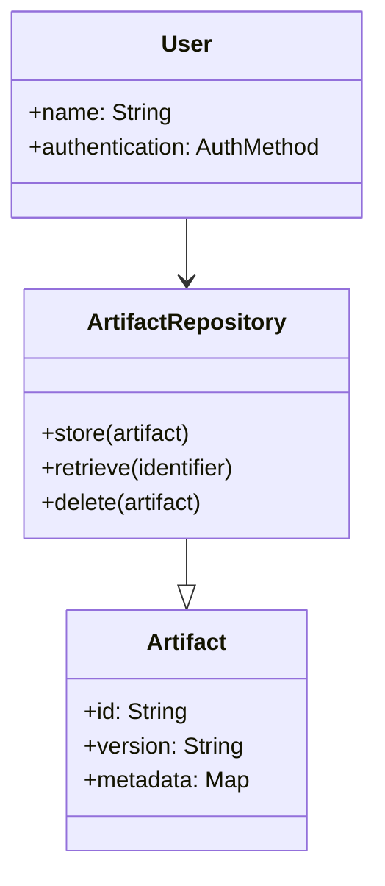

## Overview

Artifact Repositories are crucial components in modern DevOps pipelines. They serve as centralized, versioned storage for build outputs, allowing teams to manage dependencies, binaries, libraries, and other artifacts necessary for applications. These repositories enhance collaboration, improve build reproducibility, and streamline the delivery process through CI/CD.

## Pattern Description

In a continuous integration and deployment ecosystem, Artifact Repositories provide a structured and reliable way to store and retrieve artifacts. They support various formats (such as JARs for Java, NPM packages for Node.js, Docker images, etc.) and integrate seamlessly with build and deployment tools. This pattern helps decouple different stages of the software development lifecycle and reduces redundancy by avoiding the re-creation of identical artifacts.

### Key Characteristics

- **Version Control:** Artifacts are stored in a versioned manner, ensuring traceability and rollback capabilities.
- **Accessibility:** Provides easy access and distribution of artifacts across teams and environments.
- **Security:** Supports authentication and authorization mechanisms to manage access and protect sensitive artifacts.
- **Integration:** Compatible with popular CI/CD tools and build systems, such as Jenkins, Travis CI, GitLab CI/CD, and others.

## Architectural Approaches

### Centralized Artifact Management

The repository acts as the single source of truth for all artifacts, enhancing consistency across diverse environments (development, testing, production). This setup minimizes configuration drifts and simplifies dependency management.

### Distributed Artifact Repositories

For distributed systems or multi-site organizations, repositories may be designed to synchronize items across nodes or geographically spread replicas to improve redundancy and access latency.

## Example Use Cases

- **Java Applications:** Use Maven repositories to store JAR/WAR files, transitive dependencies, and manage continuous delivery processes.
- **Node.js Applications:** Employ NPM registries for package management, ensuring consistent library usage across environments.
- **Containerized Applications:** Utilize Docker registries to store Docker images, facilitating rapid deployment through container orchestrators like Kubernetes.

## Best Practices

- Automate the publishing of artifacts to the repository during CI builds to ensure updated packages are readily available.
- Use unique version tags that reflect build numbers or commit hashes to avoid conflicts and improve traceability.
- Regularly monitor and clean up old or unused artifacts to optimize storage and maintain repository performance.

## Example Code

Here's a snippet illustrating the configuration of a Maven artifact repository:

```xml
<distributionManagement>
  <repository>
    <id>central-repo</id>
    <name>Central Maven Repository</name>
    <url>https://central-repo.example.com/maven2</url>
  </repository>
</distributionManagement>
```

This XML configuration tells the Maven build tool where to publish artifacts post-build.

## Diagrams

### UML Sequence Diagram for Artifact Retrieval



### UML Class Diagram for Artifact Repository Components



## Related Patterns

- **Continuous Delivery (CD):** Ensures every change to the system is releasable, with artifact repositories spearheading the dependency distribution.
- **Configuration Management**: Tracks and controls changes in software, enhancing the reproducibility of builds through stored artifacts.

## Additional Resources

- [Understanding Maven Repositories](https://maven.apache.org/guides/introduction/introduction-to-repositories.html)
- [Docker Registry Setup](https://docs.docker.com/registry/)
- [NPM Registry](https://docs.npmjs.com/about-registry)

## Summary

Artifact Repositories form the backbone of a robust CI/CD process by managing build outputs efficiently, thereby enhancing consistency, productivity, and security in deployment pipelines. By adopting best practices and leveraging appropriate tooling, organizations can accelerate their software delivery cycles and ensure high-quality releases.
