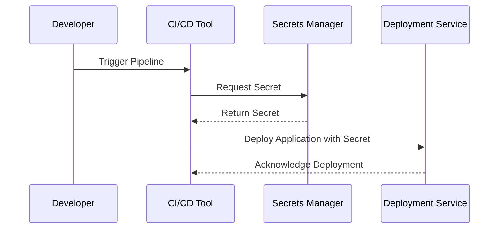

In modern DevOps practices, Continuous Integration and Continuous Deployment (CI/CD) pipelines are integral to delivering software efficiently and consistently. An important aspect of building secure and reliable pipelines is managing sensitive information, such as API keys, passwords, tokens, and other credentials—collectively known as "secrets." This article delves into the secrets management design pattern within CI/CD pipelines, highlighting architectural approaches and best practices essential for cloud environments.

## Understanding Secrets Management in Pipelines

Secrets management refers to the tools, processes, and methodologies used to securely manage sensitive information during the software development lifecycle. In a CI/CD pipeline, these secrets are necessary to execute various stages such as building, testing, and deploying applications. Proper secrets management prevents unauthorized access, reduces security risks, and ensures compliance with organizational and regulatory policies.

## Architectural Approaches

### 1. Secret as a Service

*Secret as a Service* (SaaS) involves using a dedicated secrets management service provided by cloud platforms or third-party tools. Examples include AWS Secrets Manager, Azure Key Vault, Google Cloud Secrets Manager, and HashiCorp Vault.

Benefits:
- Centralized management: Secrets are stored in a single secure location.
- Access control: Fine-grained permissions can be managed using identity and access management (IAM) policies.
- Auditing: Most services provide logs and audit trails for secret access.

### 2. Environment Variables

Environment variables are commonly used to inject secrets into the pipeline temporarily. They are configured in the CI/CD configuration files or set dynamically using orchestrated tools such as Kubernetes.

Benefits:
- Simplicity: Easy to set up and use in most CI/CD tools.
- Integration: Supported natively by orchestration platforms.

**Best Practice:** Ensure that environment variables are not exposed in logs or output. Consider encrypting them within your source control.

### 3. Encrypted Files/Credentials

In this approach, secrets are stored in encrypted files within your version control system or delivery artifacts. Tools such as Git-crypt or Ansible Vault can encrypt these files.

Benefits:
- Versioning: Encrypted secrets can be versioned alongside the code.
- Portability: Can be easily transported across environments.

### 4. Parameter Stores

Parameter stores, like AWS Systems Manager Parameter Store, offer an alternative for managing secrets through a managed service that handles both configuration data and secrets with encryption at rest.

Benefits:
- Unified storage: Handles both configurations and secrets in one place.
- Consistency: Synchronizes configurations and secrets across environments.

## Best Practices

1. **Use Least Privilege:** Grant the minimum necessary permissions for accessing secrets within the pipeline. Use role-based access control (RBAC) to enforce this.

2. **Rotate Secrets Regularly:** Implement automated secret rotation using built-in cloud service capabilities. This minimizes the impact of compromised credentials.

3. **Audit Access:** Regularly audit who has accessed secrets. Enable logging and monitoring on secrets management services.

4. **Automate Secure Handling:** Use automation tools to handle secrets securely in pipelines. Avoid manual secret handling to reduce human error.

5. **Segregate Environments:** Use separate secrets for different environments (e.g., development, staging, production) to limit the blast radius of a compromise.

## Example Code

Below is an example of using AWS Secrets Manager in a pipeline to retrieve a secret securely:

```typescript
import AWS from 'aws-sdk';

const client = new AWS.SecretsManager({
  region: 'us-west-2'
});

async function getSecretValue(secretId: string) {
  try {
    const result = await client.getSecretValue({ SecretId: secretId }).promise();
    return result.SecretString;
  } catch (error) {
    console.error(`Failed to retrieve secret: ${secretId}. Error:`, error);
    throw error;
  }
}

// Usage in a CI/CD Job
const apiSecret = await getSecretValue('myApiSecret');
console.log('Retrieved secret for API: ', apiSecret);
```

## Diagrams

### Secrets Management Flow in CI/CD Pipeline



## Related Patterns

- **Identity and Access Management (IAM) Pattern:** Secure access to cloud resources with IAM policies.
- **Environment Segregation Pattern:** Separate environments to isolate different stages of deployment.
- **Encryption at Rest and In Transit Pattern:** Ensure data is encrypted while stored and transmitted.

## Additional Resources

- [AWS Secrets Manager Documentation](https://docs.aws.amazon.com/secretsmanager)
- [Azure Key Vault Best Practices](https://docs.microsoft.com/en-us/azure/key-vault/general/best-practices)
- [Google Cloud Secrets Manager Overview](https://cloud.google.com/secret-manager/docs/overview)
- [HashiCorp Vault Documentation](https://www.vaultproject.io/docs)

## Summary

Managing secrets effectively in CI/CD pipelines is crucial to maintaining a secure software development lifecycle. By adopting structured approaches such as secret as a service, environment variables, encrypted files, and parameter stores, DevOps teams can safeguard sensitive data. Implementing best practices such as least privilege, secret rotation, access auditing, and automated handling fosters a robust security posture. By integrating these strategies, organizations can achieve efficient and secure deployment processes in cloud environments.
