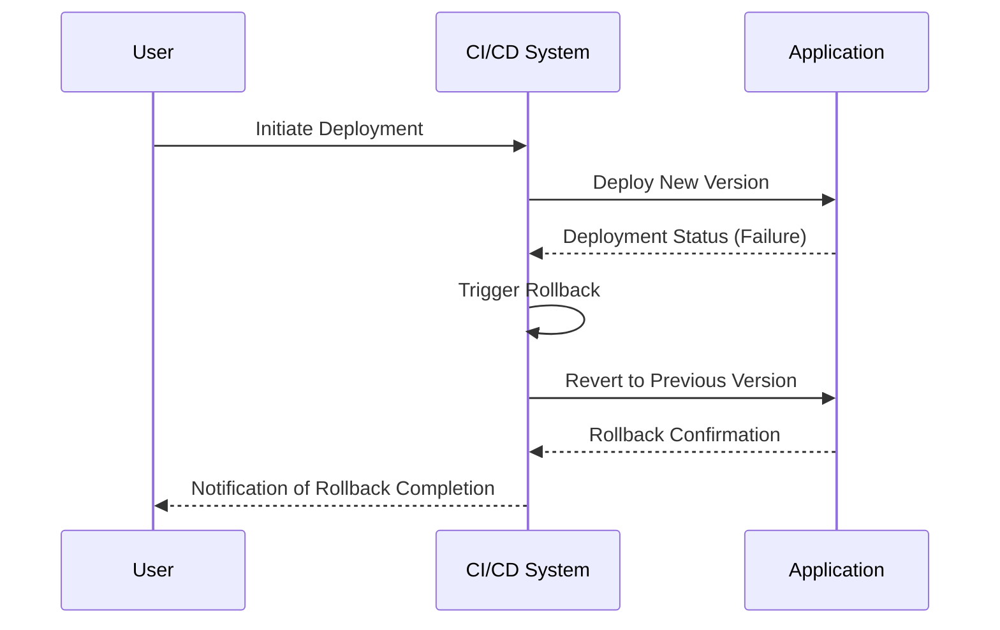

In the fast-paced world of software development, ensuring the reliability and robustness of systems is paramount. Rollback mechanisms play a crucial role in DevOps and CI/CD processes by allowing teams to revert an application or system to a previous stable state after an unsuccessful deployment. This pattern ensures minimal downtime and disruption to end-users.

## Detailed Explanation

Rollback mechanisms are strategies implemented to return a system to a known good state if a deployment introduces errors or instability. These mechanisms are critical in cloud environments where rapid deployment is common, and user impact should be minimized.

### Key Concepts

1. **Version Control**: Essential for maintaining a history of changes, enabling easy reversion to previous states.

2. **Canary Releases**: Deploying changes to a small subset of users first to detect potential issues before a full rollout.

3. **Blue-Green Deployments**: Two identical environments (blue and green) are used to swap traffic between them after a successful test, allowing rapid rollback if needed.

4. **Feature Toggles**: Allows features to be enabled or disabled at runtime, acting as a safety net to rollback undesirable changes without a full deployment.

5. **Automated Testing**: Ensures that new code does not break existing functionality, and that rollbacks maintain expected behavior.

## Architectural Approaches

Implementing rollback mechanisms can be approached with several strategies tailored to your infrastructure and operations:

### 1. **Using Containers and Kubernetes**

Kubernetes offers built-in support for rolling updates and rollbacks, enabling quick toggles between application versions:

- **Rolling Updates**: Gradually replace instances of the application.
- **Rollback**: Automatically or manually revert to previous deployments with `kubectl rollout undo`.

```yaml
apiVersion: apps/v1
kind: Deployment
metadata:
  name: example-deployment
spec:
  replicas: 3
  selector:
    matchLabels:
      app: example
  template:
    metadata:
      labels:
        app: example
    spec:
      containers:
      - name: example
        image: example-app:latest
        imagePullPolicy: Always
```

### 2. **Serverless Architectures**

Function as a Service (FaaS) platforms, such as AWS Lambda, allow versioning that can immediately switch active versions, enabling instantaneous rollbacks.

## Best Practices

- **Frequent Snapshots**: Regular snapshots of databases and stateful components help ensure rapid recovery.
- **Structured Logging and Monitoring**: Implement robust logging to quickly identify the need and point of rollback.
- **Feature Flipping**: Evaluate feature toggles that can be switched off without redeploying.

## Example Code

In Java with Spring Boot and MongoDB, you could handle feature toggles and rollbacks with a dedicated control collection in the database:

```java
@Service
public class FeatureToggleService {
    private final MongoTemplate mongoTemplate;

    public FeatureToggleService(MongoTemplate mongoTemplate) {
        this.mongoTemplate = mongoTemplate;
    }

    public boolean isFeatureEnabled(String featureName) {
        FeatureToggle featureToggle = mongoTemplate.findById(featureName, FeatureToggle.class);
        return featureToggle != null && featureToggle.isEnabled();
    }

    // Other methods for rollback, update toggles, etc.
}
```

## Diagrams

### Example Sequence Diagram



## Related Patterns

- **Continuous Deployment Patterns**: Emphasize automating the entire release process.
- **Monitoring and Alerting**: Ensure systems are observed post-deployment to catch issues early.

## Additional Resources

- [Kubernetes Documentation on Rollbacks](https://kubernetes.io/docs/concepts/workloads/controllers/deployment/#rolling-back-a-deployment)
- [AWS Lambda Versioning and Aliases](https://docs.aws.amazon.com/lambda/latest/dg/versioning-aliases.html)
- [Feature Management in Spring](https://spring.io/projects/spring-features)

## Final Summary

Rollback mechanisms are an essential element of reliable CI/CD pipelines, enabling quick recovery from deployment failures. By implementing strategies such as version control, blue-green deployments, and canary releases, you can ensure your applications maintain uptime and reliability. Regularly refine your rollback strategies in conjunction with monitoring and automated testing to provide a seamless and robust deployment process.
