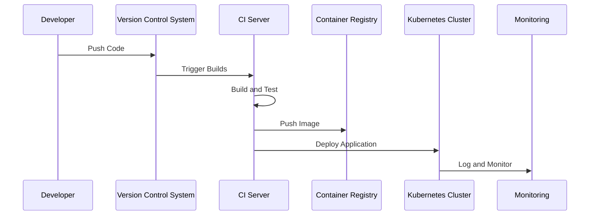

## Introduction

In modern software development, delivering robust, high-quality, and scalable applications swiftly is a top priority. To cater to this demand, organizations are increasingly leveraging containers and CI/CD pipelines as part of their DevOps strategies. The **Container CI/CD Pipelines** pattern encompasses practices and tools that automate the build, test, and deployment stages of application development specifically tailored for environments using containerization technologies.

## Understanding Container CI/CD Pipelines

Container CI/CD pipelines are a set of automated processes designed to streamline the development lifecycle of containerized applications. This pattern helps in achieving consistent, repeatable builds and deployments, enabling teams to deliver code changes more frequently and confidently to production environments.

### Key Components and Architectural Approaches

1. **Version Control Systems (VCS):** 
   - Code is stored and versioned using systems like Git, serving as the single source of truth.

2. **CI Server:**
   - Tools such as Jenkins, CircleCI, or GitLab CI are used to automate the process of building containers directly from the source code hosted in a VCS.

3. **Containerization Platforms:**
   - Docker and Kubernetes are commonly employed to package applications and run them in isolated environments, facilitating consistent application performance.

4. **Continuous Integration (CI):**
   - Automates the building and testing of code changes. It incorporates practices like code quality checks, static analysis, and unit testing.

5. **Continuous Deployment (CD):**
   - Automates the deployment of container images to various environments, ensuring that applications are released swiftly and consistently.

6. **Artifact Repositories:**
   - Container registries (Docker Hub, AWS ECR, Google Container Registry) are used to store container images that are built by the CI system.

7. **Monitoring and Logging:**
   - Tools like Prometheus, Grafana, and ELK stack provide visibility into application performance and logs, facilitating swift troubleshooting.

### Best Practices

- **Immutable Infrastructure:** Ensure container images are immutable, allowing for consistent environments across development, testing, and production.
- **Isolation and Idempotency:** Each step in the pipeline should be isolated and idempotent to avoid unintended side effects.
- **Automated Tests:** Incorporate automated tests at every stage to catch defects early and ensure high-quality releases.
- **Parallel Execution:** Leverage parallel execution capabilities to speed up pipelines.
- **Rollbacks and Blue/Green Deployments:** Implement strategies for quick rollbacks and zero-downtime deployments to production.

### Example Code

Here's a simplified Jenkinsfile example for a container CI/CD pipeline:

```groovy
pipeline {
    agent any

    stages {
        stage('Checkout') {
            steps {
                git url: 'https://github.com/your-repo.git', branch: 'main'
            }
        }
        stage('Build') {
            steps {
                script {
                    docker.build("your-app:${env.BUILD_ID}")
                }
            }
        }
        stage('Test') {
            steps {
                sh 'docker run your-app:${env.BUILD_ID} ./run-tests.sh'
            }
        }
        stage('Deploy') {
            steps {
                script {
                    docker.withRegistry('https://index.docker.io/v1/', 'dockerhub-credentials') {
                        def app = docker.image("your-app:${env.BUILD_ID}")
                        app.push()
                    }
                }
            }
        }
    }
}
```

### Diagrams

#### Sequence Diagram for Container CI/CD Pipeline



## Related Patterns

- **Infrastructure as Code (IaC):** Automating infrastructure provisioning to support speed and reliability in CI/CD pipelines.
- **Blue/Green Deployments:** Reducing downtime during deployments by maintaining two live environments.
- **Microservices Architecture:** CI/CD pipelines are especially effective in managing complex microservice deployments.

## Additional Resources

- [Jenkins for Continuous Integration](https://www.jenkins.io/)
- [Containerizing Applications with Docker](https://docs.docker.com/get-started/)
- [Kubernetes Continuous Deployment](https://kubernetes.io/docs/concepts/cluster-administration/cd/)

## Summary

Container CI/CD pipelines represent a crucial pattern in modern DevOps practices, focusing on automating and accelerating the software delivery process for containerized applications. By adopting this pattern, organizations can ensure high-quality deployments at scale, reduce errors, and improve overall agility in software delivery. With the right tools and practices, container CI/CD pipelines enable development teams to deliver more reliable software faster than ever before.
