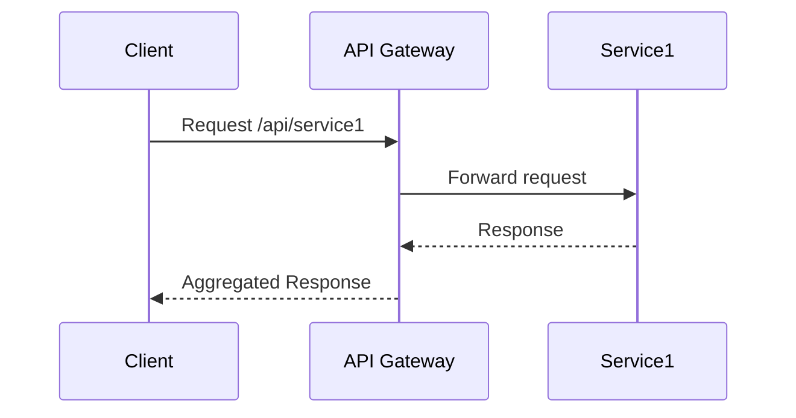

## Introduction

The **API Gateway Implementation** pattern is a crucial component in managing APIs in cloud-based and distributed systems, particularly within microservices architectures. An API Gateway provides a single entry point for clients to access various backend services, offering functionalities such as request routing, composition, protocol translation, and more.

## Design Pattern Details

### Problem Addressed

In a microservices architecture, each service is independently deployable and communicates with others through a network. Direct client communication with every microservice can lead to increased complexity, potential security vulnerabilities, and inefficiencies in handling cross-cutting concerns.

### Solution

The API Gateway serves as an intermediary between the clients and the microservices. It abstracts the complexities involved in interacting with multiple services by providing:

- **Request Routing:** Directs requests to the appropriate services based on the configured rules.
- **Protocol Translation:** Translates client requests to and from the protocol expected by services (e.g., REST to gRPC).
- **Security:** Manages authentication, authorization, and other security-related concerns.
- **Logging and Monitoring:** Centralizes logging, monitoring, and tracing to help manage and troubleshoot issues.
- **Rate Limiting and Throttling:** Controls the usage of APIs to prevent abuse and ensure availability.

### Architectural Approach

1. **Centralized Gateway**: Deploy a centralized API Gateway that all incoming client requests pass through.
2. **Service Composition**: The gateway can also act as an aggregator, composing responses from multiple services.
3. **Decoupling**: It decouples the frontend interfaces from the backend implementations, allowing independent evolution of services.

### Example Code

Here is a simplified example of an API Gateway using `Express.js` in Node.js:

```javascript
const express = require('express');
const app = express();

// Middleware for logging
app.use((req, res, next) => {
    console.log(`${req.method} ${req.url}`);
    next();
});

// Gateway routes
app.get('/api/service1', async (_req, res) => {
    // Here, implement call logic to service 1
    res.send('Response from Service 1');
});

app.get('/api/service2', async (_req, res) => {
    // Here, implement call logic to service 2
    res.send('Response from Service 2');
});

// Start the Gateway
app.listen(3000, () => {
    console.log('API Gateway listening on port 3000');
});
```

### Diagram



## Related Patterns

- **Backend for Frontend (BFF):** Tailors API endpoints for specific client applications, often used alongside the API Gateway.
- **Service Mesh:** Provides dedicated handling of service-to-service communication, complementing the API Gateway.

## Additional Resources

- [AWS API Gateway Documentation](https://docs.aws.amazon.com/apigateway)
- [Kong Open Source API Gateway](https://konghq.com/kong/)
- [Nginx as a Reverse Proxy](https://docs.nginx.com/nginx/admin-guide/web-server/reverse-proxy/)

## Summary

The API Gateway Implementation pattern is essential for managing APIs efficiently within cloud environments. By serving as a single point of entry, it simplifies client interactions, centralizes cross-cutting concerns, and enhances security. This design pattern is pivotal in microservice landscapes, ensuring scalability, security, and streamlined operation of services.
