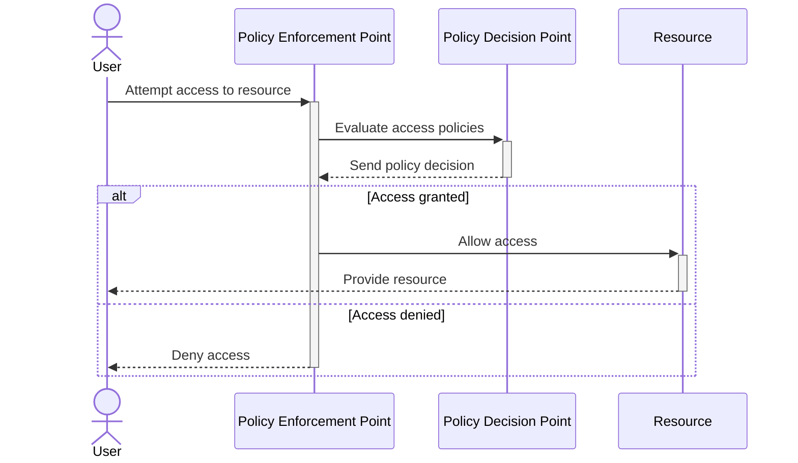

## Introduction

Policy enforcement is a crucial design pattern in cloud computing that ensures compliance with the necessary security, governance, and performance rules across all services and APIs. It provides a centralized way to enforce organizational and regulatory standards, which can help in managing risks, maintaining operational consistency, and simplifying auditing processes.

## Detailed Explanation

Policy enforcement in the cloud involves creating a mechanism that monitors and controls the access and usage of resources based on predefined policies. These policies can dictate constraints on resource usage, define security and data protection measures, and govern access control. The enforcement can take place at various levels like network, application, or data.

### Core Components of Policy Enforcement:

1. **Policy Definition**: Policies can be defined through code or configuration, focusing on security (authentication, authorization), data governance (data residency, encryption), and operational constraints (usage quotas, performance thresholds).

2. **Policy Enforcement Point (PEP)**: The module or service that intercepts requests to a resource, evaluates applicable policies, and takes necessary actions to allow or deny access.

3. **Policy Decision Point (PDP)**: Evaluates access requests against policies based on context (identity, time, location) and communicates decisions back to the PEP.

4. **Policy Administration Point (PAP)**: Interface or service for defining, managing, and deploying policies across the infrastructure.

5. **Policy Information Point (PIP)**: Serves as a data source that provides necessary contextual information for decision-making.

### Implementation Approaches

- **API Gateways**: Often used as PEPs, API gateways enforce policies on API requests and responses, making them ideal for managing cross-cutting concerns like security, rate limiting, and auditing.
  
- **Middleware Components**: Integrated within application servers to enforce policies related to application logic and data access.

- **Standalone Services**: Dedicated microservices can act as policy enforcement components, independently managing policy decisions for distributed applications.

### Example Code

Below is a simplified Java-based implementation using Spring Boot and Spring Security, focusing on a simple policy enforcement use case for API access control.

```java
@Configuration
@EnableWebSecurity
public class SecurityConfig extends WebSecurityConfigurerAdapter {

    @Override
    protected void configure(HttpSecurity http) throws Exception {
        http
            .authorizeRequests()
                .antMatchers("/public/**").permitAll()
                .antMatchers("/admin/**").hasRole("ADMIN")
                .antMatchers("/user/**").hasAnyRole("USER", "ADMIN")
                .anyRequest().authenticated()
            .and()
            .httpBasic();
    }

    @Override
    public void configure(WebSecurity web) throws Exception {
        web.ignoring().antMatchers("/resources/**");
    }
}
```

### Diagram



## Related Patterns

- **Authentication and Authorization**: Policy enforcement often works closely with authentication and authorization patterns to ensure that only verified identities access resources according to defined policies.

- **Rate Limiting**: Closely related as it helps enforce policies on the number of requests a client can make, preventing abuse or overuse of resources.

- **Content Filtering**: Ensures that the data flowing through a system adheres to business rules and compliance standards.

## Additional Resources

- [NIST Special Publication on Policy Enforcement](https://csrc.nist.gov/publications/detail/sp/800-163/rev-1/draft)
- [OAuth 2.0 and OpenID Connect for Secure API Access](https://oauth.net/2/)
- [Spring Security Reference](https://docs.spring.io/spring-security/site/docs/current/reference/html5/)

## Summary

The policy enforcement pattern is an essential aspect of cloud computing architecture, providing a consistent way to manage compliance, security, and governance across APIs and services. By centralizing policy control and integrating it seamlessly with the infrastructure, organizations can effectively minimize risks, maintain regulatory compliance, and ensure smooth service operations.
