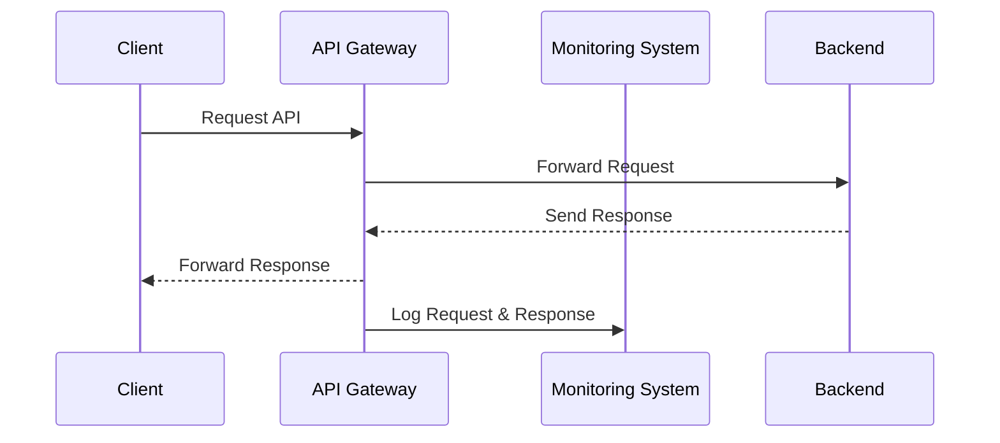

## Introduction

In the modern digital ecosystem, APIs play a critical role in enabling different systems to communicate with each other. With a growing number of APIs in use, effective API analytics and monitoring have become essential for ensuring optimal performance, identifying issues, and enhancing security. This design pattern focuses on providing organizations with the necessary tools and techniques to gather insights and maintain control over their APIs.

## Design Pattern Overview

API Analytics and Monitoring involves a set of practices and tools that allow organizations to collect data about API usage, performance, and any potential anomalies. This data is crucial for understanding the behavior of APIs and making informed decisions to improve service reliability, user experience, and security.

### Key Components

1. **Data Collection:** Collects detailed logs and statistics on API calls, including request and response times, error rates, user activity, etc.
2. **Real-time Monitoring:** Provides dashboards and alerts for real-time visibility into API performance and potential issues.
3. **Analytical Insights:** Utilizes collected data to generate insights on usage patterns, performance bottlenecks, and trends.
4. **Security Monitoring:** Ensures APIs are monitored for potential security threats like data breaches, unauthorized access, and more.

## Architectural Approaches

- **Centralized Logging and Monitoring:** Use centralized systems to gather logs and metrics from all API endpoints.
- **Cloud-based Monitoring Solutions:** Leverage scalable cloud-based monitoring solutions for quick setup and maintenance.
- **Integrated Security Monitoring:** Combine API monitoring with security tools to detect and respond to threats in real-time.

## Best Practices

- **Automate Monitoring:** Use automation for log collection and alerts to minimize manual monitoring tasks.
- **Performance Baselines:** Establish performance baselines to detect anomalies and deviations quickly.
- **Continuous Feedback Loop:** Implement a feedback loop for continuous improvement based on analytics insights.
- **Comprehensive Security Audits:** Regularly audit your APIs for security vulnerabilities using both automated tools and manual assessments.

## Example Code

```typescript
// Example using Node.js and Express for logging API requests

import express, { Request, Response } from 'express';
import morgan from 'morgan';

const app = express();

// Use morgan to log API requests in combined format
app.use(morgan('combined'));

app.get('/api/data', (req: Request, res: Response) => {
    res.json({ message: 'API data response' });
});

app.listen(3000, () => {
    console.log('Server is running on port 3000');
});
```

## Diagrams

### Sequence Diagram for API Monitoring



## Related Patterns

- **Rate Limiting and Throttling:** Protects APIs from being overloaded by limiting the number of requests a user can make within a certain timeframe.
- **Circuit Breaker:** Prevents a cascade of failures in distributed systems by stopping the invocation of a potentially faulty API.
- **Service Mesh:** Provides pervasive networking control and monitoring for microservices architectures, with built-in telemetry.

## Additional Resources

- [API Monitoring Tools](https://apimonitoringtools.example.com)
- [Best Practices in API Security](https://apibestpractices.example.com)
- [Cloud-Based API Management Platforms](https://cloudapiplatforms.example.com)

## Summary

API Analytics and Monitoring patterns are indispensable for modern cloud computing environments. By implementing robust practices and leveraging powerful tools, organizations can gain deep insights into API performance, enhance operational reliability, and strengthen security measures. Whether dealing with high-traffic APIs or sensitive data exchanges, ensuring continuous monitoring and analysis is key to maintaining system health and user satisfaction.
