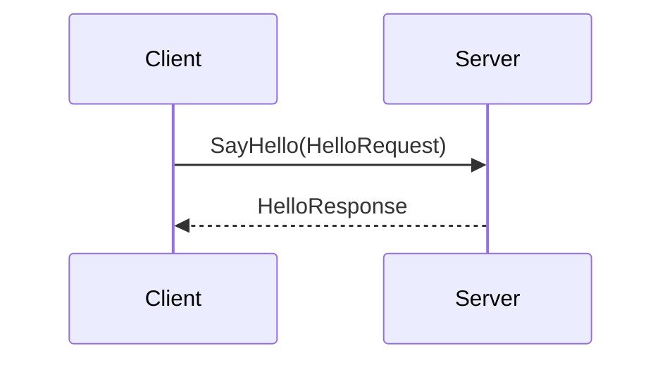

## Overview

gRPC and Protocol Buffers are powerful technologies developed by Google that streamline communication in microservices architectures. gRPC is a high-performance, open-source universal RPC (Remote Procedure Call) framework that can run in any environment. Complementing gRPC, Protocol Buffers are a language-agnostic data serialization format designed to improve communication efficiency across distributed systems.

## Detailed Explanation

### gRPC: High-Performance RPC Framework

gRPC is designed to support a variety of environments by using HTTP/2 for transport, enabling features such as multiplexing, flow control, header compression, and low latency. The framework supports various programming languages, making it highly versatile for cross-platform development.

Key Features of gRPC:
- **Language Agnostic:** Supports numerous programming languages including Java, C++, Python, Go, and more.
- **Streaming:** Enables both client-side and server-side streaming, plus bidirectional streaming.
- **Load Balancing and Resiliency:** Built-in support for load balancing and fault tolerance.
- **Support for Pluggable Authentication:** Leverages SSL/TLS for authentication and encryption.
- **Interoperability**: Works seamlessly across platforms with its standardized communication protocols.

### Protocol Buffers: Efficient Serialization Format

Protocol Buffers, often referred to as Protobuf, serve as both a data serialization format and as a language for defining the structure of your data. It's designed to be simple, portable, and efficient, reducing the size and the serialization/deserialization time compared to traditional approaches like XML or JSON.

Key Features of Protocol Buffers:
- **Compact:** Reduces bandwidth and storage requirements with efficient, small binary formats.
- **Speed:** Faster parsing and serialization compared to text-based formats.
- **Backward and Forward Compatibility:** Allows schemas to evolve over time without breaking deployed programs.
- **Automatically Generated Code:** Simplifies development by generating data access classes for multiple programming languages.

### Architectural Integration

In microservices architectures, gRPC and Protocol Buffers serve as the backbone for service-to-service communication. They allow microservices to interact seamlessly with low latency and minimal bandwidth usage, making them ideal for high-performance environments like online streaming, real-time analytics, and large-scale distributed applications.

### Example Code

An example of defining a service using Protocol Buffers and implementing it with gRPC:

#### Example .proto file

```protobuf
syntax = "proto3";

service Greeter {
  rpc SayHello (HelloRequest) returns (HelloResponse);
}

message HelloRequest {
  string name = 1;
}

message HelloResponse {
  string message = 1;
}
```

#### Server Implementation in Java

```java
public class GreeterServiceImpl extends GreeterGrpc.GreeterImplBase {
    @Override
    public void sayHello(HelloRequest req, StreamObserver<HelloResponse> responseObserver) {
        HelloResponse response = HelloResponse.newBuilder()
            .setMessage("Hello, " + req.getName())
            .build();
        responseObserver.onNext(response);
        responseObserver.onCompleted();
    }
}
```

### Diagrams

#### Sequence Diagram



## Related Patterns

- **API Gateway**: Often used in conjunction with gRPC services to manage and route requests in a microservices architecture.
- **Service Mesh**: Can enhance gRPC with added observability, security, and traffic management.

## Additional Resources

- [gRPC Official Documentation](https://grpc.io/docs/)
- [Protocol Buffers Official Guide](https://developers.google.com/protocol-buffers)
- [Microservices Architecture Best Practices](https://docs.microsoft.com/en-us/azure/architecture/microservices/)

## Summary

gRPC and Protocol Buffers offer a robust, high-performance framework for inter-service communication. Their ability to support multiple languages, combined with efficient serialization, makes them excellent choices for building scalable and responsive microservices environments. As cloud-native architectures become more prevalent, mastering these tools can significantly enhance application performance and developer productivity.
