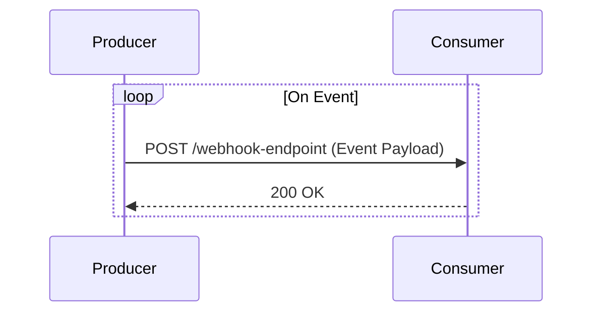

---

linkTitle: "Asynchronous APIs with Webhooks"
title: "Asynchronous APIs with Webhooks: Empowering Event-Driven Architectures"
category: "API Management and Integration Services"
series: "Cloud Computing: Essential Patterns & Practices"
description: "Explore the Asynchronous APIs with Webhooks design pattern, enabling effective event-driven communication in distributed systems, facilitating real-time data processing, and improving integration scalability."
categories:
- API Management
- Integration Services
- Event-Driven Architecture
tags:
- Webhooks
- Asynchronous Communication
- Event-Driven
- Cloud Integration
- Real-Time Processing
date: 2024-07-07
type: docs

canonical: "https://softwarepatternslexicon.com/18/12/13"
license: "© 2024 Tokenizer Inc. CC BY-NC-SA 4.0"
---

## Introduction

In today's interconnected world, applications are expected to communicate seamlessly, providing real-time updates and data sharing capabilities. Asynchronous APIs with Webhooks are an essential design pattern that supports event-driven architectures, promoting scalability and responsiveness in distributed systems. This pattern is particularly useful for applications that require instant data synchronization and streamlined event processing across various components.

## Detailed Explanation

### Design Pattern: Asynchronous APIs with Webhooks

Asynchronous APIs with Webhooks enable systems to notify external services about specific events in real-time, without the need for those services to continuously poll for updates. This is accomplished by having the event producer (usually a server-side application) make HTTP requests to pre-configured URLs (webhooks) on the consumer side when certain events occur.

#### Key Characteristics
- **Decoupled Communication**: Allows separation between services, reducing direct dependencies.
- **Event-Driven**: Supports asynchronous event processing and real-time notifications.
- **Scalability**: Enables easy scaling, as consumer services don't need to maintain persistent connections.
- **Reduced Latency and Overhead**: Minimizes unnecessary network traffic since updates are sent when events occur.

### Architectural Approaches

1. **Event Producer and Consumer Models**: 
   - The event producer generates events and sends them to consumer endpoints via webhooks.
   - Consumers need to implement HTTP endpoints to receive these notifications.

2. **Security Measures**:
   - Verify webhook signatures to ensure authenticity.
   - Use HTTPS and authentication tokens for secure communication.

3. **Handling Failures**:
   - Implement retries and exponential backoff strategies.
   - Use message queues to buffer webhook events in case of network issues or consumer unavailability.

### Best Practices

- **Design Idempotent APIs**: Ensure that even if a webhook is received multiple times, it leads to the same outcome.
- **Log and Monitor**: Keep detailed logs of sent and received webhook events for debugging and auditing.
- **Implement Backpressure Control**: Prevent overwhelming consumers by managing the flow of webhook notifications.

## Example Code

Here's an example demonstration using JavaScript and Node.js to implement a simple webhook sender and receiver:

### Sender (Producer) Code

```javascript
const axios = require('axios');

const sendWebhookNotification = async (webhookUrl, payload) => {
  try {
    await axios.post(webhookUrl, payload);
    console.log('Webhook sent successfully');
  } catch (error) {
    console.error('Error sending webhook:', error.message);
  }
};

const payload = { event: 'DATA_UPDATED', data: { id: 123, name: 'Example' } };
const webhookUrl = 'https://example.com/webhook-endpoint';

sendWebhookNotification(webhookUrl, payload);
```

### Receiver (Consumer) Code

```javascript
const express = require('express');
const app = express();

app.use(express.json());

app.post('/webhook-endpoint', (req, res) => {
  const receivedEvent = req.body;
  console.log('Received event:', receivedEvent);

  // Handle the event
  // ...

  res.status(200).send('Webhook received successfully');
});

app.listen(3000, () => {
  console.log('Webhook receiver listening on port 3000');
});
```

## Diagrams

### Sequence Diagram


## Related Patterns

- **Event-Driven Architecture**: Utilizes events to trigger and communicate between decoupled services and components.
- **Publish/Subscribe Messaging**: Similar to webhooks but uses a message broker to distribute events to subscribers.
- **CQRS (Command Query Responsibility Segregation)**: Ensures a clear separation between operations handling updates and those that handle queries.

## Additional Resources

- [Official Webhook Documentation](https://webhooks.example.com/docs)
- [Building Event-Driven Applications](https://cloudpatterns.example.com/event-driven)
- [Security Best Practices for Webhooks](https://security.example.com/webhooks)

## Summary

The Asynchronous APIs with Webhooks design pattern is instrumental in implementing efficient event-driven systems. By facilitating real-time communication and decoupling services, webhooks improve integration scalability and reduce processing latency. Adhering to best practices such as idempotence and robust security measures is crucial in leveraging this pattern effectively within your architectural landscape.

---
