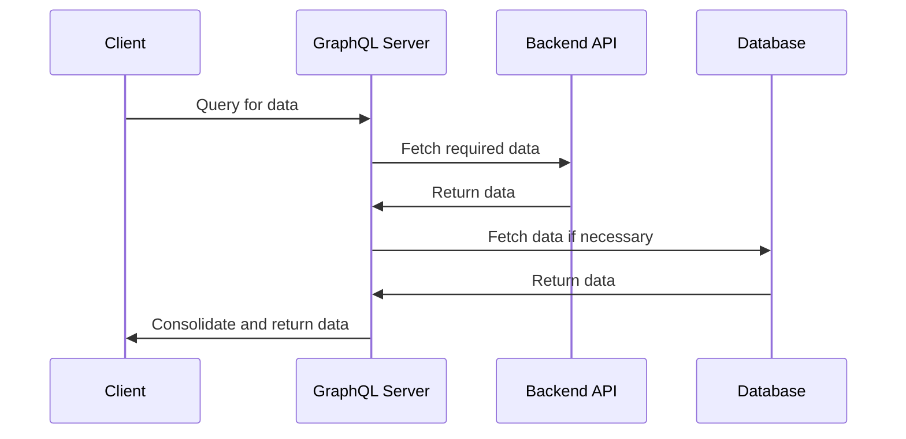

## Introduction

The **GraphQL Integration** pattern is a powerful architectural approach that leverages the benefits of GraphQL to streamline API management and service integration. GraphQL stands out with its capability to allow clients to request precisely the data they need in their desired structure, significantly enhancing efficiency and flexibility compared to traditional RESTful API approaches.

## Detailed Explanation

### Design Pattern Structure

GraphQL acts as a middle layer between the client and various backend services (databases, microservices, third-party APIs). It consolidates different data sources and presents them in a single, unified API, reducing the need for multiple network requests and enabling the client to formulate complex queries.

### Key Benefits

- **Precise Data Retrieval**: Clients fetch exact data fields needed, minimizing over-fetching and under-fetching issues common in REST APIs.
- **Single Endpoint**: All operations (queries, mutations, subscriptions) occur through a single endpoint, simplifying API endpoints management.
- **Flexible Querying**: Enables clients to specify the exact fields and structures, facilitating complex, nested queries with ease.
- **Efficient Resource Usage**: Reduces bandwidth usage and server load by avoiding large, unnecessary data payloads.
- **Real-Time Updates**: Supports real-time data fetching using subscriptions, enhancing user engagement in applications requiring live data.

### Example Code

Below is a basic example of a GraphQL schema and a simple query:

```graphql
type Query {
  message(id: ID!): Message
  user(id: ID!): User
}

type Message {
  id: ID!
  content: String
  author: User
}

type User {
  id: ID!
  username: String
  messages: [Message]
}
```

Clients can execute the following query to get a message along with the author's details:

```graphql
query {
  message(id: "123") {
    content
    author {
      username
    }
  }
}
```

### Architectural Approaches

- **GraphQL Gateway**: Acts as an aggregate point that orchestrates calls to various microservices and composes the final data response.
- **Schema Stitching and Federation**: Combines multiple GraphQL schemas into a single unified schema through inbuilt extension capabilities, enabling horizontal scalability and modular development.

### Best Practices

- **Schema Design**: Design schemas around business logic rather than backend architectures to maintain a clean separation of concerns.
- **Security**: Implement proper validation, query complexity analysis, and authentication measures to protect against query abuse and data breaches.
- **Monitoring and Logging**: Use logging and monitoring tools tailored for GraphQL to detect performance bottlenecks and ensure efficient data fetching.

## Diagrams

### GraphQL Integration Sequence Diagram


## Related Patterns

- **Backend for Frontend (BFF)**: Tailors backend API to a specific client's needs, which can complement GraphQL by optimizing its data fetching patterns.
- **API Gateway**: Handles API requests and can act as a proxy for GraphQL servers to enhance security and traffic management.
- **Microservices Architecture**: Each microservice exposes own GraphQL schema; federation combines these schemas for a unified model.

## Additional Resources

- [GraphQL Official Documentation](https://graphql.org/learn/)
- [Apollo GraphQL](https://www.apollographql.com/docs/)
- [GraphQL Best Practices](https://graphql.org/learn/best-practices/)

## Summary

The GraphQL Integration pattern represents a transformative way of handling API interactions, promoting flexible data fetching empowered by precise querying capabilities. By adopting GraphQL, organizations can streamline their data integration processes, delivering responsive and efficient client experiences in a resource-conscious manner. This pattern, when paired with complementary strategies like schema design, security protocols, and microservices alignment, can enhance scalability and maintainability in cloud-based architecture.
