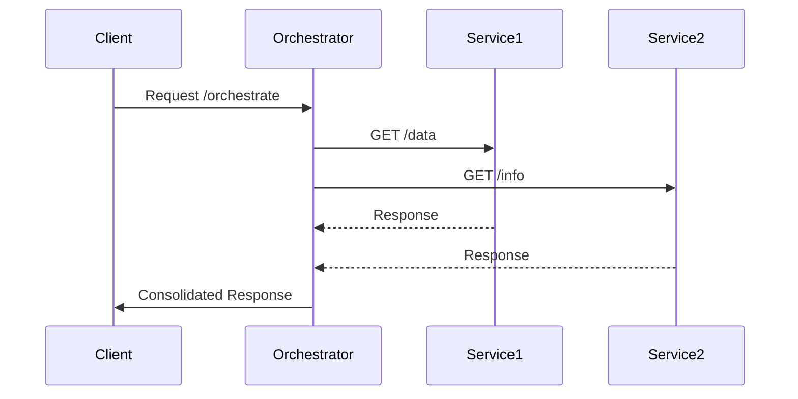

## Introduction

API Orchestration is a critical design pattern in the realm of cloud computing that allows the composition of multiple service endpoints into a single cohesive API layer. By orchestrating APIs, businesses can streamline workflows, reduce latency, and enhance the functionality of their systems.

## Detailed Explanation

### What is API Orchestration?

API Orchestration involves coordinating the execution of multiple API calls across different services to achieve a specific business goal. Unlike API composition, which is a simpler form of direct API aggregation, orchestration includes complex decision-making and multiple interactions that may involve sequential or parallel processing, error handling, and transformation.

### Key Concepts

- **Sequence Flow**: The order in which API requests are made and responses are processed.
- **Parallel Execution**: Simultaneously executing multiple API requests to improve performance.
- **Error Handling**: Techniques to address failures in API calls, such as retries and fallbacks.
- **Data Transformation**: Formatting or transforming the data between different APIs to maintain compatibility.

### Architectural Approaches

1. **Centralized Orchestration**:
   - Typically implemented using middleware or a dedicated orchestration server that handles all API interactions.
   - Allows for complex business logic to be centrally managed.

2. **Decentralized Orchestration**:
   - Distributed responsibility where each service manages its own orchestration logic.
   - Suitable for microservices architectures where services need autonomy.

## Best Practices

- **Use Middleware**: Implement middleware to handle orchestration logic, which can reduce complexity in individual services.
- **Promote Resilience**: Implement circuit breakers, retries, and fallbacks to handle API failures gracefully.
- **Optimize for Performance**: Leverage parallel execution of APIs wherever possible to reduce latency.
- **Maintain Scalability**: Ensure the orchestration layer can scale with the underlying services.

## Example Code

Here's a simplistic example using JavaScript and Node.js to orchestrate multiple APIs:

```javascript
const express = require('express');
const axios = require('axios');

const app = express();

app.get('/orchestrate', async (req, res) => {
  try {
    const [api1Response, api2Response] = await Promise.all([
      axios.get('https://api.service1.com/data'),
      axios.get('https://api.service2.com/info')
    ]);

    const combinedData = {
      ...api1Response.data,
      ...api2Response.data
    };

    res.status(200).send(combinedData);
  } catch (error) {
    console.error('Error in orchestration', error);
    res.status(500).send('Internal Server Error');
  }
});

app.listen(3000, () => {
  console.log('API Orchestration server running on port 3000');
});
```

## Diagrams

### Sequence Diagram



## Related Patterns

- **API Gateway**: Acts as a single entry point for multiple APIs, providing routing and policy enforcement, which complements orchestration.
- **Service Choreography**: Unlike orchestration, where a central coordinator manages interactions, choreography allows services to work independently based on a common protocol and coordination logic.

## Additional Resources

- [Enterprise Integration Patterns](https://www.enterpriseintegrationpatterns.com/)
- [API Design Patterns](https://www.manning.com/books/api-design-patterns)
- [Microservices Architecture](https://martinfowler.com/microservices/)

## Summary

API Orchestration is an essential pattern for integrating and managing complex interactions among multiple APIs. By providing a coherent and unified API layer, orchestration facilitates increased control, efficiency, and scalability of business processes in a cloud computing environment. Implementing best practices and utilizing architectural strategies can help achieve robust orchestration solutions.
