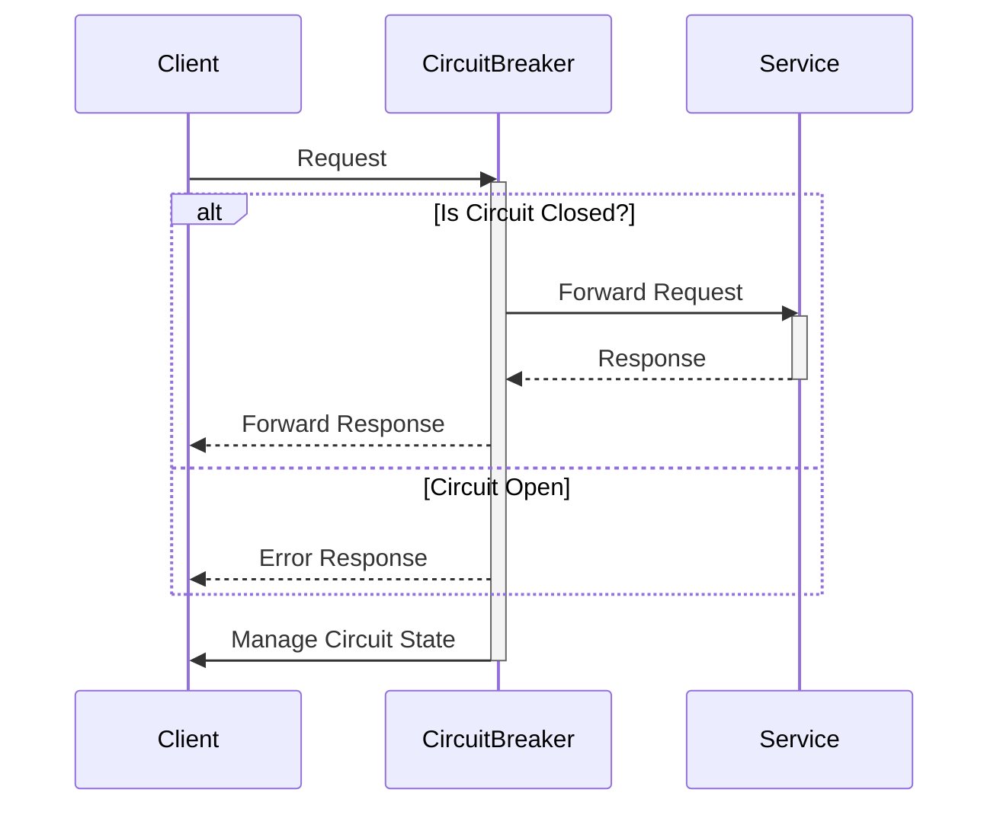

## Overview

In the world of distributed systems, failures are inevitable. A critical approach to managing failures gracefully within APIs is the **Circuit Breaker** pattern. This design pattern, inspired by electrical circuit breakers, prevents continuous service usage when outbound services are unresponsive or exhibiting errors, thereby maintaining system stability and user experience.

## Explanation of Circuit Breaker Pattern

### Concept

The Circuit Breaker pattern is designed to prevent client applications from attempting to execute operations which are likely to fail. This reduces the time spent trying to recover from faults, allows services to clear problems without more requests being made, and protects APIs from cascading failures.

### States of a Circuit Breaker

1. **Closed**: The normal operating state. Requests flow normally until the failure threshold is reached.
2. **Open**: Once a predefined threshold for failures is met, the circuit breaker trips and enters the open state, blocking requests to the failing service and immediately returning an error.
3. **Half-Open**: After a specified duration, the circuit breaker transitions to this state to test if the underlying issue has been resolved. A limited number of requests may be allowed through. Depending on the outcome, it may transition back to the closed or open state.

### Key Benefits

- **Fault Isolation**: Stops the propagation of errors that can lead to cascading failures.
- **Improved Reliability**: Ensures that failures in one component don’t bring down the entire system.
- **Faster Recovery**: Allows time for failing components to stabilize and recover.

## Example Code

Below is an example implementation in Java using the popular resilience4j library:

```java
import io.github.resilience4j.circuitbreaker.CircuitBreaker;
import io.github.resilience4j.circuitbreaker.CircuitBreakerConfig;
import io.github.resilience4j.circuitbreaker.CircuitBreakerRegistry;

import java.time.Duration;
import java.util.function.Supplier;

public class CircuitBreakerExample {

    public static void main(String[] args) {
        CircuitBreakerConfig config = CircuitBreakerConfig.custom()
                .failureRateThreshold(50)
                .waitDurationInOpenState(Duration.ofMillis(1000))
                .slidingWindowSize(2)
                .build();

        CircuitBreakerRegistry registry = CircuitBreakerRegistry.of(config);
        CircuitBreaker circuitBreaker = registry.circuitBreaker("myCircuitBreaker");

        Supplier<String> decoratedSupplier = CircuitBreaker.decorateSupplier(circuitBreaker, CircuitBreakerExample::remoteCall);

        try {
            System.out.println(decoratedSupplier.get());
        } catch (Exception e) {
            System.err.println("Service call failed: " + e.getMessage());
        }
    }

    public static String remoteCall() {
        // Simulate a remote API call which might fail
        throw new RuntimeException("Simulated failure");
    }
}
```

## Diagram

Here's a sequence diagram illustrating the flow of the Circuit Breaker pattern in an API call context:



## Related Patterns

- **Retry Pattern**: Often used in conjunction with Circuit Breaker; allows retrying failed operations under a controlled condition.
- **Bulkhead Pattern**: Isolates resources to prevent failure in one part from cascading.
- **Timeout Pattern**: Helps prevent a system from waiting indefinitely for a service response.

## Additional Resources

- Martin Fowler’s blog on [Circuit Breaker Pattern](https://martinfowler.com/bliki/CircuitBreaker.html)
- Resilience4j documentation on [Circuit Breaker](https://resilience4j.readme.io/docs/circuitbreaker)

## Summary

The Circuit Breaker pattern is a critical tool in the resilient engineering of cloud systems, particularly for API management. By shutting down faulty service calls and preventing cascading failures, it ensures that systems remain functional, responsive, and user-friendly, even in the face of component outages or service failures.
