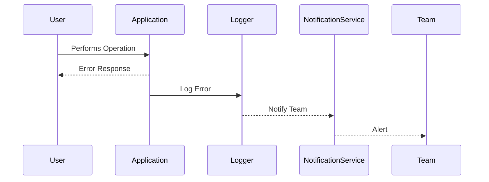

## Overview

In the increasingly complex landscape of cloud applications, error handling is crucial for ensuring application reliability, user satisfaction, and system resilience. Error handling standards provide a consistent methodology for identifying, managing, and responding to errors in distributed systems.

This pattern focuses on establishing best practices for error handling in cloud environments, with particular emphasis on APIs and integration services. By standardizing error handling processes, organizations can effectively mitigate issues, enhance fault tolerance, and improve system observability.

## Architectural Approaches

### Centralized Error Handling

In cloud architectures, a centralized approach to error handling involves collecting and managing error information in one location. This allows for streamlined monitoring and easier troubleshooting.

- **Centralized Logging and Monitoring**: Implement centralized logging systems (e.g., ELK stack, Splunk) where all errors are logged, facilitating real-time monitoring and analysis.
- **Global Error Handlers**: Use middleware or global error handlers that capture exceptions and errors across the application stack.

### Decoupled Error Management

Decoupled error management relies on separating the error handling logic from the application code to enhance modularity and reusability.

- **Error Codes and Contextual Information**: Define a set of standardized error codes with descriptive messaging and context to help identify the root cause.
- **Retry Patterns**: Implement retry mechanisms to handle transient errors, such as network failures, using exponential backoff strategies.

## Best Practices

- **Granular Error Reports**: Provide detailed error reports with stack traces, timestamps, and relevant metadata for efficient debugging.
- **User-Friendly Error Messages**: Display user-friendly error messages without exposing sensitive information, thus maintaining security and usability.
- **Alerting and Notifications**: Set up alerts and notifications to inform teams of errors or anomalies in real-time, aiding prompt resolution.

## Example Code

Below is a sample implementation of an error handler in a Java Spring Boot application:

```java
@RestControllerAdvice
public class GlobalExceptionHandler {

    @ExceptionHandler(Exception.class)
    public ResponseEntity<ErrorResponse> handleException(Exception ex) {
        ErrorResponse errorResponse = new ErrorResponse(
                "ERR-001", "Internal Server Error", ex.getMessage());
        return new ResponseEntity<>(errorResponse, HttpStatus.INTERNAL_SERVER_ERROR);
    }

    public static class ErrorResponse {
        private String errorCode;
        private String errorMessage;
        private String detailedMessage;

        // Getters and Setters
    }
}
```

## Diagrams

### Error Handling Flow Diagram



## Related Patterns

- **Circuit Breaker**: Temporarily block requests to prevent system overload during error scenarios.
- **Retry Pattern**: Automatically retry operations that fail due to transient issues.
- **Bulkhead**: Isolate components to prevent failure from cascading across the system.

## Additional Resources

- [Microsoft Azure Documentation on Error Handling](https://docs.microsoft.com/en-us/azure/architecture/best-practices/error-management)
- [AWS Well-Architected Framework](https://aws.amazon.com/architecture/well-architected/)
- [Spring Boot Error Handling Guide](https://spring.io/guides/tutorials/spring-boot-oauth2/)

## Summary

Error handling standards are pivotal in creating robust, fault-tolerant cloud applications. By adopting centralized, decoupled error handling approaches and adhering to best practices, you can enhance your application's resilience and ensure a smoother user experience.
