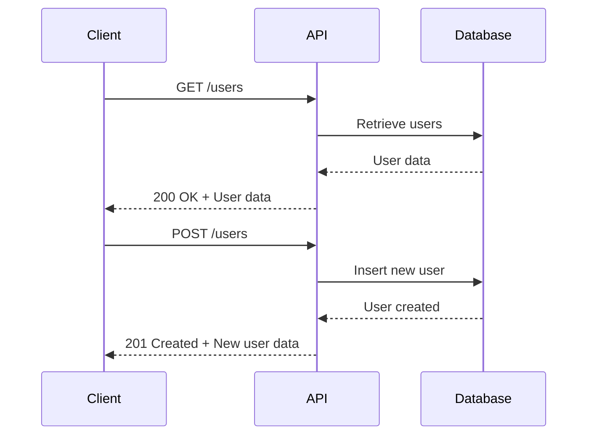

## Introduction to RESTful API Design

RESTful API design has become a foundational pattern in modern web development, facilitating interoperability between systems. REST, which stands for Representational State Transfer, leverages standard HTTP methods to dictate the behavior of a web service. A well-crafted RESTful API can enhance scalability, improve maintenance, and foster a seamless developer experience. Emphasizing resources and stateless interactions, RESTful APIs are inherently scalable and flexible.

## Design Principles

1. **Uniform Interface**: This principle defines a standardized way of interacting with resources. RESTful APIs utilize HTTP methods such as GET, POST, PUT, DELETE, ensuring consistent and clear operations.

2. **Statelessness**: Each request from a client must contain all the information the server needs to fulfill it, maintaining state exclusively on the client-side or through stateless tokens.

3. **Cacheability**: API responses should be explicitly labeled as cacheable or non-cacheable to optimize interactions by reducing the overhead on servers.

4. **Client-Server Separation**: The decoupling of client and server mechanics maintains the independence of client-side development from server-side evolution.

5. **Layered System**: Architectural layers can be added to separate concerns, such as a caching layer to improve performance without affecting other components.

6. **Code on Demand (optional)**: Occasionally, APIs may extend functionality by returned executable code (such as JavaScript), reducing client-side complexity.

## Best Practices

- **Use Nouns, Not Verbs**: Utilize nouns to represent resources, and HTTP methods to specify actions (e.g., `GET /users/` instead of `GET /getUsers`).
- **Resource Nesting**: Apply nesting judiciously to reflect the hierarchy while avoiding deep, excessively nested paths.
- **Versioning**: Implement version control in APIs to ensure backward compatibility, often through URI design (`/v1/`) or custom headers.
- **Error Handling**: Use standard HTTP status codes to indicate success or type of error, and provide detailed JSON error messages.
- **Documentation**: Utilize tools like Swagger or OpenAPI for clear documentation, facilitating understanding and integration.

## Example Code

Here's a simple implementation using Node.js and Express to demonstrate a RESTful API for managing user resources:

```javascript
const express = require('express');
const app = express();
app.use(express.json());

let users = [{ id: 1, name: "John Doe" }];

app.get('/users', (req, res) => {
    res.status(200).json(users);
});

app.post('/users', (req, res) => {
    const newUser = { id: users.length + 1, ...req.body };
    users.push(newUser);
    res.status(201).json(newUser);
});

app.put('/users/:id', (req, res) => {
    const user = users.find(u => u.id === parseInt(req.params.id));
    if (user) {
        Object.assign(user, req.body);
        res.status(200).json(user);
    } else {
        res.status(404).json({ message: "User not found" });
    }
});

app.delete('/users/:id', (req, res) => {
    const index = users.findIndex(u => u.id === parseInt(req.params.id));
    if (index !== -1) {
        users.splice(index, 1);
        res.status(204).end();
    } else {
        res.status(404).json({ message: "User not found" });
    }
});

app.listen(3000, () => {
    console.log("Server running on port 3000");
});
```

## Diagrams

### Basic RESTful API Sequence Diagram



## Related Patterns

- **API Gateway**: Serves as a single entry point for API calls, handling request routing, authentication, and rate limiting.
- **Service Mesh**: Manages service interactions by providing additional functionalities like observability and traffic control.
- **Microservices**: Empowers service independence across an ecosystem of decoupled services.

## Additional Resources

- "RESTful Web APIs" by Leonard Richardson and Mike Amundsen
- REST API Design Toolkits such as Swagger/OpenAPI
- REST Client Tools like Postman for testing and debugging

## Summary

The RESTful API Design pattern forms the backbone of modern web services, enabling seamless integration across diverse systems through established web standards and architectural principles. Understanding and implementing these principles facilitates the development of robust, scalable, and maintainable systems that evolve to meet modern cloud computing demands.
