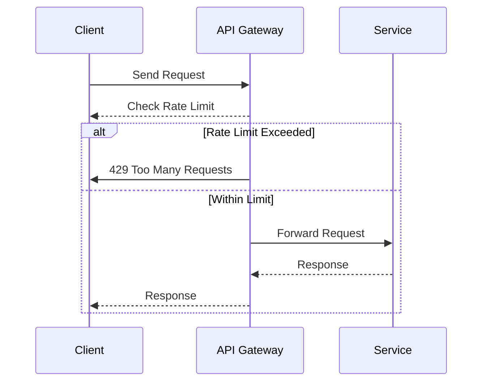

---

linkTitle: "Throttling and Rate Limiting"
title: "Throttling and Rate Limiting: Managing API Traffic"
category: "API Management and Integration Services"
series: "Cloud Computing: Essential Patterns & Practices"
description: "Exploring the design patterns of throttling and rate limiting in cloud computing to effectively manage API traffic, ensure availability, and maintain performance under high load conditions."
categories:
- Cloud Computing
- API Management
- Integration Services
tags:
- Throttling
- Rate Limiting
- API Management
- Cloud Patterns
- Performance
date: 2024-07-07
type: docs

canonical: "https://softwarepatternslexicon.com/18/12/2"
license: "© 2024 Tokenizer Inc. CC BY-NC-SA 4.0"
---

## Introduction to Throttling and Rate Limiting

Throttling and rate limiting are fundamental design patterns within API management and cloud services used to control the rate of requests sent or received by an API. These patterns play critical roles in maintaining system performance and availability, protecting services from being overwhelmed by excessive requests, and ensuring equitable resource distribution among consumers.

### Key Concepts

- **Throttling**: The practice of limiting the number of requests that a user can make in a given amount of time. It often involves queuing, delaying, or discarding requests that exceed the limit.
  
- **Rate Limiting**: Specifically sets thresholds on API calls within a defined period (e.g., 100 requests per minute). It differs slightly from throttling by explicitly restricting the number of operations whereas throttling might include managing the flow of requests once limits are approached.

## Architectural Approaches

### Implementation Strategies

1. **Leaky Bucket**: This model handles request flow similar to a bucket with a hole at the bottom. Requests fill the bucket and are processed at a constant rate. Extra requests overflow when the bucket is full.

2. **Token Bucket**: Assigns a set number of tokens for actions a user can perform. Each request consumes a token, which replenishes at a fixed rate, ideal for burst handling.

3. **Fixed Window**: Counts requests in a time window (e.g., from 00:00 to 01:00), resetting the limit afterwards. It's straightforward but may cause spikes at the edges of windows.

4. **Sliding Window**: Mitigates fixed window issues by continuously recording a usage history, checking request rates over a sliding time period, thus offering smoother limits.

### Best Practices

- **Graceful Degradation**: Incorporate fallback mechanisms that degrade service quality gracefully without full denials of service during high demand.

- **Monitoring and Logging**: Implement detailed logging to track usage patterns and adjust thresholds dynamically based on real-time analytics.

- **Client Notification**: Clearly communicate rate limits and throttling actions via HTTP headers and documentation so clients can manage retries effectively.

## Example Code

Here's an example of implementing a token bucket algorithm in Java:

```java
import java.util.concurrent.ConcurrentHashMap;
import java.util.concurrent.TimeUnit;

public class TokenBucket {
    private final long maxTokens;
    private final long refillRate;
    private long availableTokens;
    private long lastRefillTimestamp;

    public TokenBucket(long maxTokens, long refillRate) {
        this.maxTokens = maxTokens;
        this.refillRate = refillRate;
        this.availableTokens = maxTokens;
        this.lastRefillTimestamp = System.nanoTime();
    }

    public synchronized boolean allowRequest() {
        refill();
        if (availableTokens > 0) {
            availableTokens--;
            return true;
        }
        return false;
    }

    private void refill() {
        long now = System.nanoTime();
        long tokensToAdd = (now - lastRefillTimestamp) * refillRate / TimeUnit.SECONDS.toNanos(1);
        availableTokens = Math.min(maxTokens, availableTokens + tokensToAdd);
        lastRefillTimestamp = now;
    }
}

// Usage
TokenBucket tokenBucket = new TokenBucket(10, 1); // 10 tokens, refill 1 per second
boolean requestAllowed = tokenBucket.allowRequest();
```

## Diagrams

### Sequence Diagram



## Related Patterns

- **Circuit Breaker**: Prevents system overload by detecting and isolating failing endpoints.
  
- **Bulkhead**: Isolates system components to limit fault impact spread and underpin overall system resilience.

## Additional Resources

- [AWS API Gateway Throttling](https://docs.aws.amazon.com/apigateway/latest/developerguide/api-gateway-request-throttling.html)
- [Google Cloud Rate Limiting](https://cloud.google.com/api-gateway/docs/configure-ratelimit)
- [Azure API Management Rate Limit Policies](https://learn.microsoft.com/en-us/azure/api-management/api-management-access-restriction-policies#RateLimitPolicy)

## Summary

Throttling and rate limiting are vital design patterns for managing request traffic in cloud-based applications, ensuring that services remain reliable and perform well even under high demand. By effectively implementing and managing these patterns in conjunction with appropriate monitoring and client communication strategies, service providers can ensure a balanced load and fair resource distribution across users.
