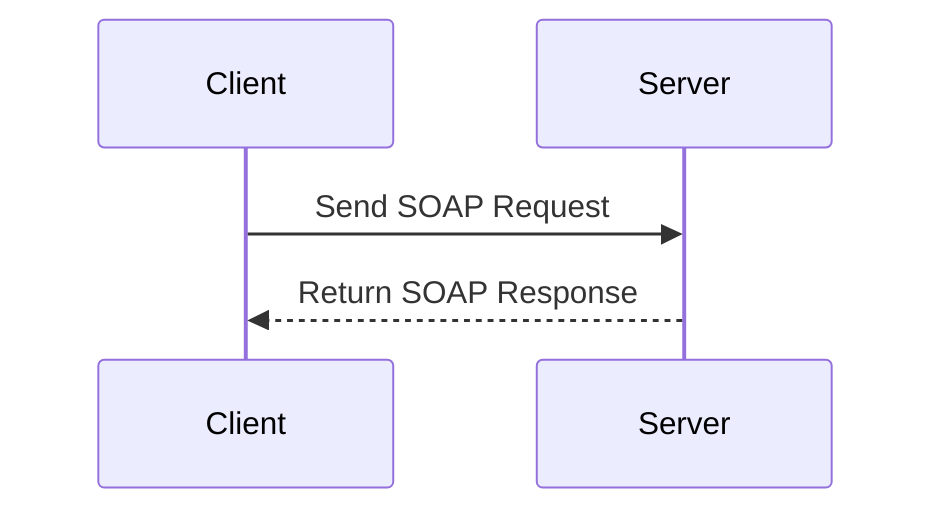

## Introduction to SOAP Service Integration

SOAP (Simple Object Access Protocol) is a protocol used for exchanging structured information in the implementation of web services. It relies on XML for its message format and usually relies on other application layer protocols, primarily HTTP or SMTP, for message negotiation and transmission.

SOAP Service Integration involves incorporating SOAP-based services into your architecture to enable cross-platform communication and interoperability. Despite the growing popularity of RESTful services, SOAP remains a critical component for many enterprise applications due to its robustness in terms of security and reliability within transactional systems.

## Design Pattern Overview

### Architectural Approach

In a typical SOAP Service Integration pattern, the following components are essential:

- **SOAP Client**: Initiates the request by invoking the web service operation.
- **SOAP Server**: Hosts the service endpoint, processes the incoming requests, and sends responses back to the client.
- **WSDL (Web Services Description Language)**: Describes the service's capabilities, inputs, and outputs. Clients use WSDL to understand how to interact with the service.
- **Envelope**: The outermost component of a SOAP message which defines the start and end of the message.
- **Header and Body Elements**: The header is used for metadata and control information such as authentication. The body contains the actual message (payload).

### Best Practices

1. **Secure Transmission**: Use HTTPS to encrypt the data transmitted between client and server.
2. **Error Handling**: Implement comprehensive error handling strategies including retry mechanisms for transient faults.
3. **Logging & Monitoring**: Employ logging and monitoring tools to track service usage and performance.
4. **Loose Coupling**: Ensure that the SOAP services are loosely coupled from the client application to improve flexibility and scalability.
5. **Scalability**: Leverage cloud-based solutions like AWS API Gateway or Azure API Management to scale the soap service infrastructure to meet fluctuating demands.

### Example Code

Here is a basic example of a SOAP Client in Java using the JAX-WS API:

```java
package com.example;

import javax.xml.namespace.QName;
import javax.xml.ws.Service;
import java.net.URL;

public class SOAPClient {
    public static void main(String[] args) throws Exception {
        URL url = new URL("http://localhost:8080/ws/service?wsdl");
        QName qname = new QName("http://example.com/", "MyServiceService");

        Service service = Service.create(url, qname);
        MyService myService = service.getPort(MyService.class);

        System.out.println(myService.getMessage("Hello SOAP!"));
    }
}
```

### Diagram

Below is a simple sequence diagram illustrating a SOAP service interaction:



## Related Patterns

- **RESTful Service Integration**: For scenarios favoring simpler, more stateless communication.
- **API Gateway**: Acting as a single entry point for multiple services, providing management, security, and orchestration.
- **Enterprise Service Bus (ESB)**: Facilitates communication between multiple SOAP web services by acting as a message broker.

## Additional Resources

- [SOAP W3C Recommendation](https://www.w3.org/TR/soap/)
- [Apache CXF - Open-Source Services Framework](https://cxf.apache.org/)
- [Oracle's JAX-WS Guide](https://docs.oracle.com/javase/8/docs/technotes/guides/xml/jax-ws/)

## Summary

SOAP Service Integration remains a prominent pattern in enterprise environments where reliability, security, and transaction compliance are critical. By following best practices such as ensuring secure communication and implementing scalable architecture, organizations can leverage SOAP services effectively in their distributed systems to ensure robust and reliable service communication.
