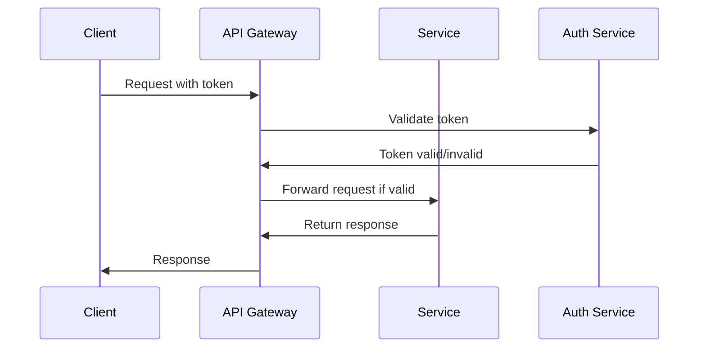

## Introduction

In the evolving landscape of cloud computing and microservices, APIs have emerged as the cornerstone that enables seamless communication between diverse systems. However, with this convenience comes the heightened risk of security breaches. API security best practices are fundamental to protecting both the data in transit and the integrity of the systems involved, preventing unauthorized access and ensuring data privacy.

## Key Concepts

API security encompasses a wide range of strategies and tactics used to protect the accuracy, availability, confidentiality, and integrity of APIs. It involves implementing security controls, monitoring API calls, and ensuring that endpoints are protected against potential threats such as unauthorized access, data breaches, and Distributed Denial of Service (DDoS) attacks.

## Design Patterns and Best Practices

### Use HTTPS

Secure your APIs with HTTPS to encrypt data-in-transit. This prevents eavesdropping attacks and man-in-the-middle attacks.

### Authentication and Authorization

- **OAuth 2.0**: Implement OAuth 2.0 to delegate authentication and authorization. OAuth provides token-based authentication which ensures that only authorized users can access your APIs.
- **JWT (JSON Web Tokens)**: Utilize JWT for securely transmitting information between parties as a JSON object. The tokens are signed using a cryptographic algorithm to ensure integrity.

### Rate Limiting and Throttling

Implement rate limiting to control the number of requests a user can make to your API over a certain period. This helps in mitigating abuse and DDoS attacks.

### Input Validation

Ensure strict validation of input parameters to protect against injection attacks. Use parameterized queries and validate fields such as headers, query parameters, and request body.

### API Gateway

Employ an API Gateway as it acts as an intermediary, offering additional security layers and features such as request validation, authentication, logging, and caching.

### Auditing and Logging

Maintain comprehensive logs of all API requests and employ auditing mechanisms to monitor and review suspicious activities and potential security breaches.

## Example Code

Here is a simplified example of how you can secure an API using Express.js in Node.js with JWT:

```javascript
const express = require('express');
const jwt = require('jsonwebtoken');

const app = express();
const PORT = 3000;

// Middleware to check JWT token
function authenticateJWT(req, res, next) {
    const token = req.header('Authorization');
    if (token) {
        jwt.verify(token, 'your_jwt_secret', (err, user) => {
            if (err) {
                return res.sendStatus(403);
            }
            req.user = user;
            next();
        });
    } else {
        res.sendStatus(401);
    }
}

app.get('/secure-endpoint', authenticateJWT, (req, res) => {
    res.json({
        message: 'This is a secured endpoint'
    });
});

app.listen(PORT, () => {
    console.log(`Server is running on port ${PORT}`);
});
```

## Diagrams

Let's visualize how an API Gateway functions as the central point of API management and security using a UML Sequence Diagram.



## Related Patterns

- **API Gateway Pattern**: Centralized entry point for all client requests to microservices.
- **Circuit Breaker Pattern**: Provides stability and prevents failures from propagating throughout the system.
- **Service Mesh**: Offers features like traffic management, security, and observability in microservices environments.

## Additional Resources

- [OAuth 2.0 Specification](https://tools.ietf.org/html/rfc6749)
- [RFC 7519: JSON Web Token (JWT)](https://tools.ietf.org/html/rfc7519)
- [OWASP API Security Top 10](https://owasp.org/www-project-api-security/)

## Summary

API security is an essential component of a robust cloud-based architecture. By applying best practices like HTTPS, token-based authentication, rate limiting, and leveraging an API Gateway, you can greatly enhance the security posture of your APIs, ensuring that data remains secure during communication between disparate systems.
