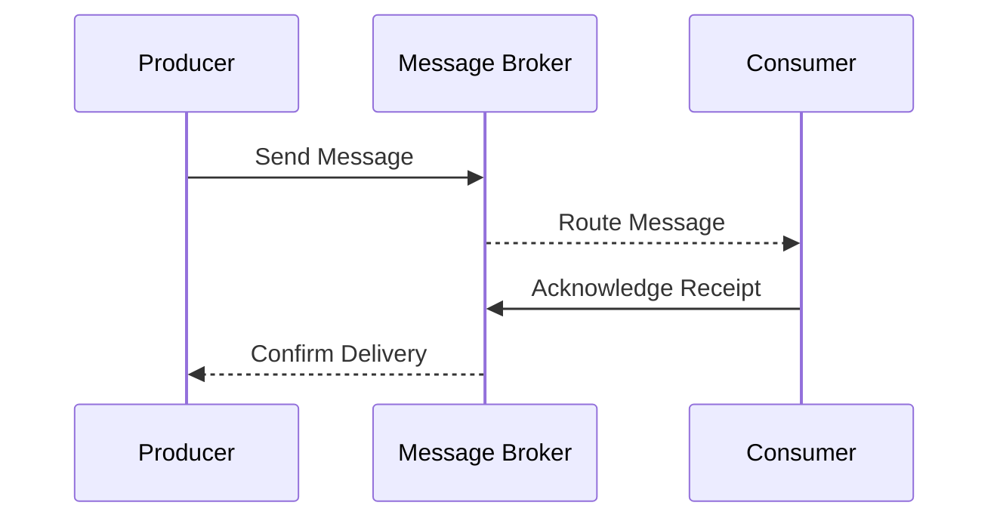

## Overview

Message Brokers are critical in cloud-based integration patterns that enable seamless communication between disparate systems. They decouple the sending and receiving components, allowing systems to interact without requiring direct communication channels or shared data models. This design pattern supports asynchronous processing, reliability, fault tolerance, and scalability in distributed environments.

## Design Pattern Description

A Message Broker acts as an intermediary that manages messages sent by producers before delivering them to the appropriate consumers. It significantly simplifies the integration strategy in complex architectures by performing tasks such as message transformations, storage, and routing according to configurable logic.

### Key Concepts

- **Decoupling:** Separates message producers from consumers, facilitating independent system evolution without impacting interfacing systems.
- **Asynchronous Communication:** Message brokers enable asynchronous messaging, allowing components to operate without waiting for responses.
- **Reliability and Fault Tolerance:** Brokers ensure message delivery and can retry transmissions in case of failures.
- **Scalability:** Can handle an increasing number of messages and system components by distributing load efficiently across resources.

## Architectural Approaches

### 1. Publish-Subscribe Model

In this model, messages are sent to a topic rather than a specific consumer, allowing multiple subscribers to receive copies of the message. This is useful for event-driven architectures.

### 2. Point-to-Point Model

Here, the message broker directs messages from a producer to a single consumer in a queue. This is often used where only one consumer should process a particular piece of data.

### 3. Hybrid Models

Mixing models to suit specific needs; selectively using publish-subscribe for notifications and point-to-point for direct orders.

## Best Practices

- **Idempotency:** Ensure operations can handle repeated processing without side effects.
- **Message Consistency:** Maintain consistent message formats and schema validation for interoperability.
- **Monitoring and Logging:** Use tools for real-time monitoring and logging to track message flows and broker performance.
- **Security:** Implement robust authentication, authorization, and encryption protocols to protect data in transit.

## Example Code: Implementing a Message Broker Using RabbitMQ

```java
import com.rabbitmq.client.*;

public class MessageBrokerExample {

    private final static String QUEUE_NAME = "exampleQueue";

    public static void main(String[] argv) throws Exception {
        ConnectionFactory factory = new ConnectionFactory();
        factory.setHost("localhost");
        try (Connection connection = factory.newConnection(); 
             Channel channel = connection.createChannel()) {
            channel.queueDeclare(QUEUE_NAME, false, false, false, null);

            String message = "Hello, World!";
            channel.basicPublish("", QUEUE_NAME, null, message.getBytes());
            System.out.println(" [x] Sent '" + message + "'");

            channel.basicConsume(QUEUE_NAME, true, new DefaultConsumer(channel) {
                @Override
                public void handleDelivery(String consumerTag, Envelope envelope, AMQP.BasicProperties properties, byte[] body) throws IOException {
                    String receivedMessage = new String(body, "UTF-8");
                    System.out.println(" [x] Received '" + receivedMessage + "'");
                }
            });
        }
    }
}
```

## Diagram



## Related Patterns

- **Event Sourcing:** In conjunction with brokers, captures state changes as event logs for future replay or auditing.
- **CQRS (Command Query Responsibility Segregation):** Often paired with message brokers to separate read and write operations through events.
- **API Gateway:** Can integrate with brokers for routing API calls and messages in a cloud environment.

## Additional Resources

- [Enterprise Integration Patterns: Designing, Building, and Deploying Messaging Solutions](https://www.enterpriseintegrationpatterns.com/)
- [RabbitMQ Documentation](https://www.rabbitmq.com/documentation.html)
- [AWS SQS (Simple Queue Service)](https://aws.amazon.com/sqs/)

## Summary

Message Brokers are integral to modern cloud architectures, offering a resilient and flexible means to connect disparate systems. By adopting message brokering in your integration strategy, systems can scale and adapt to evolving business needs while maintaining robustness and high availability. Such patterns enable organizations to construct seamlessly interconnected applications, fostering agility and innovation.
