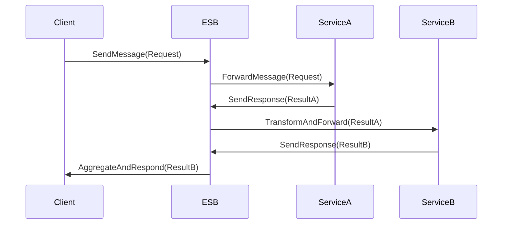

---

linkTitle: "Enterprise Service Bus (ESB) Utilization"
title: "Enterprise Service Bus (ESB) Utilization: Enhancing System Integration"
category: "API Management and Integration Services"
series: "Cloud Computing: Essential Patterns & Practices"
description: "Explore the Enterprise Service Bus (ESB) pattern, a key architecture in API management and system integration services, focusing on its design, implementation advantages, and best practices for seamless data flow within distributed applications."
categories:
- Integration
- Architecture
- Cloud Computing
tags:
- ESB
- API Management
- Integration Services
- Distributed Systems
- Cloud Architecture
date: 2023-10-20
type: docs

canonical: "https://softwarepatternslexicon.com/18/12/23"
license: "© 2024 Tokenizer Inc. CC BY-NC-SA 4.0"
---

## Introduction

The **Enterprise Service Bus (ESB) Utilization** pattern is pivotal in integrating and managing the communication between disparate applications in a scalable and efficient manner. It acts as a middleware solution that enables different systems to interact with each other by offering services such as message routing, data transformation, and protocol conversion.

## Design Pattern Explanation

### Architectural Approach

ESBs facilitate a communication layer across different services by using a centralized bus architecture. This approach promotes a unified means to coordinate the interaction among multiple services using a variety of communication protocols.

### Key Components
- **Message Router:** Directs messages to the appropriate services based on content or headers.
- **Message Transformer:** Alters data to match the receiving service’s format and structure.
- **Service Locator:** Maintains a directory of services and their endpoints.
- **Protocol Converter:** Translates messages between different communication protocols to ensure interoperability.

### Diagram

Below is UML Sequence diagram illustrating the ESB Utilization pattern:



## Best Practices

- **Ensure Loose Coupling:** Design services to be independent, minimizing dependencies directly on other services.
- **Implement Robust Error Handling**: Ensure that the ESB can handle failure gracefully and retry operations as needed.
- **Leverage Message Queues**: Utilize queues to buffer messages and manage workloads, increasing the reliability and scalability of the ESB.
- **Monitor and Scale Dynamically**: Integrate comprehensive logging and monitoring schemes to adapt to changing loads.

## Example Code

Here's a simple Java example using a fictional ESB library to demonstrate message transformation and routing:

```java
import com.example.esb.*;

public class ESBExample {
    public static void main(String[] args) {
        ESB esb = new ESB();

        esb.addRoute("ServiceA", (message) -> {
            return message.transform().toServiceType("ServiceBType");
        });

        esb.addServiceLocator("ServiceA", "http://service-a.example.com");
        esb.addServiceLocator("ServiceB", "http://service-b.example.com");

        Message response = esb.send("ServiceA", new Message("RequestData"));
        System.out.println("Response from ServiceB: " + response.getBody());
    }
}
```

## Related Patterns

- **API Gateway**: Acts as a single entry point for managing APIs but focuses more on HTTP-based interactions.
- **Saga Pattern**: Coordinates complex transactions involving multiple services, focusing on data consistency.

## Additional Resources

- [Enterprise Integration Patterns by Gregor Hohpe](https://www.enterpriseintegrationpatterns.com/)
- [Building Microservices by Sam Newman](https://samnewman.io/r/books/building_microservices/)

## Summary

An ESB facilitates efficient and scalable integration within an enterprise ecosystem by connecting disparate systems through a central bus. By adopting this pattern, organizations can ensure smooth communications, enhanced service orchestration, and maintain system interoperability. This pattern is particularly beneficial in cloud computing environments, where flexibility and adaptability are paramount.
