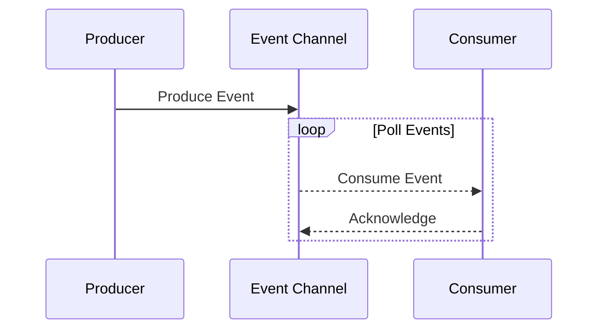

## Overview

**Event-Driven Integration** is a design pattern that enables different software components and services to interact with each other through the production and consumption of events. Events represent significant occurrences or changes in state within a system, which other components can consume to perform necessary actions. This pattern is an essential piece of the puzzle for building responsive, scalable, and resilient distributed systems.

## Detailed Explanation

In a traditional request/response model, synchronous communication often creates bottlenecks and reduces system responsiveness. In contrast, event-driven architecture promotes asynchronous communication where an event producer sends an event without waiting for a direct response from an event consumer. This decoupling of producers and consumers enhances the scalability and flexibility of the system.

### Architectural Components

#### 1. **Event Producers**
Event producers generate events that reflect changes or significant occurrences. These can be microservices, user actions, or system events like file uploads.

#### 2. **Event Consumers**
Event consumers subscribe to events of interest and perform actions accordingly. They can react or transform events, triggering further processes in the system.

#### 3. **Event Channels**
These are the pipelines through which events travel. Typically implemented using message brokers like Apache Kafka, RabbitMQ, or Amazon SNS, they ensure reliable event delivery.

#### 4. **Event Processing**
Event processing can include filtering, transformation, aggregation, or any computational tasks that must be applied to the events as they flow from producers to consumers.

## Best Practices

- **Design with Decoupling in Mind**: Ensure that the event producers and consumers are loosely coupled. This allows independent scaling and evolution of services.
- **Use Idempotent Consumers**: Consumers should handle duplicate events gracefully, ensuring operations are idempotent.
- **Employ Event Sourcing**: Store events for auditing purposes and system state reconstruction if required.
- **Ensure High Availability**: Deploy robust message brokers with high availability and fault tolerance configurations.

## Example Code

Here's an example of a simple event producer and consumer using Apache Kafka in Java:

```java
// Event Producer
Properties producerProperties = new Properties();
producerProperties.put("bootstrap.servers", "localhost:9092");
producerProperties.put("key.serializer", "org.apache.kafka.common.serialization.StringSerializer");
producerProperties.put("value.serializer", "org.apache.kafka.common.serialization.StringSerializer");

KafkaProducer<String, String> producer = new KafkaProducer<>(producerProperties);
ProducerRecord<String, String> record = new ProducerRecord<>("events_topic", "key", "event_value");
producer.send(record);
producer.close();

// Event Consumer
Properties consumerProperties = new Properties();
consumerProperties.put("bootstrap.servers", "localhost:9092");
consumerProperties.put("group.id", "event_consumers");
consumerProperties.put("key.deserializer", "org.apache.kafka.common.serialization.StringDeserializer");
consumerProperties.put("value.deserializer", "org.apache.kafka.common.serialization.StringDeserializer");

KafkaConsumer<String, String> consumer = new KafkaConsumer<>(consumerProperties);
consumer.subscribe(Collections.singletonList("events_topic"));

while (true) {
    ConsumerRecords<String, String> records = consumer.poll(Duration.ofMillis(100));
    for (ConsumerRecord<String, String> record : records) {
        System.out.println("Received event: " + record.value());
    }
}
```

## UML Diagram

Below is UML Sequence diagram illustrating the sequence of events among producers, channels, and consumers:



## Related Patterns

- **Command Query Responsibility Segregation (CQRS)**: Separates the read and write operations to handle large-scale systems effectively.
- **Event Sourcing**: Stores state changes as a sequence of events, allowing reconstruction of the current state.
- **Publisher-Subscriber**: Allows multiple subscribers to receive updates on topics of interest from publishers.

## Additional Resources

- [Apache Kafka Documentation](https://kafka.apache.org/documentation/)
- [Amazon SNS User Guide](https://docs.aws.amazon.com/sns/latest/dg/welcome.html)
- [Google Cloud Pub/Sub Documentation](https://cloud.google.com/pubsub/docs)

## Final Summary

Event-Driven Integration is a powerful pattern that enables the decoupling of systems and components in a scalable and resilient manner using asynchronous communication. By leveraging events as the primary mode of data exchange, systems can be more responsive, fault-tolerant, and capable of handling complex business processes. As cloud technologies advance, event-driven architectures will continue to play a pivotal role in modern software development.
