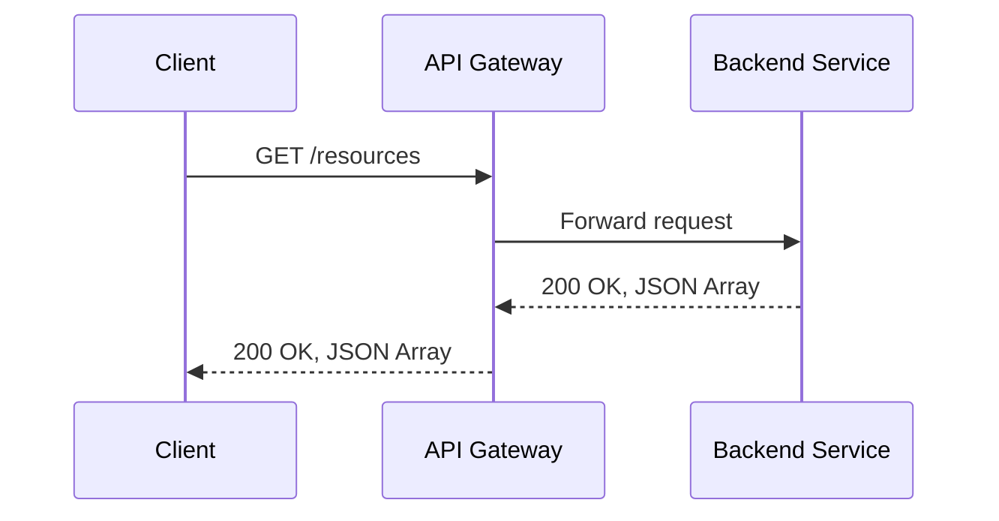

API Lifecycle Management is a crucial practice in modern software development that involves overseeing the entire journey of an API from conception, design, and implementation through to versioning, retirement, and deprecation. It ensures that APIs meet business goals while maintaining technical excellence and reliability over time.

## Design Patterns and Architectural Approaches

### 1. API Design and Prototyping
- **Usage of OpenAPI and Swagger**: Designing and documenting APIs using OpenAPI specifications to ensure clear contracts between services.
- *Example*: Define your API paths, parameters, and response types upfront to align with stakeholders.

### 2. API Security and Authentication
- **OAuth2 and API Gateways**: Employing authentication protocols to secure sensitive endpoints.
- *Example*: Utilize OAuth2 flows for securing APIs with different user roles and permissions.

### 3. API Deployment and Versioning
- **Canary Releases and Version Control**: Implementing controlled releases to test and deploy API updates safely.
- *Example*: Deploy new API versions alongside existing ones and route a small percentage of traffic to test.

### 4. API Monitoring and Analytics
- **Performance Monitoring Tools**: Leveraging tools like Prometheus and Grafana to track API performance and usage.
- *Example*: Set up dashboards that display real-time API request latencies and error rates.

### 5. API Documentation and Developer Portal
- **Dynamic Documentation Tools**: Use tools like Swagger UI to auto-generate and update API documentation as new changes are made.
- *Example*: Keep your developer portal synchronized with your API's latest documentation to facilitate ease of integration.

## Paradigms and Best Practices

- **Continuous Integration and Continuous Deployment (CI/CD)**: Integrate your API lifecycle with CI/CD practices to automate testing and deployment.
- **API Rate Limiting and Throttling**: Implement these to maintain performance and protect against abuse.
- **Use of Microservices**: Design APIs as independent microservices for modularity and scalability.

## Example Code Snippet

Below is a simple implementation of setting up a RESTful API using Node.js and Express, illustrating basic API setup and routing:

```javascript
const express = require('express');
const api = express();

api.get('/resources', (req, res) => {
  res.send('List of resources');
});

api.post('/resources', (req, res) => {
  res.send('Resource created');
});

api.listen(3000, () => {
  console.log('API is running on port 3000');
});
```

## Diagrams

### Sequence Diagram



## Related Patterns

- **Circuit Breaker Pattern**: Protects APIs from cascading failures by stopping repeated attempts.
- **API Gateway Pattern**: Facilitates API management by routing, securing, and aggregating services.

## Additional Resources

- [OpenAPI Initiative](https://www.openapis.org/)
- [OAuth2 Specifications](https://oauth.net/2/)
- [Prometheus Monitoring](https://prometheus.io/)
- [API Developer Portal Best Practices](https://example.com/developer-portals-best-practices)

## Final Summary

API Lifecycle Management is essential to the modern API-driven application infrastructure. By employing best practices such as secure authentication, meticulous documentation, proactive monitoring, and iterative deployment, organizations can ensure their APIs are scalable, reliable, and secure. This pattern addresses integration challenges and enhances developer productivity, ultimately leading to more robust and agile service architectures.
