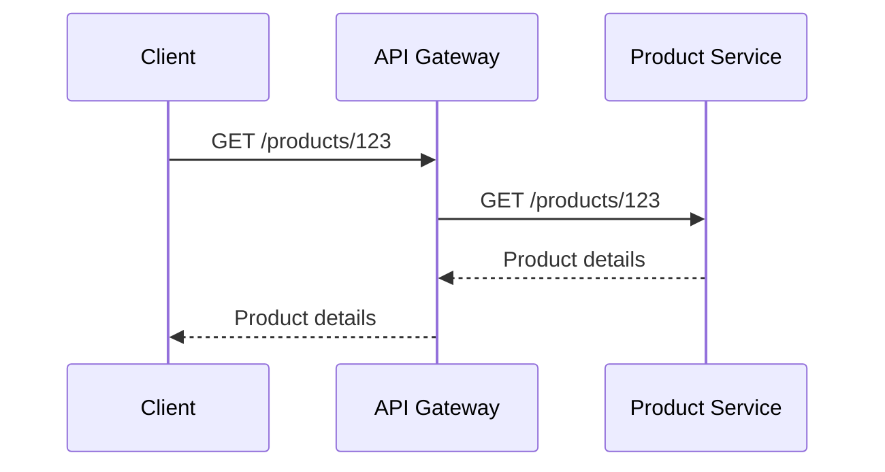

## Microservices API Management

Microservices API Management is a critical design pattern in cloud architecture aimed at efficiently handling the interactions, orchestration, security, and analytics of APIs within a microservices-based application. This pattern ensures that APIs, as the connective tissue between microservices and external systems, remain secure, scalable, and easy to manage.

### Detailed Explanation

In a microservices architecture, applications are composed of small, autonomous services that communicate over a network, typically using HTTP/REST or similar protocols. Each microservice exposes a set of APIs (Application Programming Interfaces) that define how other services and client applications interact with it. As the number of APIs grows, managing them effectively becomes crucial.

#### Key Components of API Management

- **API Gateway:** The API Gateway is a focal point for handling all incoming requests. It abstracts the underlying microservices, offers a single entry point, and can enforce authentication and rate limiting.

- **Security:** API management involves implementing robust authentication, authorization, and encryption mechanisms to secure API endpoints. This typically includes OAuth, JWT, or API keys.

- **Documentation:** Providing comprehensive and up-to-date documentation for APIs is essential for developers to understand how to use them effectively.

- **Monitoring and Analytics:** Capturing metrics and logs associated with API usage helps in understanding usage patterns and performance issues, aiding in optimization and scaling efforts.

- **Rate Limiting and Throttling:** It is essential to control the usage of APIs to prevent abuse and ensure fair distribution of resources among consumers.

- **Transformation and Enrichment:** APIs often require data transformation, adaptation, and enrichment to ensure that requests and responses are handled in a format suitable for the client or backend systems.

### Best Practices

- **Decentralized Governance:** Allow teams to own their APIs while adhering to organizational standards and security policies.

- **Versioning:** Implement a robust versioning strategy to ensure that changes to APIs do not break existing clients.

- **API Gateway Pattern:** Utilize an API gateway to aggregate, transform, and route requests between clients and backend services.

- **Design for Resilience:** Implement circuit breakers, retries, and fallbacks to handle failures gracefully.

- **Integrate with CI/CD:** Automate the deployment and versioning of APIs through continuous integration and deployment pipelines.

### Example Code

Here's a simple example using Java and Spring Boot to create a RESTful API endpoint:

```java
@RestController
@RequestMapping("/api/v1")
public class ProductController {

    @GetMapping("/products/{id}")
    public ResponseEntity<Product> getProduct(@PathVariable Long id) {
        Product product = productService.findById(id);
        return product != null ? ResponseEntity.ok(product) : ResponseEntity.notFound().build();
    }
}
```

### Diagram

Here is sequence diagram showing API management in a microservices environment:



### Related Patterns

- **Service Mesh:** Complements API management by managing service-to-service communication within a microservices architecture.
  
- **Backend for Frontend (BFF):** Tailors APIs to specific client needs, avoiding overloading a general API gateway with too many responsibilities.

- **Circuit Breaker:** Protects microservices from cascading failures and improves resilience.

### Additional Resources

- [Microservices at Netflix: Lessons for Architectural Designers](https://www.infoq.com/articles/microservices-at-netflix-architectural-best-practices/)
- [AWS API Gateway](https://aws.amazon.com/api-gateway/)
- [Google Cloud API Gateway](https://cloud.google.com/api-gateway)
- [Spring Cloud Gateway](https://spring.io/projects/spring-cloud-gateway)

### Summary

Microservices API Management is a pivotal pattern in ensuring the smooth operation and scaling of microservices architectures. By leveraging an API Gateway, enforcing security measures, documenting APIs thoroughly, and integrating monitoring tools, organizations can effectively manage APIs to better meet consumer demands and business objectives.
