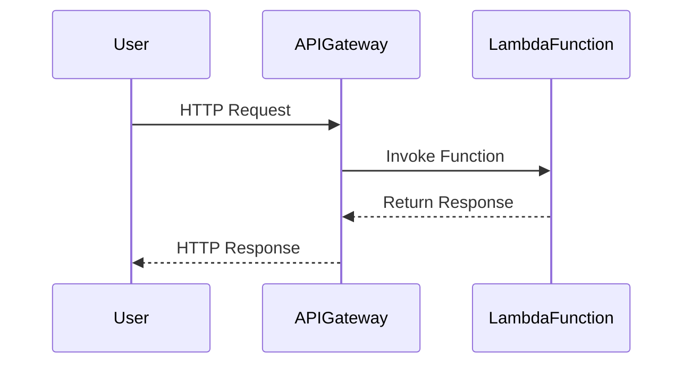

## Introduction

In the realm of cloud computing, **Serverless APIs** represent a transformative approach that shifts the focus from infrastructure management to pure application development. By leveraging cloud providers' capabilities to auto-scale, manage, and execute server functions, developers can focus on building robust APIs without the overhead of server administration. This pattern is particularly beneficial in creating scalable, cost-effective, and event-driven applications.

## Design Patterns

1. **Event-Driven Instrumentation**:
   - Events trigger functions that automatically scale to meet dynamic workload demands.
   - Example: AWS Lambda functions that interface with API Gateway to handle RESTful API requests.

2. **Microservice Choreography**:
   - Serverless functions act as discrete microservices performing specific tasks.
   - Use case: Backend-for-frontend patterns where individual functions cater to specific client needs.

3. **Function Composition**:
   - Orchestrate multiple serverless functions using patterns like Function as a Service (FaaS).
   - Sequence complex workflows from simple stateless functions using platforms such as Azure Durable Functions.

## Architectural Approaches

- **Stateless Execution**:
  - Each function invocation is independent, aiding in scalability and fault tolerance.
  - Design for idempotency to handle retries seamlessly.

- **Fine-Grained Authorization**:
  - Implement authentication mechanisms using API Gateway features or external identity services (e.g., AWS Cognito, Auth0).

- **Cold Start Mitigation**:
  - Minimize latency by optimizing execution environments, leveraging provisioned concurrency in AWS Lambda.

## Best Practices

- Emphasize **function granularity**; smaller pieces mean better scalability and simpler maintenance.
- Employ **API versioning** and governance to manage the evolution of APIs over time seamlessly.
- Utilize **blue-green deployments** for rolling out updates without service interruption.
- Implement **logging and monitoring** via tools like AWS CloudWatch or Azure Monitor to gain insights into function performance and error tracking.

## Example Code

Here's a basic example of a serverless function in AWS Lambda using JavaScript:

```javascript
exports.handler = async (event) => {
    console.log('Received event:', JSON.stringify(event, null, 2));
    const response = {
        statusCode: 200,
        body: JSON.stringify({ message: 'Hello from Serverless API!' }),
    };
    return response;
};
```

## Diagrams

### Sequence Diagram of a Serverless API Call



## Related Patterns

- **CQRS (Command Query Responsibility Segregation)**: Separate data modification from retrieval processes, often utilized with serverless to enhance efficiency.
  
- **API Gateway Pattern**: Centralized API management offering routing, security, and composition, serving as an entry point for client requests into a serverless architecture.

## Additional Resources

- [Serverless Framework Documentation](https://www.serverless.com/framework/docs/)
- [AWS Lambda Best Practices](https://docs.aws.amazon.com/lambda/latest/dg/best-practices.html)
- [Azure Functions Overview](https://docs.microsoft.com/en-us/azure/azure-functions/functions-overview)

## Summary

Serverless APIs present a paradigm shift in how APIs are built and managed, eliminating the need for server upkeep while enhancing scalability and cost efficiency. By following best practices such as employing event-driven designs and leveraging the inherent strengths of cloud-native architectures, organizations can achieve robust API deployments capable of scaling with demand without compromising on performance or cost-effectiveness. This pattern is a compelling choice for modern cloud-based application ecosystems, enabling rapid development cycles and simplified operational models.
