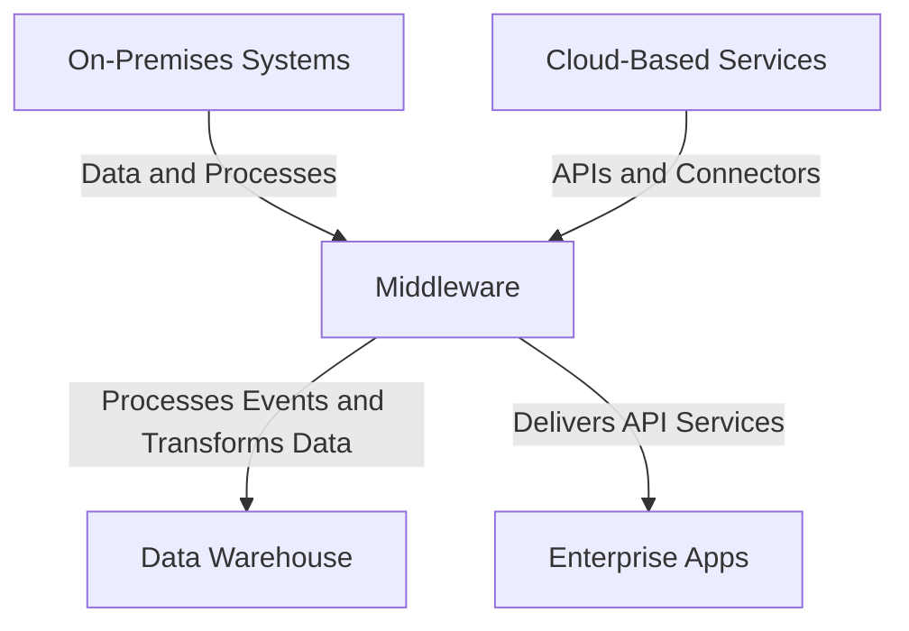

## Introduction

In the evolving landscape of enterprise IT infrastructure, **Hybrid Integration Platforms (HIPs)** are a pivotal design pattern that addresses the need for seamless integration between cloud-based services and on-premise systems. This pattern enables organizations to leverage the benefits of cloud computing while maintaining the integrity and control of their existing legacy systems.

## Design Pattern Overview

Hybrid Integration Platforms facilitate efficient data exchange and business process automation across disparate environments. They function by using middleware solutions that encompass API management, data integration, application integration, and lifecycle management.

### Key Components:

- **API Management:** Centralizes API deployment and monitoring. API gateways in HIPs manage requests flowing between on-premises and cloud services.
- **Data Integration:** Ensures smooth data flow and transformation between systems, often using ETL (Extract, Transform, Load) processes.
- **Application Integration:** Bridges the gap between different applications to ensure synchronized operations and consistent data updates.
- **Security and Compliance:** Implements robust security measures and compliance adherence for data protection.

## Architectural Approaches

### Middleware-Centric

Middleware solutions such as IBM App Connect, MuleSoft Anypoint Platform, and Red Hat's Fuse are often used to mediate transactions, manage data flow, and ensure operational consistency across platforms. These tools provide pre-packaged connectors and transform data in-flight to match schema expectations between systems.

### Event-Driven Architecture

Utilizing event-driven patterns like publish/subscribe and message queues ensures real-time data synchronization. Platforms like Apache Kafka enable event-streaming, making it feasible to process and react to data events as they occur.

### Microservices Approach

Decoupling integration tasks into microservices enhances scalability and maintainability. Independent, modular services interact through RESTful APIs or asynchronous messaging, facilitating easier upgrades and troubleshooting.

### Example Code

Below is a simplified example of using a middleware platform like MuleSoft for integrating Salesforce (cloud) with SAP (on-premise):

```xml
<mule xmlns="http://www.mulesoft.org/schema/mule/core" 
      xmlns:xsi="http://www.w3.org/2001/XMLSchema-instance"
      xmlns:salesforce="http://www.mulesoft.org/schema/mule/salesforce"
      xmlns:sap="http://www.mulesoft.org/schema/mule/sap">
    <flow name="SalesforceToSAPFlow">
        <salesforce:config name="SalesforceConnector"/>
        <sap:config name="SAPConnector"/>
        
        <salesforce:query config-ref="SalesforceConnector" query="SELECT Id, Name FROM Account"/>
        <logger message="Received Salesforce Accounts: #[payload]" level="INFO"/>
        
        <sap:invoke-bapi convolve="${sap:bapiName}" config-ref="SAPConnector">
            <sap:bapi-parameter key="Customers" value="#[payload]"/>
        </sap:invoke-bapi>

        <logger message="SAP BAPI Invocation Result: #[payload]" level="INFO"/>
    </flow>
</mule>
```

## Diagrams

### Architecture Diagram



## Related Patterns

- **API Gateway Pattern:** Manages and routes API requests, essential for securing and orchestrating APIs in a hybrid environment.
- **Service Mesh Pattern:** Offers traffic management, authentication, and monitoring, providing systematic communication across microservices.
- **Event-Driven Architecture Pattern:** Ensures systems remain reactive and adaptable by processing real-time data streams.

## Best Practices

- **Governance and Monitoring:** Implement centralized monitoring and logging to manage integrations and troubleshoot effectively.
- **Scalability:** Design integrations that can scale as the volume of data or number of services rise.
- **Security First:** Utilize encryption, OAuth, and other security measures to protect data in transit and at rest.
- **Compliance Management:** Regular audits to ensure all interfaces adhere to necessary compliance standards.

## Additional Resources

- [IBM Hybrid Cloud](https://www.ibm.com/cloud/hybrid-cloud)
- [MuleSoft Anypoint Platform](https://www.mulesoft.com/platform/enterprise-integration)
- [Red Hat Fuse](https://www.redhat.com/en/technologies/jboss-middleware/fuse)

## Summary

Hybrid Integration Platforms are foundational in modernizing enterprise IT and facilitating the digital transformation journey. They enable businesses to integrate seamlessly, providing a unified view and control over disparate systems. By adopting HIPs, enterprises can maximize cloud benefits while preserving existing investments, ensuring agility, and scaling capabilities to meet ever-evolving business needs.
