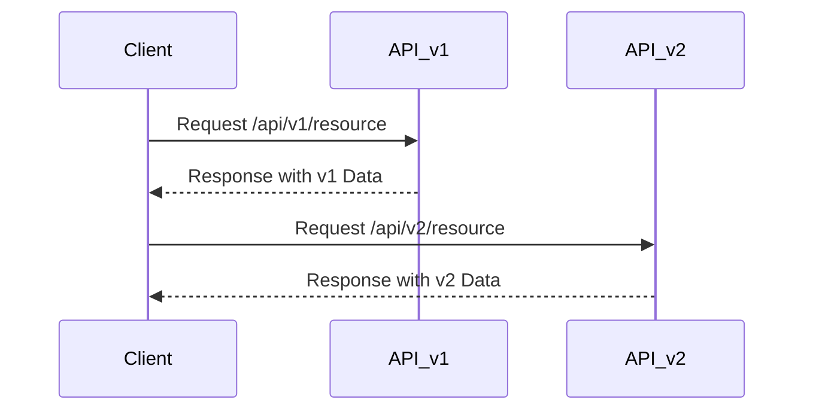

## Introduction

As software systems evolve, so do the APIs that enable integration and communication between various components. Effective API versioning strategies are crucial to accommodate changes without disrupting existing consumers. Whether your APIs are RESTful, GraphQL, or follow other paradigms, versioning is key for maintaining stability while allowing for evolution.

## Design Pattern Explanation

API versioning addresses the lifecycle management of APIs. It's about controlling how API changes (new features or deprecated endpoints) are introduced as new versions, ensuring existing clients can continue to operate without immediate changes. 

### Key Concepts

- **Backward Compatibility**: Maintaining support for earlier API versions even as new versions are introduced.
- **Deprecation Policy**: Procedures for notifying consumers before retiring an older API version.
- **Semantic Versioning**: A versioning method using MAJOR.MINOR.PATCH format, where:
  - MAJOR versions introduce incompatible API changes.
  - MINOR versions add new backward-compatible functionality.
  - PATCH versions make backward-compatible bug fixes.

## Architectural Approaches

### URI Versioning

One common strategy is to include the version number in the endpoint URI, such as:

```
/api/v1/resource
```

This method clearly defines which version is being accessed, making it visible and explicit.

### Header Versioning

Another approach uses custom headers to specify the API version, keeping URLs clean and consistent:

```
GET /resource
Headers: 
  Accept-Version: v1
```

### Query String Versioning

Embedding version information as query parameters is another approach:

```
/resource?version=1
```

This can be more flexible but may not be as clear or RESTful as URI versioning.

### Content Negotiation

Leveraging HTTP's content negotiation capabilities, API versions can be specified using `Accept` headers with MIME types:

```
GET /resource
Headers:
  Accept: application/vnd.yourcompany.v1+json
```

## Best Practices

- **Early and Explicit Versioning**: Begin API design with versioning in mind, even if you have only one version at launch.
- **Deprecation Notices**: Clearly document and communicate deprecation policies.
- **Consistent Release Cycles**: Regularity helps consumers manage expectations and plan for updates.

## Example Code

Consider the following basic example of URI versioning using a Node.js and Express-based API:

```javascript
const express = require('express');
const app = express();

// v1 routes
app.get('/api/v1/resource', (req, res) => {
  res.json({ message: 'Resource from v1' });
});

// v2 routes
app.get('/api/v2/resource', (req, res) => {
  res.json({ message: 'Resource from v2', features: ['newFeature'] });
});

app.listen(3000, () => {
  console.log('API is running on port 3000');
});
```

## Diagrams

### API Versioning Strategy Sequence Diagram



## Related Patterns

- **Backward Compatibility Pattern**: Ensures that older versions remain operable despite the introduction of new versions.
- **Enterprise Integration Pattern**: For designing complex integrations across systems that require versioned APIs.
- **Deprecation Management**: Strategies and notifications involved in API lifecycle management.

## Additional Resources

- [API Versioning Best Practices](https://apiguide.com/best-practices/versioning/)
- [REST API Versioning](https://restfulapi.net/versioning/)
- [GraphQL Versioning Strategies](https://graphql.org/learn/best-practices/#versioning)

## Final Summary

API Versioning Strategies are a fundamental part of successful API management and lifecycle planning. While there are several strategies available, the choice often depends on the specific project's needs, constraints, and external dependencies. It is critical to balance innovation with backward compatibility to ensure continuity and maintainability for consumers and integrators alike. Implementing a robust versioning strategy helps in setting clear expectations and providing a smoother experience as APIs evolve.
