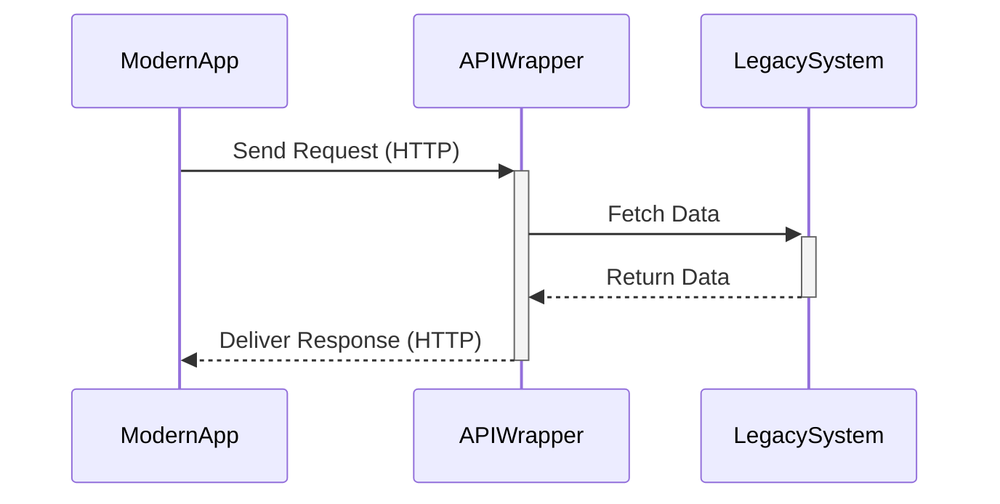

Legacy systems often form the backbone of enterprise IT infrastructure. These systems, although reliable and fundamental, can pose significant challenges when organizations attempt to modernize their operations using cloud-based technologies. The **Legacy System Integration** pattern provides strategies for enabling these older systems to communicate effectively with modern applications, ensuring data consistency and functional interoperability.

## Design Pattern Explanation

### Architectural Approaches

Legacy System Integration involves various architectural approaches to ensure that old systems can coexist and interact with newer, cloud-based solutions. The primary approaches include:

1. **Wrapper Pattern**: Encapsulate legacy systems with an API layer, allowing modern applications to interact with these systems seamlessly.
2. **Data Streaming and Batch Processing**: Enable real-time or scheduled data processing for systems that require constant data updates or periodic reports.
3. **Message-Oriented Middleware (MOM)**: Utilize messaging queues and topics to facilitate communication between legacy systems and cloud applications.
4. **Service-Oriented Architecture (SOA)**: Break down system functionalities into services with standard interfaces for integration.

### Best Practices

- **API-Centric Designs**: Employ RESTful or gRPC APIs to abstract the complexity of legacy systems.
- **Data Transformation Tools**: Use ETL (Extract, Transform, Load) tools to convert data formats between systems.
- **Security and Compliance**: Maintain rigorous security protocols and ensure compliance with industry standards during integration.
- **Scalability and Performance Tuning**: Design integrations to handle varied loads and optimize for latency and throughput.

## Example Code

Here's a basic example demonstrating how a legacy system can be wrapped with a REST API using Java and Spring Boot:

```java
@RestController
@RequestMapping("/legacy")
public class LegacySystemController {

    // Assume LegacyService is a dependency that connects directly to the legacy system
    private final LegacyService legacyService;

    public LegacySystemController(LegacyService legacyService) {
        this.legacyService = legacyService;
    }

    @GetMapping("/data/{id}")
    public ResponseEntity<LegacyData> getLegacyData(@PathVariable String id) {
        LegacyData data = legacyService.getData(id);
        return new ResponseEntity<>(data, HttpStatus.OK);
    }

    @PostMapping("/data")
    public ResponseEntity<Void> postLegacyData(@RequestBody LegacyData data) {
        legacyService.saveData(data);
        return new ResponseEntity<>(HttpStatus.CREATED);
    }
}
```

## Diagrams

### Legacy System Integration Architecture



## Related Patterns

- **Anti-Corruption Layer**: Serves as an intermediary to avoid direct dependencies on the legacy system.
- **Strangler Fig Pattern**: Gradually replace legacy functionalities with new implementations.
- **Façade Pattern**: Simplifies interactions by providing a unified interface to a set of interfaces in a subsystem.

## Additional Resources

- [Martin Fowler's Enterprise Integration Patterns](https://martinfowler.com/bliki/EnterpriseIntegration.html)
- [Spring Integration Framework](https://spring.io/projects/spring-integration)
- [Apache Camel for Enterprise Integration](https://camel.apache.org/)

## Summary

Seamlessly integrating legacy systems with modern cloud infrastructure is crucial for leveraging existing investments while adopting new technologies. By employing the Legacy System Integration Pattern, organizations can build robust, scalable systems that enhance interoperability and drive innovation without disrupting critical business operations. This pattern emphasizes wrapping, messaging, and service orientation to unlock legacy capabilities in modern digital ecosystems.
