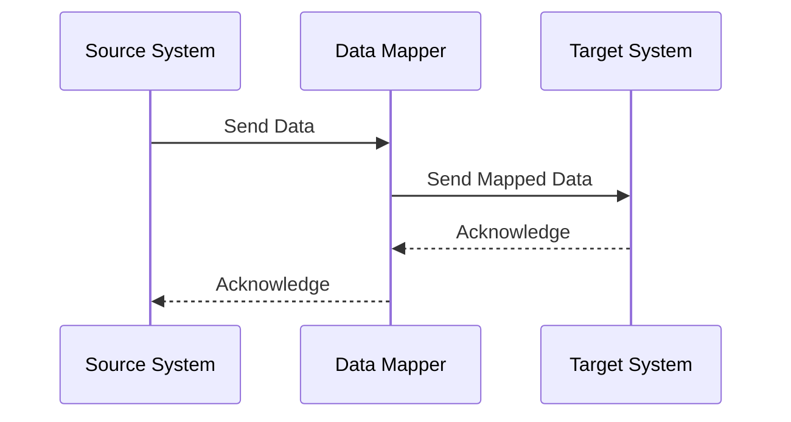

## Introduction

In the rapidly evolving landscape of cloud computing, seamless interoperability between applications and systems has become a paramount necessity. **Data Mapping and Transformation** is a design pattern that focuses on the conversion and normalization of data between different data models and formats. This pattern facilitates the integration of disparate systems, enabling smooth communication and data exchange within a cloud environment.

## Detailed Explanation

### Data Mapping

Data Mapping involves defining relationships between data structures in different systems. It aligns fields from one set of objects to fields in another, facilitating data interchange between systems with differing formats. For instance, mapping a JSON object's attributes to an XML schema or database table columns. The process typically involves two steps:

1. **Identification:** Recognize the source and target data models and determine how the data fields relate to each other.

2. **Mapping Rules:** Create rules or configurations that define how data from the source schema should be copied or transformed into the target schema.

### Data Transformation

Data Transformation is the process of converting data from one format or structure into another. This can involve:

- **Format Conversion:** Changing data types, such as converting a string to a date format.
- **Normalization:** Adjusting values to fit within a particular range or structure.
- **Aggregation:** Summarizing data fields, such as calculating averages or totals.
- **Enrichment:** Adding context or additional information to data.

Transformations can be executed in real-time as data flows through pipelines, or in batch jobs for larger datasets.

### Architectural Approaches

1. **ETL (Extract, Transform, Load):** This traditional approach extracts data, transforms it, and loads it into a target system. Useful for batch processing of large data volumes.

2. **Streaming Data Pipelines:** Utilizes platforms like Apache Kafka or AWS Kinesis for real-time data transformation as data streams between sources and destinations.

3. **API Gateways and Middleware:** API management solutions that include transformation capabilities, ensuring consistent data formats as data enters or exits cloud services.

### Best Practices

- **Define Clear Data Models:** Establish comprehensive data schemas for both source and target to ensure accurate mappings.
- **Decouple Transformation Logic:** Use middleware to separate transformation logic from business logic for better maintenance.
- **Version Control:** Maintain versions of data mappings and transformation logic to support backward compatibility.

### Example Code

Below is a simple example of data transformation using JavaScript for converting JSON data to XML:

```javascript
const json2xml = require('json2xml');

// Sample JSON data
const jsonData = {
  customer: {
    name: "John Doe",
    age: 30,
    email: "john.doe@example.com"
  }
};

// Convert JSON to XML
const xmlData = json2xml(jsonData);

console.log(xmlData);
```

### Diagrams

#### Data Mapping Process Flow



### Related Patterns

- **Facade Pattern:** Simplifies data access by providing a unified interface to a set of interfaces in a subsystem.
- **Adapter Pattern:** Allows incompatible interfaces to work together, which complements data mapping.

### Additional Resources

- **Book:** "Enterprise Integration Patterns" by Gregor Hohpe & Bobby Woolf.
- **Tool:** [Apache Camel](https://camel.apache.org/) - A widely-used integration library for data transformation.
- **Documentation:** [AWS Glue](https://docs.aws.amazon.com/glue/latest/dg/what-is-glue.html) – A cloud-based ETL service.

## Summary

The Data Mapping and Transformation pattern is a cornerstone of efficient data integration, facilitating interoperability among varied systems by converting, mapping, and transforming data into compatible formats. By leveraging established architectural approaches, such as ETL processes and real-time streams, and following best practices, you can enhance data exchange and integration capabilities within your cloud environment.
