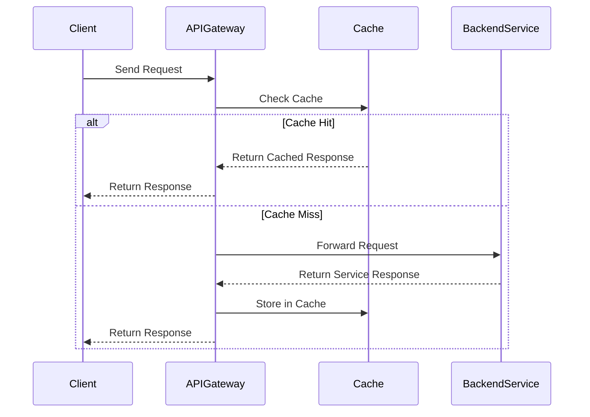

## Introduction

API Gateway Caching is a vital design pattern used in cloud-based architectures to enhance the performance and scalability of APIs. By leveraging caching mechanisms, it temporarily stores data from backend services, reducing the need for repeated data retrieval and minimizing API response latency. This pattern is exceptionally beneficial in scenarios with high read-request volumes or when backend services are slow or resource-intensive.

## Detailed Explanation

### Architectural Approach

API Gateway acts as a central entry point for API requests, managing and directing them to various backend services. Integrating caching into the API Gateway layer involves storing the API responses temporarily, allowing future requests for the same data to be served from the cache instead of querying the backend service.

Key architectural components include:

- **API Gateway**: The intermediary component managing API requests and routing them to appropriate backend services.
- **Cache Layer**: Integrated within the API Gateway, this layer temporarily stores frequently accessed API responses.
- **Backend Services**: These are the original data sources that handle requests and provide responses.

### Paradigms and Best Practices

- **Cache Control**: Implement strategies like Time-to-Live (TTL) or cache invalidation rules to maintain data freshness and consistency.
- **Granularity**: Decide on the caching granularity (e.g., entire response vs. partial content) based on specific use cases and system requirements.
- **Coherency**: Ensure different instances of the API Gateway maintain cache correctness and consistency.

### Example Code

Below is a simplified example of an API Gateway Caching mechanism using Java and Spring Cloud Gateway:

```java
@Component
public class CachingFilter implements GatewayFilter {

  private final CacheManager cacheManager;

  public CachingFilter(CacheManager cacheManager) {
    this.cacheManager = cacheManager;
  }

  @Override
  public Mono<Void> filter(ServerWebExchange exchange, GatewayFilterChain chain) {
    String requestKey = generateCacheKey(exchange);
    Cache cache = cacheManager.getCache("apiCache");
    return cache.get(requestKey, Mono.class)
      .switchIfEmpty(chain.filter(exchange)
        .doOnSuccess(response -> cache.put(requestKey, response))
      );
  }

  private String generateCacheKey(ServerWebExchange exchange) {
    return exchange.getRequest().getURI().toString();
  }
}
```

### Diagrams

Here is sequence diagram illustrating the flow of API requests through a gateway with caching:



## Related Patterns

- **Edge Caching**: Pushes caching closer to the client to reduce latency even further.
- **Circuit Breaker**: Used alongside caching to ensure system resilience during backend service failures.
- **Content Delivery Network (CDN)**: Similar to caching but operates at the content level, typically for static content delivery.

## Additional Resources

1. [AWS API Gateway Caching Documentation](https://docs.aws.amazon.com/apigateway/latest/developerguide/api-gateway-caching.html)
2. [Azure API Management Caching](https://learn.microsoft.com/en-us/azure/api-management/api-management-howto-cache)
3. [Spring Cloud Gateway](https://spring.io/projects/spring-cloud-gateway)

## Summary

API Gateway Caching is a crucial pattern for improving the performance and scalability of API-driven applications. By temporarily storing responses, it reduces API latency and lowers the load on backend services. Implementing this pattern requires careful consideration of caching strategies, granularity, and consistency to ensure data reliability and optimal user experiences.

This design pattern, when implemented effectively, significantly enhances system responsiveness and can lead to considerable cost savings by reducing the computational load on backend resources.
