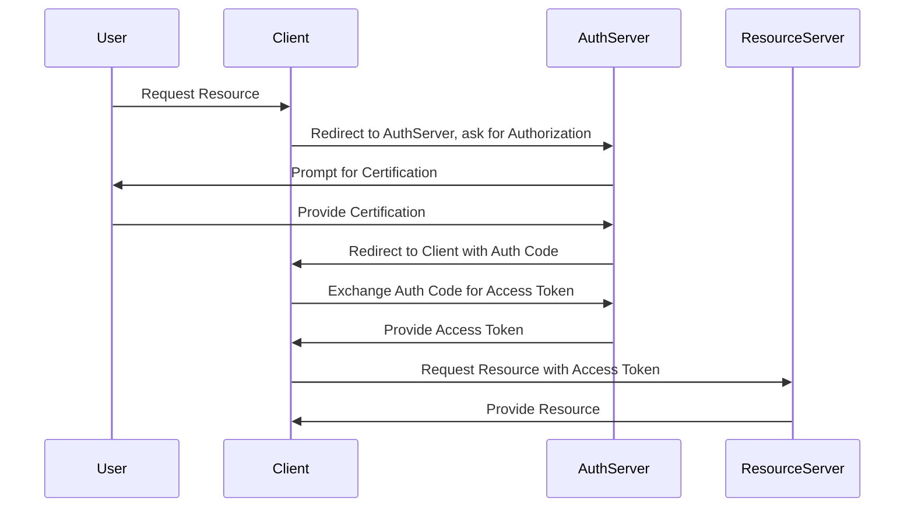

## OAuth and Token-Based Authentication: Secure API Interactions

### Introduction

As cloud architectures evolve, securing APIs becomes increasingly critical. OAuth and token-based authentication offer robust mechanisms to manage access control. These systems leverage tokens to verify identities and authorize requests, facilitating secure communication between clients and servers. With OAuth, user consent is obtained before access rights are shared, ensuring privacy and security.

### Detailed Explanation

#### OAuth Overview

OAuth is an open-standard authorization protocol or framework that provides applications the ability to secure designated access. OAuth allows end-users to authorize third-party clients to access their data without sharing their credentials. It's widely used in various contexts, especially in authorizing access to RESTful APIs.

**How OAuth Works:**
1. **Resource Owner:** The user who owns the data.
2. **Client:** The application requesting access to the resource owner's data.
3. **Resource Server:** The server hosting the resource owner's data, capable of accepting requests using OAuth tokens.
4. **Authorization Server:** The server issuing access tokens to the client after authenticating the resource owner and obtaining authorization.

Typically, OAuth defines the following flows:
- **Authorization Code Flow**
- **Implicit Flow**
- **Resource Owner Password Credential Flow**
- **Client Credentials Flow**

Among these, the Authorization Code Flow is the most secure for web applications, involving redirection between the client and the authorization server, which ensures that credentials are kept confidential.

#### Token-Based Authentication

Token-based authentication is a protocol that relies on encrypted tokens to verify user identities. A token is a string of data that signifies access permissions over a network resource. Once authenticated, users receive a token, which must accompany every subsequent request to validate their access rights.

**Key Components:**
- **Token Generator:** Issues tokens post successful authentication.
- **Token Validator:** Validates tokens presented by users.
- **Token Revocation:** Manages rescinding outdated or invalid tokens.

### Best Practices

1. **Use Secure Token Storage:** Store tokens securely using encryption to prevent unauthorized access.
2. **Implement Token Expiry:** Use short-lived tokens with refresh capabilities to enhance security.
3. **Employ HTTPS:** Always use TLS/SSL to encrypt communication channels and protect sensitive data.
4. **Scopes:** Define and enforce scopes to limit token-based access to specific resources.
5. **Regular Auditing:** Perform regular audits and logging of token usage to detect anomalies.

### Example Code

Here's a basic example illustrating OAuth implementation using Node.js with Express and Passport.js for authentication.

```javascript
const express = require('express');
const passport = require('passport');
const OAuth2Strategy = require('passport-oauth2');

passport.use(new OAuth2Strategy({
    authorizationURL: 'https://example.com/auth',
    tokenURL: 'https://example.com/token',
    clientID: 'yourClientId',
    clientSecret: 'yourClientSecret',
    callbackURL: 'http://localhost:3000/callback'
  },
  function(accessToken, refreshToken, profile, cb) {
    User.findOrCreate({ oauthId: profile.id }, function (err, user) {
      return cb(err, user);
    });
  }
));

const app = express();

app.get('/auth/example', passport.authenticate('oauth2'));

app.get('/callback', passport.authenticate('oauth2', { failureRedirect: '/login' }),
  function(req, res) {
    res.redirect('/');
  });

app.listen(3000, () => {
  console.log('Server started on http://localhost:3000');
});
```

### Diagrams

#### OAuth Flow Diagram



### Related Patterns

- **JWT (JSON Web Tokens):** Provides an approach for secure token-based exchange.
- **SAML (Security Assertion Markup Language):** Commonly used for single sign-on (SSO) integrations.
- **OpenID Connect:** A simple identity layer on top of OAuth 2.0.

### Additional Resources

1. [OAuth 2.0 Authorization Framework](https://oauth.net/2/)
2. [IETF OAuth Working Group](https://tools.ietf.org/wg/oauth/)
3. [OWASP OAuth Security](https://owasp.org/www-project-oauth-security-assessment-cheat-sheet/)

### Summary

OAuth and token-based authentication are crucial in securing APIs by controlling access and granting specific permissions based on token exchange. By leveraging these patterns effectively, applications can ensure secure and seamless user authentication and authorization across distributed systems, enhancing the security posture of modern cloud solutions. This guide serves as a critical resource for understanding and implementing these authentication mechanisms securely.
