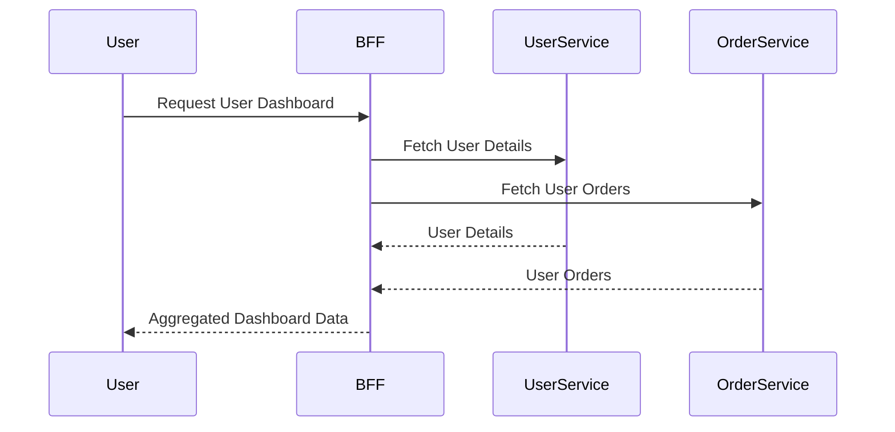

## Introduction
The Backend for Frontend (BFF) pattern is an architectural approach that involves creating tailored backends for each different frontend application. This design pattern addresses unique requirements of each frontend, such as web, mobile, or other interfaces, by having a dedicated backend that caters specifically to its needs, thus optimizing performance, security, and developer workflow.

## Detailed Explanation

In modern application architectures, especially those involving microservices, it is common to have a variety of frontend interfaces, each with specific interaction patterns and data requirements. The Backend for Frontend pattern provides a solution to these challenges by structuring the system architecture with dedicated backends for each frontend type.

### Key Components

1. **Frontend Applications**: These are the user interfaces, which could be web apps, mobile apps, or desktop apps, each having unique user interactions with the backend.

2. **Backend for Frontend (BFF) Services**: Each frontend has a dedicated backend service that aggregates, processes, and presents data optimized for that frontend.

3. **Microservices**: These are the core business services that provide reusable and cohesive functionalities to be consumed by the BFF services.

### Benefits

- **Optimized API Calls**: Each BFF can aggregate and transform data specifically for its frontend, reducing the number of calls and data transformations required on the client side.
- **Separation of Concerns**: It encourages a clear separation of concerns by decoupling frontend requirements and backend logic.
- **Flexibility and Scalability**: Each BFF can be developed, deployed, and scaled independently, allowing teams to work in parallel and reducing interdependencies.
- **Security**: Since each BFF is specific to a frontend, it can enforce security policies tailored to that client, minimizing risk.

### Example Code

Here's a simplistic view of how a BFF service might be structured in a Node.js environment using Express.js:

```javascript
const express = require('express');
const app = express();
const port = 3000;

// Import microservices clients or SDKs
const userService = require('./services/userService');
const orderService = require('./services/orderService');

// Route for fetching user dashboard info
app.get('/api/v1/user/dashboard', async (req, res) => {
    try {
        const userId = req.user.id;
        const userDetails = await userService.getUser(userId);
        const userOrders = await orderService.getOrdersByUser(userId);
        
        res.json({
            user: userDetails,
            orders: userOrders,
        });
    } catch (error) {
        res.status(500).json({error: 'Internal Server Error'});
    }
});

app.listen(port, () => {
    console.log(`BFF listening at http://localhost:${port}`);
});
```

### Diagrams

Here is a simple [Mermaid UML Sequence Diagram](https://mermaid-js.github.io/) illustrating the interaction between user, BFF, and microservices:



## Related Patterns

- **API Gateway**: While similar, an API Gateway typically serves multiple frontend applications and does not tailor functionality specifically for each frontend like a BFF.
- **Microservices**: Breaks down monolithic applications into smaller, more manageable services that may provide the underlying functionality consumed by BFFs.

## Additional Resources

- [Microservices and Backend for Frontend (BFF)](https://martinfowler.com/articles/microservice-trade-offs.html)
- [The Backend for Frontend Pattern](https://samnewman.io/patterns/architectural/bff/)
- [API Gateway vs Backend for Frontend](https://dzone.com/articles/api-gateway-vs-backend-for-frontend)

## Summary

The Backend for Frontend pattern enhances system architecture by creating dedicated backends for each frontend, enabling optimized data handling, improved performance, and tailored security measures. This leads to decoupled development and deployment processes, substantial scalability, and flexibility, making it a powerful strategy in modern, cloud-based applications involving diverse client interfaces.
