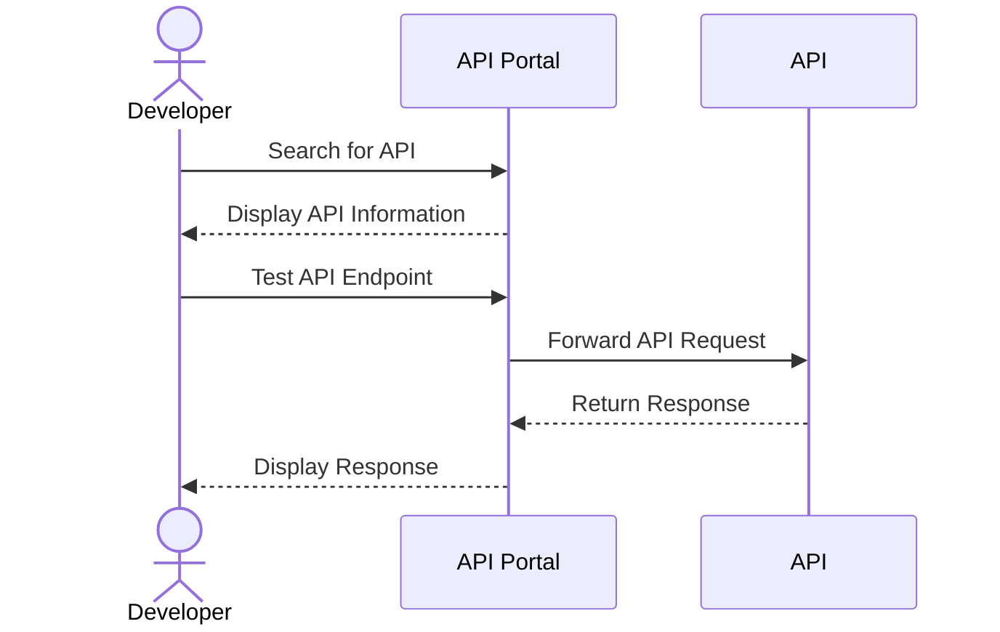

## Introduction

In the evolving digital landscape, APIs (Application Programming Interfaces) serve as vital connectors between disparate systems, enabling seamless data exchange and functionality sharing. A robust API Documentation and Discovery pattern is essential for enhancing the developer experience by providing clear, comprehensive, and searchable API documentation. This pattern not only aids in the understanding and utilization of APIs but also significantly improves the discoverability of services within an ecosystem.

## Detailed Explanations

### Design Pattern Overview

The API Documentation and Discovery pattern focuses on creating a structured, comprehensive documentation system that provides developers with all necessary information to effectively use an API. This involves detailing every aspect of the API, including endpoints, request/response structures, authentication methods, error codes, and usage examples.

Additionally, the discovery component ensures that APIs are easily findable and accessible by providing a directory or registry where APIs are listed along with their documentation. This assists developers and systems in identifying available APIs and understanding their capabilities.

### Architectural Approaches

1. **Structured Documentation Framework**: Utilize tools like Swagger/OpenAPI, RAML, and API Blueprint to automatically generate documentation from annotated API code. This ensures consistency and accuracy.
   
2. **Discovery Mechanisms**: Implement API gateways or service registries, such as AWS API Gateway or Azure API Management, which facilitate the discovery and management of APIs across different environments.
   
3. **Interactive Documentation Portals**: Create portals using platforms like Swagger UI or Redoc, which provide developers with interactive interfaces for exploring and testing API endpoints live.

4. **Versioning and Change Logs**: Maintain versioned documentation to help developers integrate with different versions of an API effectively, backed by comprehensive change logs.

### Best Practices

- **Consistency**: Ensure that all documentation follows a consistent format and style guide to prevent confusion and maintain professionalism.
  
- **Comprehensiveness**: Include detailed information about endpoints, authentication, rate limits, and error handling to cover all use cases.
  
- **Interactivity**: Provide interactive API documentation to allow developers to test service calls directly from the documentation.

- **Up-to-date Information**: Regularly update the documentation to reflect changes in API functionality, ensuring that what developers see is always relevant.

- **Usage Examples**: Include multiple usage examples in different programming languages to cater to a diverse developer audience.

## Example Code

Below is an example snippet of an OpenAPI specification for a simple API endpoint:

```yaml
openapi: 3.0.0
info:
  title: Simple API
  version: 1.0.0
paths:
  /api/items:
    get:
      summary: List all items
      operationId: listItems
      responses:
        '200':
          description: A list of items.
          content:
            application/json:
              schema:
                type: array
                items:
                  type: string
```

### Diagram

Here's sequence diagram illustrating the interaction of a developer discovering and testing an API via an API Portal:



## Related Patterns

- **API Gateway Pattern**: An architectural pattern that provides a single entry point for all API requests, simplifying authentication, logging, and load balancing.
  
- **Service Registry and Discovery Pattern**: Enables dynamic discovery of service instances through a centralized registry, improving network efficiency and scalability.

- **Version Control Management Pattern**: Focuses on managing and documenting different API versions to ensure backward compatibility and smooth transitions.

## Additional Resources

- [OpenAPI Specification](https://www.openapis.org/)
- [Swagger UI](https://swagger.io/tools/swagger-ui/)
- [Building APIs with Azure API Management](https://docs.microsoft.com/en-us/azure/api-management/)
- [AWS API Gateway Documentation](https://docs.aws.amazon.com/apigateway/latest/developerguide/)

## Summary

The API Documentation and Discovery pattern is indispensable for streamlining API integration and utilization across organizational boundaries. By focusing on detailed, consistent, and interactive documentation, alongside implementing a well-organized discovery mechanism, this pattern significantly boosts API adoption and developer satisfaction. A strategic approach to documentation and discovery can lead to substantial efficiencies in application development and system integration.
