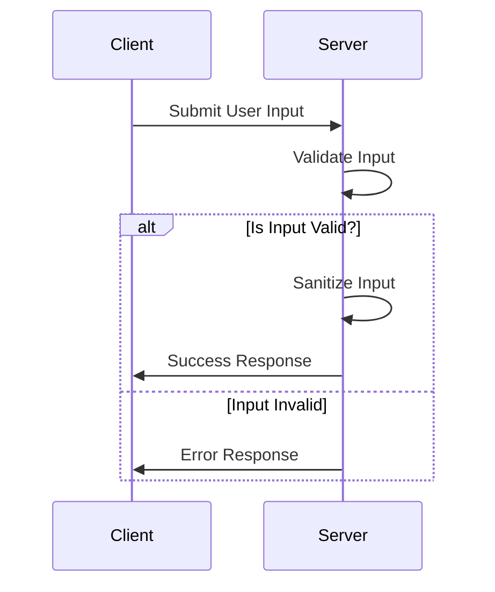

---

linkTitle: "Input Validation and Sanitization"
title: "Input Validation and Sanitization: Ensuring API Security and Data Integrity"
category: "API Management and Integration Services"
series: "Cloud Computing: Essential Patterns & Practices"
description: "Explore the practices of input validation and sanitization to secure APIs and maintain data integrity in cloud computing. Learn about validation techniques, safe data handling, and related patterns to prevent security vulnerabilities like injection attacks."
categories:
- Cloud Computing
- Security
- API Management
tags:
- Input Validation
- Data Sanitization
- Cloud Security
- API Security
- Data Integrity
date: 2024-07-07
type: docs
canonical: "https://softwarepatternslexicon.com/18/12/7"
license: "© 2024 Tokenizer Inc. CC BY-NC-SA 4.0"
---

### Introduction

Input validation and sanitization are essential practices in cloud computing to ensure the security and integrity of data handled by applications and services. By validating and sanitizing inputs, you can prevent various security vulnerabilities such as SQL injection, cross-site scripting (XSS), and other injection attacks.

### Design Pattern Overview

Input validation is the process of checking user inputs against a set of rules or criteria before processing or storing them. Sanitization refers to transforming input data to make it safe for storage or use, typically by removing or encoding special characters.

#### Key Objectives:
- Prevent injection attacks
- Ensure data integrity and validity
- Enhance overall system security

### Architectural Approaches

#### 1. Client-Side Validation
- Provides an early line of defense by preventing invalid data from being submitted.
- Implement validation rules using JavaScript-based frameworks like React, Angular, or Vue.js.

#### 2. Server-Side Validation
- Crucial for enforcing security as client-side validation can be bypassed.
- Utilize robust programming languages and frameworks, e.g., Java Spring, Node.js, or Django.

#### 3. Whitelisting vs. Blacklisting
- Whitelisting: Specify exactly what input values are acceptable; typically more secure.
- Blacklisting: Define disallowed inputs; might allow some harmful inputs through.

### Best Practices

- **Strict Type Validation:** Enforce strict type checks for numeric, date, and boolean values.
- **Length and Format Checks:** Specify acceptable input lengths and formats (e.g., regex for emails).
- **Escape Special Characters:** Use escaping functions to neutralize special characters in inputs.
- **Avoid Direct SQL Queries:** Use parameterized queries or ORM frameworks to prevent SQL injection.
  
### Example Code

```java
// Example of input validation and sanitization in Java
import java.util.regex.Pattern;

public class InputValidator {
    // Regular expression for valid email address
    private static final Pattern EMAIL_PATTERN = Pattern.compile(
        "^[A-Z0-9._%+-]+@[A-Z0-9.-]+\\.[A-Z]{2,6}$", Pattern.CASE_INSENSITIVE);

    public static boolean isEmailValid(String email) {
        return EMAIL_PATTERN.matcher(email).find();
    }

    public static String sanitizeInput(String input) {
        // Example sanitization by escaping HTML
        return input.replaceAll("<", "&lt;").replaceAll(">", "&gt;");
    }
}
```

### Diagrams

#### Sequence Diagram: Input Validation Process



### Related Patterns and Practices

- **Content Security Policy (CSP):** Prevents XSS attacks by restricting the sources of content that can be loaded.
- **JWT Authentication:** Securely transmit information between client and server using JSON Web Tokens.
- **Rate Limiting:** Protects against abuse and denial-of-service (DoS) attacks by controlling the number of requests.

### Additional Resources

- [OWASP Input Validation Cheat Sheet](https://cheatsheetseries.owasp.org/cheatsheets/Input_Validation_Cheat_Sheet.html)
- [Google Web Fundamentals: Validating Input](https://developers.google.com/web/fundamentals/security/secure-development/input-validation)

### Summary

Input validation and sanitization are indispensable for securing APIs and ensuring data integrity in cloud-based applications. By implementing robust validation and sanitization mechanisms, developers can defend against common vulnerabilities, thereby enhancing the reliability and security of their systems. Adopting best practices like utilizing whitelists, escaping special characters, and server-side validations provides a strong foundation for secure application development.

---
