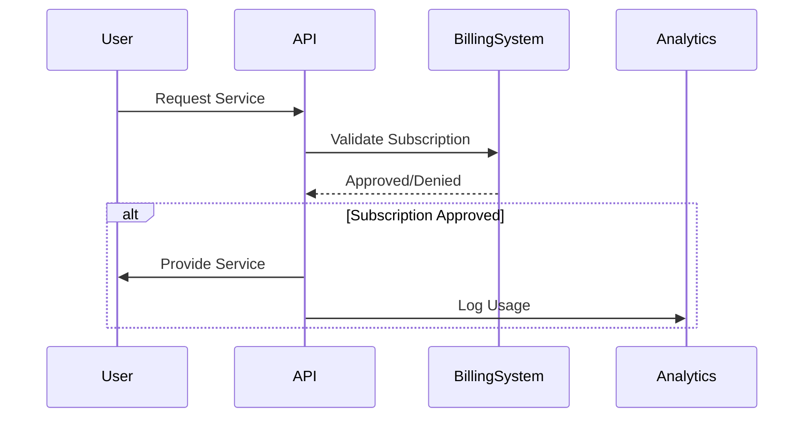

## Introduction

API Monetization is a strategic approach to transform APIs into revenue-generating assets. This design pattern enables organizations to leverage APIs to create new business models, enhance existing services, and establish partnerships. The trend of API economy empowers businesses to open new economic opportunities by exposing their services to extended ecosystems. Successful API monetization requires careful planning, implementing the right models, and ensuring seamless integration with existing technologies and customer workflows.

## Detailed Explanation

### Key Components of API Monetization:

1. **Usage Models:** Define how the API services will be utilized — for instance, free usage followed by a premium tier model (Freemium), or pay-as-you-go pricing based on API call volume.

2. **Access Control:** Implement API gateways to manage subscription plans, authenticate users, and control access based on payment tiers.

3. **Analytics & Reporting:** Provide detailed analytics to understand usage patterns, which in turn can offer insights into consumer behavior and help optimize pricing strategies.

4. **Billing and Invoicing:** Integrate with billing systems to automate fee calculation and billing processes. This can be achieved using internal systems or third-party services.

### Architectural Approaches:

- **API Gateway:** Acts as a façade to manage access, enforce policies, and ensure security across different APIs. Utilizing platforms like AWS API Gateway, Google Cloud's Apigee, or Azure API Management can streamline this process.

- **Microservices Architecture:** Encourage modular architectural designs that allow independent deployment and scaling of individual services, thereby enhancing the flexibility of billing systems.

- **Event-Driven Systems:** Utilize platforms like Apache Kafka for real-time analytics and notification services, improving customer experiences by offering dynamic usage insights.

## Best Practices

- **Understand the Audience:** Before monetizing APIs, it’s crucial to understand who the consumers are and what are their needs.
  
- **Performance Optimization:** Ensure that APIs are designed to handle various levels of demand seamlessly and efficiently to provide consistent experiences to all users.

- **Security and Compliance:** Implement robust security measures like OAuth for authorization, secure data transmission with TLS, and comply with relevant data protection regulations (e.g., GDPR, CCPA).

- **Documentation and Support:** Offer comprehensive documentation and customer support to facilitate easy integration and troubleshooting for users.

## Example Code

Here's a simple illustration using Node.js and Express to set up an endpoint for API rate limiting, a crucial aspect of API Monetization.

```javascript
const express = require('express');
const rateLimit = require('express-rate-limit');

const app = express();

// Apply rate limit to all requests
const apiLimiter = rateLimit({
  windowMs: 15 * 60 * 1000, // 15 minutes
  max: 100 // Limit each IP to 100 requests per window
});

app.use('/api/', apiLimiter);

app.get('/api/product', (req, res) => {
  res.send('Welcome to API Monetization Product!');
});

app.listen(3000, () => {
  console.log('API running on port 3000');
});
```

## Diagrams

### API Monetization Lifecycle



## Related Patterns

- **API Gateway Pattern:** Enhances access control and security.
- **Service Mesh Pattern:** Offers comprehensive monitoring and security across microservices.
- **Enterprise Service Bus (ESB):** Allows seamless integration between diverse software applications.

## Additional Resources

- [API Economy: Securing the Digital Economy](https://www.exampleapi.com/economy)
- [Google Cloud's Apigee Documentation](https://cloud.google.com/apigee)

## Summary

API Monetization presents a transformative opportunity for businesses to leverage APIs as a revenue stream, aligning technology with business goals. By adopting strategic models and technological frameworks, companies can enhance direct revenue, foster innovation, and open new business channels. Through effective use of gateways, analytics, security, and documentation, businesses can ensure a successful API monetization endeavor.
