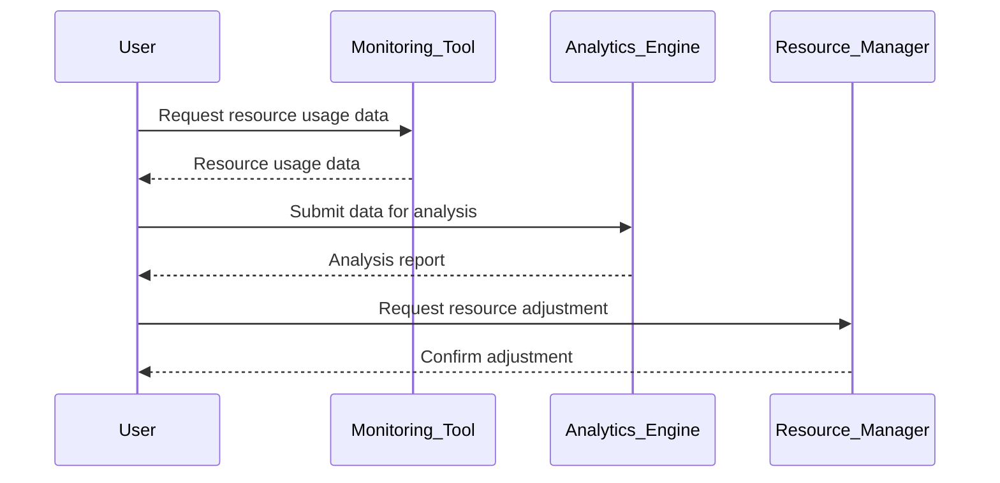

Right-sizing resources is a critical design pattern in cloud computing, primarily focused on matching your allocated cloud resources with the actual workload demands. This pattern not only ensures cost-efficiency but also aids in optimizing performance and resource utilization.

## Overview

In cloud computing, resources like compute instances, storage, and network capacities can be dynamically allocated. However, improper allocation or unused capacities can result in unnecessary costs. Right-sizing involves selecting the appropriate size and type of resource to match the application's workload requirements closely. This tactic is especially valuable in scenarios where workload patterns are predictable or can have fluctuations.

## Architectural Approach

1. **Monitoring and Analysis**: Utilize monitoring tools to collect data on current resource utilization. Services like AWS CloudWatch, Azure Monitor, or Google Cloud Monitoring can provide insights into CPU usage, memory consumption, I/O operations, and more.

2. **Analytics and Prediction**: Implement data analysis tools to understand patterns and predict future workload requirements. Machine learning models can be employed for predictive scaling, forecasting future usage based on historical data.

3. **Resource Adjustment**: Based on analytics, adjust resources using manual intervention or automated scripts. Most cloud providers offer APIs and tools for modifying resource allocation, such as AWS EC2 Auto Scaling, Azure VM Scale Sets, and Google Cloud Instance Groups.

4. **Feedback Loop**: Maintain a continuous feedback loop for monitoring and analytics to ensure that resources remain optimally sized as workloads evolve over time.

## Best Practices

- **Automate Where Possible**: Automate the right-sizing process using cloud-native automation tools. This reduces human error and ensures swift resource adjustments.

- **Use Spot and Reserved Instances**: For predictable workloads, consider reserved instances which offer cost savings for long-term use. For flexible tasks, spot instances can provide cost benefits.

- **Regularly Review Utilization Metrics**: Conduct regular evaluations of resource utilization to identify any over-provisioned resources.

- **Prioritize Cost Efficiency and Performance Balance**: While minimizing costs is important, it's equally crucial to ensure that performance levels meet business requirements.

## Example Code

Here's a simple script demonstrating how to automate right-sizing using AWS SDK for Python (Boto3):

```python
import boto3

def adjust_instance_type(instance_id, target_instance_type):
    ec2_client = boto3.client('ec2')
    ec2_client.stop_instances(InstanceIds=[instance_id])
    ec2_client.modify_instance_attribute(InstanceId=instance_id, Attribute='instanceType', Value=target_instance_type)
    ec2_client.start_instances(InstanceIds=[instance_id])

instance_id = 'i-0abcd1234efgh5678'  # Example instance ID
new_instance_type = 't3.small'

adjust_instance_type(instance_id, new_instance_type)
```

This code snippet stops an instance, adjusts its type, and then restarts it.

## Diagrams

### Sequence Diagram for Right-Sizing



## Related Patterns

- **Auto-Scaling**: Automatically adjusts the amount of computational resources based on load and demand.
- **Cost-Effective Storage Tiers**: Use different storage tiers to manage costs effectively based on access frequency and latency requirements.

## Additional Resources

- [AWS Right Sizing Recommendations](https://aws.amazon.com/aws-cost-management/right-sizing/)
- [Google Cloud Cost Management Tools](https://cloud.google.com/products/tools/)
- [Azure Pricing Calculator](https://azure.microsoft.com/en-us/pricing/calculator/)

## Summary

The Right-Sizing Resources pattern is essential for organizations looking to optimize their cloud expenses while maintaining workload performance. By continuously monitoring, analyzing, and adjusting resource allocations, businesses can ensure they are getting the most value from their cloud investments. With the rise of automated tools and machine learning, right-sizing has become increasingly efficient, making it a fundamental aspect of modern cloud operations.
