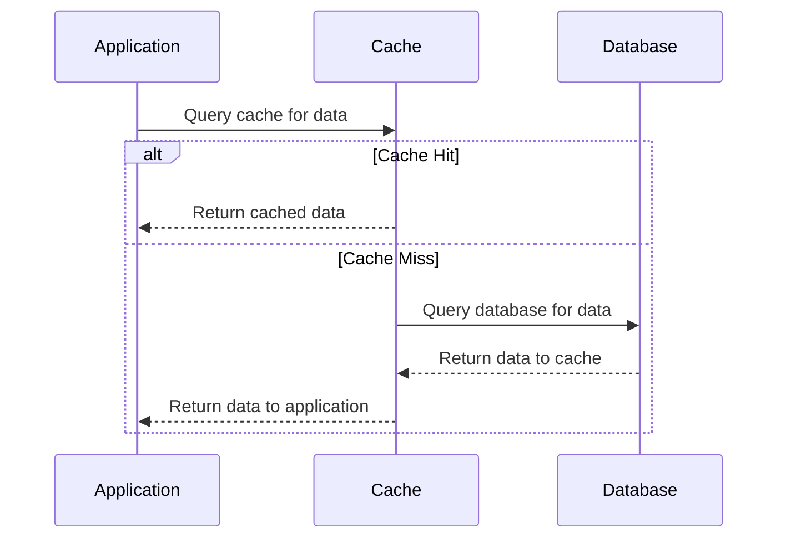

### Overview

The **Caching Frequent Data** pattern is a pivotal design principle that involves storing frequently accessed data in a temporary storage area, or cache, to improve application performance and reduce the load on the primary database and network resources. This pattern is instrumental for applications hosted on cloud platforms where minimizing costs and optimizing resource usage are critical.

### Detailed Explanation

Caching is a well-established technique used to enhance data retrieval speed, decrease latency, and optimize both database query loads and network bandwidth usage. Within the context of cloud computing, this pattern can significantly lower operating costs by reducing expensive database access and minimizing data transfer across the network.

#### Key Components

- **Cache Storage**: A temporary storage location, typically in memory, where frequently accessed data is stored to provide faster access.
  - Examples include in-memory databases like Redis, Memcached, or distributed caching systems like AWS ElastiCache or Azure Cache for Redis.

- **Cache Keys**: Unique identifiers that map requested data to the cached data. They ensure the correct data is retrieved efficiently.

- **Cache Policies**: Strategies to manage the lifecycle of cached data, including:
  - **Expiration Time (TTL)**: Determines how long an item remains in the cache.
  - **Eviction Policies**: Define which items to remove when the cache is full (e.g., Least Recently Used - LRU, Most Recently Used - MRU).

- **Cache Consistency**: Mechanisms to ensure the cached data remains consistent with the source data, which may involve write-through, write-around, or write-back strategies.

### Architectural Approach

Incorporating caching into an architecture involves placing a cache between the data source and the application. When a request is made, the application initially checks the cache:

1. **Cache Hit**: If data is found, it's directly returned to the user, leading to decreased latency and reduced database load.
2. **Cache Miss**: If data is not found, the application retrieves it from the database, stores it in the cache, and then returns it to the user.

By positioning this intermediary layer, we reduce the frequency of direct database queries, optimize bandwidth usage, and ultimately lower costs.

```json
// Pseudocode example for cache lookup
function fetchData(query) {
    const cachedData = cache.get(query);
    if (cachedData) {
        return cachedData;  // Cache Hit
    } else {
        const data = database.query(query);
        cache.set(query, data);
        return data;  // Cache Miss
    }
}
```

### Diagrams

#### UML Sequence Diagram



### Best Practices

- **Select an Appropriate Cache Storage**: Choose a cache solution that complements your application's needs, considering factors like read-write performance, data distribution, and scalability.
  
- **Optimize Cache Size and Eviction Policies**: Configure the cache to hold the ideal amount of data, and select eviction strategies that align with the data's access patterns.

- **Monitor Cache Performance**: Utilize cloud provider monitoring tools to observe cache hit ratios, latency, and item size distribution for ongoing optimization.

- **Implement Security Measures**: Ensure data security in the cache by enabling encryption, implementing strong access controls, and monitoring for unauthorized access.

### Related Patterns

- **Content Delivery Network (CDN)**: Often used in conjunction with caching to distribute static content closer to the user, reducing latency.
  
- **Read-Through and Write-Through Caching**: Automated strategies for reading and writing data, where the cache manages communication with data sources seamlessly.

### Additional Resources

- [AWS Caching Strategies](https://aws.amazon.com/caching/)
- [Google Cloud Caching Best Practices](https://cloud.google.com/caching/)
- [Redis Documentation](https://redis.io/documentation)

### Summary

The **Caching Frequent Data** pattern provides a strategic approach to reducing database and network loads in cloud environments. By leveraging caching solutions, applications can achieve faster data access, improve user experience, and significantly cut down on operational costs. Implement this pattern thoughtfully, considering cache consistency, appropriate storage solutions, and rigorous performance monitoring for optimal results.
