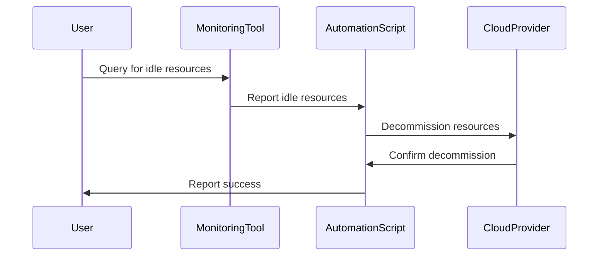

## Introduction

In the dynamic world of cloud computing, one of the key challenges that organizations face is managing costs effectively. Over time, resources may become underutilized or idle, leading to inefficiencies and unnecessary expenses. The **Consolidating Idle Resources** design pattern addresses this issue by providing a systematic approach to identify, consolidate, and terminate idle resources, thereby optimizing costs and improving resource utilization.

## Architectural Approach

This pattern involves several steps, each of which contributes to efficient resource management:

1. **Monitoring and Identifying Idle Resources**: Utilize cloud-native monitoring tools or third-party solutions to track resource utilization. Implement usage thresholds to easily pinpoint resources that fall below efficiency benchmarks over a specified period.

2. **Analysis and Verification**: Once identified, analyze these resources to understand why they are idle. Engage with stakeholders to ensure that resources are not held for critical or upcoming tasks.

3. **Consolidation Strategies**: Combine workloads from underutilized resources onto fewer, more efficient resources. This may involve resizing instances, adjusting storage allocations, or merging databases.

4. **Deployment Automation**: Use infrastructure-as-code (IaC) solutions to automate the consolidation and decommissioning process, ensuring consistent and error-free executions.

5. **Terminate Unnecessary Resources**: Safely decommission resources that are verified as no longer needed. Implement policies to prevent the creation of similar idle resources in the future.

## Best Practices

- **Implement Continuous Monitoring**: Ensure there is a robust and automated monitoring system to detect anomalies and track resource usage trends.

- **Stakeholder Engagement**: Collaborate with teams to avoid decommissioning resources that might be necessary for near-future projects.

- **Use Cost Management Tools**: Leverage cloud provider tools or third-party financial management services to get detailed insights into cost drivers and savings opportunities.

- **Schedule Reviews and Audits**: Regularly review resource utilization reports to keep optimization efforts aligned with organizational goals.

- **Embrace Automation**: Automate as much of the decommissioning process as possible to reduce manual errors and enhance speed.

## Example Code

Here is an example using AWS Lambda function to detect idle EC2 instances and trigger their shutdown:

```javascript
const AWS = require('aws-sdk');
const ec2 = new AWS.EC2();

exports.handler = async () => {
    const instances = await ec2.describeInstances().promise();
    let idleInstances = [];

    instances.Reservations.forEach(reservation => {
        reservation.Instances.forEach(instance => {
            if (isInstanceIdle(instance)) {
                idleInstances.push(instance.InstanceId);
            }
        });
    });

    if (idleInstances.length > 0) {
        await ec2.stopInstances({ InstanceIds: idleInstances }).promise();
        console.log(`Stopped instances: ${idleInstances.join(', ')}`);
    }
};

function isInstanceIdle(instance) {
    // Implement logic to determine if an instance is idle
    return true; // Placeholder
}
```

## Diagrams



## Related Patterns

- **Auto-Scaling**: Automatically adjust the number of resources to accommodate varying load levels.
- **Instance Scheduled Hibernation**: Schedule non-essential instances to hibernate during off-peak times.
- **Resource Tagging**: Use tags to categorize and manage cloud resources effectively.

## Additional Resources

- [AWS Cost Management](https://aws.amazon.com/aws-cost-management/)
- [Google Cloud's Operations Suite](https://cloud.google.com/products/operations)
- [Azure Cost Management](https://azure.microsoft.com/en-us/services/cost-management/)

## Summary

The **Consolidating Idle Resources** pattern is essential for maintaining cost efficiency in cloud environments. Through effective identification, analysis, consolidation, and termination of idle resources, organizations can significantly reduce their cloud expenses while improving overall system performance. By integrating continuous monitoring, stakeholder collaboration, and automation, enterprises ensure long-term success in resource management.
