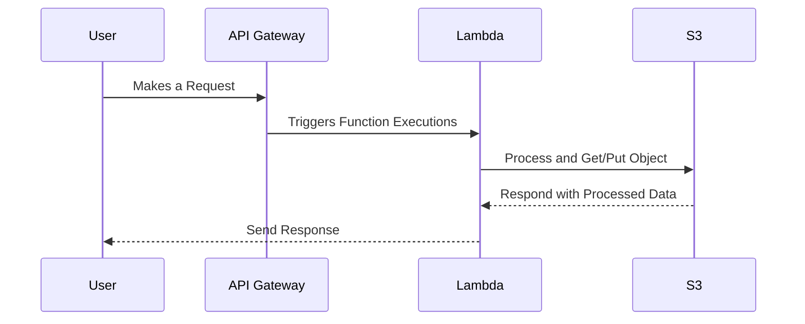

## Overview

Serverless architectures represent a paradigm shift in cloud computing, emphasizing efficiency and cost-effectiveness by abstracting infrastructure management. This model provides a service, where cloud providers automatically handle the provisioning, scaling, and management of servers. Developers focus solely on coding the application's functions without the burden of managing server instances, thereby optimizing operational efficiency and reducing the total cost of ownership.

## Architectural Approaches

- **Function as a Service (FaaS)**: Focused on small, singular-purpose functions triggered by events. Cloud platforms like AWS Lambda, Google Cloud Functions, and Azure Functions are popular FaaS examples.
- **Backend as a Service (BaaS)**: Provides scalable backend services such as databases, authentication, and user management. Firebase and AWS Amplify are examples where infrastructure elements are fully managed.

## Design Patterns and Use Cases

1. **Event-Driven Computing**: Triggers and events initiate function execution. Ideal for applications such as IoT signal processing or financial services that require continuous or scheduled data processing.
   
2. **Microservices Integration**: Decouples application functionality into microservices, each responsible for distinct business capabilities. Perfect for large-scale applications requiring modular scalability.

3. **Stateless Function Execution**: Each function execution is independent, requiring external storage for state maintenance. Useful for webhooks and serverless web applications with no need for persistent connections.

4. **Asynchronous Processing**: Functions often run asynchronously for jobs like image transformation, file processing, and real-time data pipelines, integrating seamlessly with message queues.

## Best Practices

- **Cold Start Minimization**: Optimize function initialization time by reducing package size and dependencies. Use provisioned concurrency for critical functions needing immediate response times.
- **Security Hardened Execution**: Implement robust IAM policies, minimize cross-function access, and maintain updated libraries to prevent vulnerabilities.
- **Cost Monitoring**: Leverage tools such as AWS CloudWatch and Azure Monitor to keep track of function executions and resource utilization, adjusting configurations as needed to optimize costs.

## Example Code

### AWS Lambda with S3 Trigger

```javascript
exports.handler = async (event) => {
    const s3 = new AWS.S3();
    const records = event.Records.map(record => ({
        Bucket: record.s3.bucket.name,
        Key: record.s3.object.key,
    }));

    for (let record of records) {
        const params = {
            Bucket: record.Bucket,
            Key: record.Key,
        };
        const data = await s3.getObject(params).promise();
        console.log("Object data:", data);
    }
};
```

## Diagrams

### Sequence Diagram for Serverless Processing



## Related Patterns

- **Microservices Architecture**: Decouples complex applications into smaller, independent services, often complementing serverless functions.
- **Event Sourcing**: Utilized with serverless for capturing all changes as a sequence of events, providing detailed audit trails.

## Additional Resources

- [AWS Lambda: Developer Guide](https://docs.aws.amazon.com/lambda/latest/dg/welcome.html)
- [Azure Functions Documentation](https://learn.microsoft.com/en-us/azure/azure-functions/)
- [Google Cloud Functions Overview](https://cloud.google.com/functions/docs)

## Summary

Serverless architectures streamline cloud operations by allowing applications to scale dynamically and improving cost-efficiency by eliminating idle server time. By restructuring traditional server management, serverless enables a flexible computing paradigm highly suitable for modern, rapidly evolving applications requiring event-driven execution and microservices integration. Leveraging this architecture pattern empowers developers to concentrate on business logic over infrastructure concerns, ultimately fostering innovative solutions in the cloud-native ecosystem.
