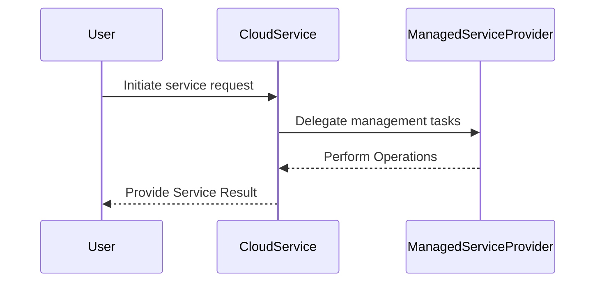

## Introduction

Managed Services Utilization is a design pattern in cloud computing that centers on offloading various IT responsibilities, such as infrastructure management, maintenance, and monitoring, to cloud service providers. This strategy enables organizations to focus on their primary business goals while benefiting from cost efficiencies, scalability, and reduced operational overhead.

In modern business environments, where agility and efficiency are paramount, managed services allow organizations to avoid the complexities of managing underlying hardware, software, and network resources. Instead, they can leverage the specialized skills and economies of scale offered by cloud providers.

## Design Pattern Explanation

### Core Concepts

- **Offloading Operations**: This involves shifting day-to-day management and operational tasks like patch management, updates, security, and reporting from in-house teams to cloud service providers.
- **Cost Efficiency**: Reduces capital expenditure (CAPEX) by converting it into operational expenditure (OPEX), with businesses only paying for the services they use.
- **Scalability and Flexibility**: Managed services can be adjusted to meet the changing needs of a business, providing flexibility in deployment and scaling resources.
- **Focus on Core Business**: By offloading IT management tasks, businesses can concentrate on innovation and growth within their market niche.

### Architectural Approaches

- **Platform as a Service (PaaS)**: Utilizing PaaS allows developers to build applications without the complexity of managing underlying infrastructure.
- **Infrastructure as a Service (IaaS)**: Virtualized computing resources managed by providers give businesses the capability to scale CPU, memory, and storage.
- **Software as a Service (SaaS)**: Software deployment and management is handled entirely by third-party vendors, reducing the need for internal software lifecycle management.
- **Managed Databases**: Cloud-managed database services alleviate the burden of database maintenance, including backup, scaling, and instance failover, from the client.

## Example Code

Here's an example of using AWS Lambda, a managed service that runs code in response to triggers without the need to manage server environments:

```javascript
exports.handler = async (event) => {
    const name = event.name || "World";
    return {
        statusCode: 200,
        body: `Hello, ${name}!`
    };
};
```

## Diagrams

### UML Sequence Diagram



## Best Practices

- **Evaluate Needs**: Thoroughly assess business requirements and identify areas where cloud managed services can provide the most value.
- **Choose the Right Provider**: Consider factors such as reliability, performance, and support when selecting a cloud provider.
- **Monitor and Optimize**: Use cloud monitoring tools to track usage, performance, and costs to continually optimize managed services usage.
- **Security Considerations**: Ensure data encryption and compliance standards are strictly followed when using managed services.

## Related Patterns

- **Auto-Scaling**: Automatically adjusts resources based on demand, another way to optimize costs and efficiency in cloud environments.
- **Serverless Computing**: Runs on managed services without the need for managing servers, similar in philosophy to managed services but focused on execution.
- **Service Choreography**: Involves decentralized coordination of managed services in complex workflows to maximize resource utilization.

## Additional Resources

- [AWS Managed Services](https://aws.amazon.com/managed-services/)
- [Azure Managed Services](https://azure.microsoft.com/en-us/services/management-and-governance/)
- [Google Cloud Managed Services](https://cloud.google.com/products/operations)

## Summary

Managed Services Utilization is a strategic cloud computing pattern that allows businesses to leverage the infrastructure, applications, and expertise of cloud providers, translating into significant cost savings and operational efficiencies. By focusing on what they do best and letting cloud providers handle the rest, organizations can innovate faster and respond more rapidly to market changes. This pattern aligns with the broader trend of increasing reliance on cloud-based solutions for agility and scalability in today's digital landscape.
