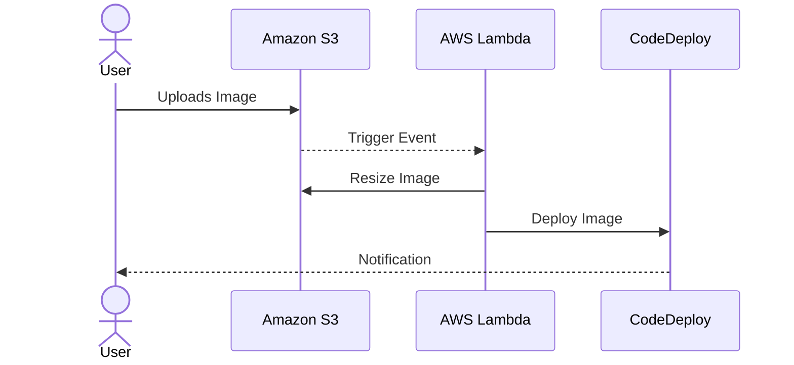

## Automation of Repetitive Tasks

When operating in a cloud environment, repetitive tasks like data processing, system monitoring, resource provisioning, and deployment, if carried out manually, can lead to inefficiencies and increased operational costs. The Automation of Repetitive Tasks pattern addresses this by leveraging automation tools and scripts to handle these tasks, thereby optimizing cost and reducing human error.

### Detailed Explanation

#### Design Pattern Overview
Automation in cloud computing involves using technologies to perform common tasks automatically. By automating repetitive tasks, businesses can significantly reduce the time and cost involved in managing cloud resources, while also minimizing the risk of human error.

##### Benefits of Automating Repetitive Tasks:

- **Cost Reduction**: Automation reduces labor costs significantly by eliminating mundane, repetitive work and allowing team members to focus on strategic initiatives.
- **Increased Efficiency**: Automated tasks are performed consistently and faster than manual processes, boosting overall operational efficiency.
- **Error Reduction**: Automated processes are far less prone to human error, resulting in a more reliable and consistent output.
- **Scalability**: Automation enables operations to scale seamlessly without the need for constant human intervention.

#### Best Practices
- **Use Cloud-Native Tools**: Leverage cloud provider tools such as AWS Lambda, Azure Functions, or Google Cloud Functions to automate tasks without managing underlying infrastructure.
- **Implement CI/CD Pipelines**: Automate application deployment processes using Continuous Integration and Continuous Deployment (CI/CD) tools like Jenkins, GitLab CI, or AWS CodePipeline.
- **Automate Monitoring**: Use monitoring tools like Amazon CloudWatch or Azure Monitor to automate system and application monitoring, alerting you to potential issues without manual checks.
- **Infrastructure as Code (IaC)**: Implement IaC with tools like Terraform or AWS CloudFormation for automating infrastructure provisioning to ensure consistency and repeatability.

### Example Code
Below is a basic example of a Lambda function in AWS to automate a simple task, such as resizing an image uploaded to an S3 bucket:

```javascript
const AWS = require('aws-sdk');
const S3 = new AWS.S3();
const Sharp = require('sharp');

exports.handler = async (event) => {
    const bucket = event.Records[0].s3.bucket.name;
    const key = decodeURIComponent(event.Records[0].s3.object.key.replace(/\+/g, ' '));
    
    try {
        const { Body } = await S3.getObject({ Bucket: bucket, Key: key }).promise();
        const resizedImage = await Sharp(Body).resize(200, 200).toBuffer();
        
        await S3.putObject({
            Bucket: bucket,
            Key: `resized/${key}`,
            Body: resizedImage,
            ContentType: 'image/jpeg'
        }).promise();

        return `Successfully resized and uploaded image: ${key}`;
    } catch (error) {
        console.error(`Error processing ${key} from ${bucket}. Error: ${error}`);
        throw new Error(`Error processing ${key}`);
    }
};
```

### Diagrams



### Related Patterns
- **Event-Driven Architecture**: Supports automation by using events to trigger responses in a decoupled manner.
- **Infrastructure as Code (IaC)**: Facilitates automated provisioning and management of infrastructure.

### Additional Resources
- [AWS Lambda Documentation](https://docs.aws.amazon.com/lambda/latest/dg/welcome.html)
- [Azure Functions Overview](https://docs.microsoft.com/en-us/azure/azure-functions/functions-overview)
- [Google Cloud Functions](https://cloud.google.com/functions/docs)

### Summary
The Automation of Repetitive Tasks pattern is essential for any organization aiming to optimize cloud operations by reducing labor costs, improving efficiency, and minimizing human error. By implementing automated solutions, businesses can scale operations and focus resources on more strategic tasks. Embracing cloud-native tools and adopting best practices in CI/CD, monitoring, and IaC can further enhance the benefits of automation.
