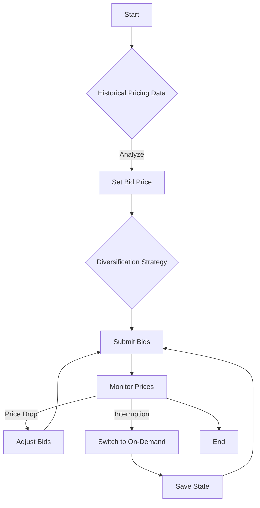

## Introduction

In cloud computing, leveraging spot instances can offer substantial cost savings compared to regular on-demand instances. Spot instances represent unused capacity that cloud providers, such as AWS, GCP, and Azure, offer at discounted rates. However, acquiring these instances requires a bidding process, which can be a challenge to navigate due to the dynamic pricing model and potential interruption risks.

## Benefits of Spot Instances

- **Cost Efficiency**: Spot instances can be acquired at a fraction of the cost of on-demand instances, leading to significant savings.
- **Scaling Capabilities**: They enable the ability to scale workloads economically by leveraging fluctuating market prices.
- **Batch Processing Suitability**: Ideal for workloads such as batch processing, data analysis, and Monte Carlo simulations, where interruptions are manageable.

## Bidding Strategies

### 1. **Optimal Bid Pricing**

When placing bids, consider the volatility of spot instance prices. Setting a bid too high may not lead to cost savings, while a bid too low might lead to frequent interruptions. Aim to set a bid price that balances between these extremes based on historical price trends.

### 2. **Diversification**

Use a diversified bidding strategy across multiple instance types and Availability Zones. This approach increases the chances of acquiring spot instances while minimizing the risk of interruption. 

### 3. **Hybrid Strategy**

Combine spot instances with on-demand instances to ensure application stability. Use spot instances for non-critical parts of the workload and on-demand instances for essential components.

### 4. **Automated Bidding**

Utilize tools offered by cloud providers or third-party solutions to automate bidding based on pre-set conditions and real-time pricing information. This can enhance efficiency and responsiveness to market changes.

### 5. **Spot Fleet and Equivalent Options**

In AWS, for instance, use Spot Fleets to simplify management and enhance the robustness of spot instance utilization through diversified allocation strategies, including lowest-price or capacity-optimized strategies.

## Best Practices

- **Monitor Spot Pricing Trends**: Regularly review historical pricing data to inform bidding decisions and adjust strategies accordingly.
- **Use Spot Advisories and Alerts**: Leverage available advisories to gain insights into potential disruptions and adapt swiftly.
- **Implement Checkpointing**: Ensure applications have mechanisms to save state regularly, allowing recovery from interruptions without data loss.

## Example Code

Here’s an example of setting up a Spot Fleet request in AWS using the AWS SDK for Java:

```java
import com.amazonaws.services.ec2.AmazonEC2;
import com.amazonaws.services.ec2.AmazonEC2ClientBuilder;
import com.amazonaws.services.ec2.model.*;

public class SpotFleetExample {
    public static void main(String[] args) {
        final AmazonEC2 ec2 = AmazonEC2ClientBuilder.defaultClient();

        SpotFleetRequestConfigData configData = new SpotFleetRequestConfigData()
                .withIamFleetRole("arn:aws:iam::123456789012:role/spot-fleet-role")
                .withAllocationStrategy("lowestPrice")
                .withSpotPrice("0.05")
                .withTargetCapacity(10)
                .withLaunchSpecifications(
                        new SpotFleetLaunchSpecification()
                        .withInstanceType("m4.large")
                        .withImageId("ami-0abcdef1234567890")
                );

        RequestSpotFleetRequest request = new RequestSpotFleetRequest().withSpotFleetRequestConfig(configData);
        RequestSpotFleetResult result = ec2.requestSpotFleet(request);

        System.out.println("Successfully requested Spot Fleet: " + result.getSpotFleetRequestId());
    }
}
```

## Diagrams

### Bidding Strategy Flow Diagram



## Related Patterns

- **Batch Processing on the Cloud**: Leveraging cloud resources to efficiently handle non-interactive workloads.
- **Autoscaling**: Dynamically adjusting resources to match load demands without manual intervention.

## Additional Resources

- AWS Spot Instances [AWS Documentation](https://aws.amazon.com/ec2/spot/)
- Google Preemptible VM Instances [Google Documentation](https://cloud.google.com/preemptible-vms)
- Azure Spot Virtual Machines [Azure Documentation](https://azure.microsoft.com/en-us/pricing/spot/)

## Summary

Spot instances can dramatically reduce cloud infrastructure costs if managed appropriately. By implementing effective bidding strategies, diversifying instance types, automating processes, and understanding market dynamics, organizations can harness the full potential of spot instances. Always ensure your application architecture supports recovery from interruptions, which are inherent in using spot services.
