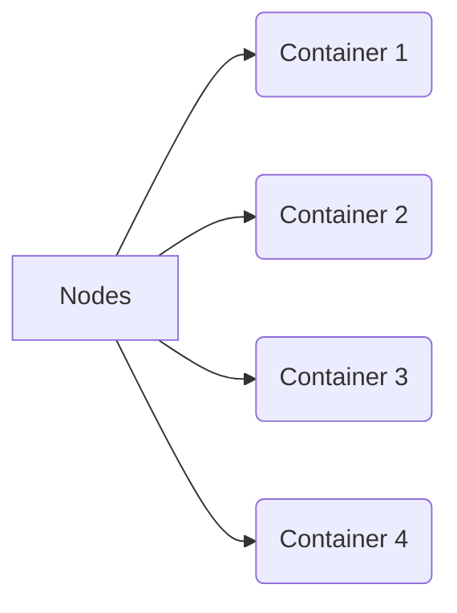

## Introduction

In the realm of cloud computing, optimizing resource utilization to reduce operational costs is paramount. **Container Density Optimization** emerges as a key strategy by orchestrating workloads using containerization to achieve higher utilization and efficiency. This pattern highlights how to efficiently pack workloads to run on fewer resources, ultimately lowering cloud expenses.

## Detailed Explanation

Container Density Optimization involves deploying multiple application workloads onto a shared infrastructure with minimal overhead. By leveraging containerization technology such as Docker or Kubernetes, this pattern achieves high efficiency and resource utilization.

### Key Concepts:

- **Containerization**: Encapsulating applications and their dependencies into isolated units known as containers, ensuring consistent operation across different environments.
- **Resource Utilization**: Increasing the amount of work achieved using the same amount of resources by minimizing idle capacity.
- **Cost Efficiency**: Achieving the required computing goals while minimizing expenses.

By smartly utilizing shared resources, you can ensure your workloads efficiently use available compute, memory, and storage without the need for additional infrastructure.

## Architectural Approaches

1. **Resource Profiling**: Analyze current workloads to understand their demands and usage patterns, enabling precise allocation of resources per container.
2. **Dynamic Scheduling**: Use orchestration tools to dynamically distribute workloads across available compute instances for maximum utilization.
3. **Vertical & Horizontal Scaling**: Employ both scaling methods to adjust resources based on demand, automatically adding or removing allocated resources as necessary.
4. **Node Optimization**: Adjust node configurations to optimize for cost and performance, such as selecting instance types that maximize resource socking without excessive over-provisioning.

## Example Code

Here is a basic example that illustrates how you might set up containers using Kubernetes:

```yaml
apiVersion: v1
kind: Pod
metadata:
  name: optimized-app
spec:
  containers:
  - name: app-container
    image: myapp:latest
    resources:
      requests:
        memory: "1Gi"
        cpu: "500m"
      limits:
        memory: "2Gi"
        cpu: "1"
```

This YAML configuration requests specific memory and CPU for a container while also setting limits to prevent overuse, optimizing for density on a given node.

## Diagrams

### Container Density Model



In the diagram above, all containers utilize shared resources from a node, demonstrating efficient packing and maximizing resource utilization.

## Related Patterns

- **Auto-Scaling Pattern**: Dynamically adjust the number of resources in a cloud environment based on the load.
- **Service Mesh**: Simplifies service-to-service communications, improving the efficiency of resource usage.
- **Serverless Architecture**: Further reduces overhead by eliminating server management concerns entirely.

## Additional Resources

- [Kubernetes Official Documentation](https://kubernetes.io/docs/home/)
- [Docker Best Practices](https://docs.docker.com/develop/dev-best-practices/)
- [Cloud Optimization Tips](https://cloud.google.com/architecture/cloud-optimization-tips)

## Summary

Container Density Optimization is a potent strategy to enhance cloud resource efficiency and minimize costs. By packing more workloads onto fewer resources using state-of-the-art containerization technologies, organizations can achieve their performance objectives while maintaining fiscal prudence. The pattern supports sustainable growth and scalability in cloud environments, ensuring alignment with modern DevOps practices. Understanding this pattern is essential for efficient cloud cost management and operational excellence.
