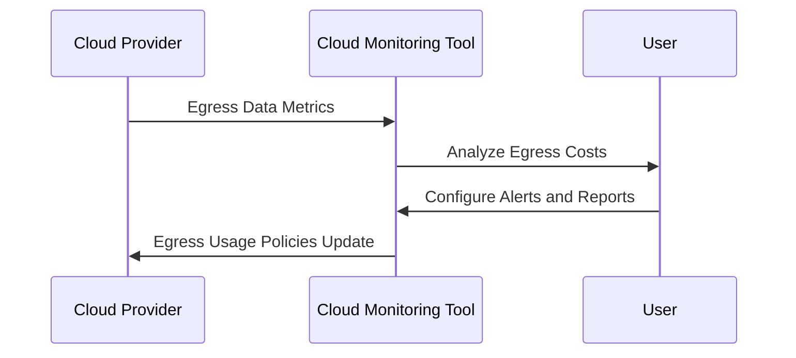

## Introduction

Monitoring egress costs is a vital aspect of cloud cost management. Egress costs are the charges incurred when data is transferred out from a cloud provider's network to the internet or another cloud service. Unlike ingress, where data moves into the cloud with minimal charges, egress can become a significant cost factor, especially for businesses with heavy data transfer needs.

## Problem Statement

Organizations often face unexpectedly high cloud bills because of unmonitored egress costs. Without proper tracking and management, these costs can spiral out of control, impacting budget planning and financial forecasts negatively. 

## Solution Overview

The Monitoring Egress Costs pattern provides structured approaches to track, report, and optimize egress-related expenditures. It emphasizes proactive monitoring, cost allocation, alert setups, and strategic data locality decisions to minimize unnecessary charges.

## Architectural Approach

1. **Data Monitoring and Reporting:**
   - Implement cloud-native tools or third-party solutions like AWS CloudWatch, Google Cloud's Monitoring, Azure Monitor, or Datadog to keep track of data egress patterns.
   - Utilize tagging and resource grouping for granular cost allocation and reporting.

2. **Alert Configuration:**
   - Set up alerts for abnormal egress usage using thresholds and rules.
   - Use anomaly detection to predict and warn about potential over-usage before it happens.

3. **Data Transfer Analysis:**
   - Analyze data transfer patterns using analytics tools to identify unnecessary data flows.
   - Regularly review network architectures and design documents to ensure efficient data routing.

4. **Cost Allocation Mechanism:**
   - Apply cost attribution to different departments or projects to identify and hold responsible entities within an organization accountable.

5. **Optimizing Data Locality:**
   - Use edge solutions and content delivery networks (CDNs) to reduce the volume of direct cloud exits.
   - Leverage regional cloud facility selections to decrease long-haul data transfer costs.

## Best Practices

- Regularly audit your cloud architecture and identify services with high data transfer rates.
- Educate teams on cost implications of architectural designs and encourage disciplined data policies.
- Consider implementing costs dashboards that visualize egress trends over time for better strategic planning.

## Example Code

Below is a hypothetical configuration snippet for setting up an alert rule in AWS CloudWatch to monitor high egress usage:

```shell
aws cloudwatch put-metric-alarm --alarm-name "High Egress Usage Alarm" \
--metric-name "NetworkOut" \
--namespace "AWS/EC2" \
--statistic "Sum" \
--period 300 \
--threshold 1000000 \
--comparison-operator "GreaterThanThreshold" \
--dimensions Name=InstanceId,Value=i-1234567890abcdef0 \
--evaluation-periods 1 \
--alarm-actions arn:aws:sns:us-west-2:123456789012:my-sns-topic \
--unit "Bytes"
```

## Diagrams



## Related Patterns

- **Network Traffic Management:** Techniques for optimizing data traffic to manage loads better.
- **Cloud Cost Management and Utilizing Reserved Instances:** Strategies for predictively managing overall cloud costs.

## Additional Resources

- [AWS Cost Explorer Documentation](https://docs.aws.amazon.com/awsaccountbilling/latest/aboutv2/cost-explorer-what-is.html)
- [Google Cloud Billing Reports](https://cloud.google.com/billing/docs/reports)
- [Azure Egress Data Charges Guide](https://azure.microsoft.com/en-us/pricing/details/bandwidth/)

## Summary

Egress costs can be a hidden and expensive aspect of cloud usage. By adopting the Monitoring Egress Costs pattern, organizations can proactively manage and optimize data transfer expenses, align data movement strategies with financial goals, and prevent unexpected charges through vigilant monitoring and reporting.
