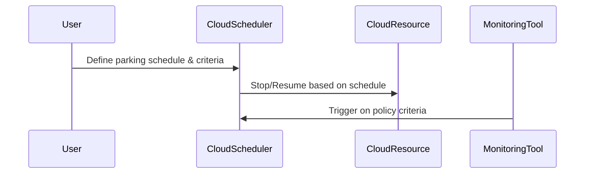

## Introduction

In the realm of cloud computing, managing and optimizing costs while maintaining resource efficiency is paramount. The **Auto-Parking Solutions** design pattern is a strategy that automates the process of stopping cloud resources when they are not in use. This pattern plays a vital role in minimizing unnecessary spending and ensuring that resources are available when needed without incurring additional costs during downtimes.

## Detailed Explanation

Auto-parking solutions are essentially built on the principles of automation and resource management in the cloud. This design pattern leverages cloud provider's capabilities like schedules, triggers, and policies to dynamically shut down services that are not required during non-peak hours. For instance, development or testing environments, which are only required during business hours, can be automatically paused outside these hours.

### Architectural Approach

1. **Scheduler and Triggers**: Utilizes scheduled jobs or cron-like services provided by cloud platforms to start and stop resources based on predetermined times.
   
2. **Event-Driven Triggers**: Uses event-driven functions, such as AWS Lambda or Google Cloud Functions, that stop resources based on specific triggers like CPU usage below a certain threshold.

3. **Policy-Based Management**: Implement policies to monitor and assess resource usage continuously, taking actions based on predefined criteria.

4. **Integration with Monitoring Tools**: Connects with cloud monitoring solutions to track usage patterns and automatically initiate the parking process.

### Example Code Snippet

Here is a hypothetical example using AWS SDK in Python to stop EC2 instances based on a schedule:

```python
import boto3
from datetime import datetime

def stop_instances():
    ec2 = boto3.client('ec2')

    # Specify the criteria for stopping instances
    criteria_time = datetime.now().hour

    # Retrieve all running instances
    instances = ec2.describe_instances(Filters=[{'Name': 'instance-state-name', 'Values': ['running']}])

    for reservation in instances['Reservations']:
        for instance in reservation['Instances']:
            # Assume stopping instances when it reaches out-of-office hours
            if criteria_time not in range(9, 17): 
                ec2.stop_instances(InstanceIds=[instance['InstanceId']])

if __name__ == "__main__":
    stop_instances()
```

### Diagrams



## Related Patterns

- **Dynamic Scaling**: Auto-Parking can be combined with dynamic scaling to further optimize resource allocation by scaling out when demand increases and parking when demand is low.
- **Resource Tagging**: Using tags on resources to identify those eligible for auto-parking.

## Additional Resources

- [AWS Instance Scheduler](https://aws.amazon.com/solutions/implementations/instance-scheduler/)
- [Google Cloud Scheduler](https://cloud.google.com/scheduler)
- [Azure Automation](https://azure.microsoft.com/en-us/services/automation/)

## Summary

The **Auto-Parking Solutions** pattern is indispensable for cloud cost optimization and resource management. By predefined scheduling and defining clear criteria for resource usage, businesses can significantly reduce costs while maintaining the necessary infrastructure readiness. As cloud environments grow more complex, implementing such automated patterns ensures efficient use of cloud resources, adhering to both budgetary and operational expectations.
