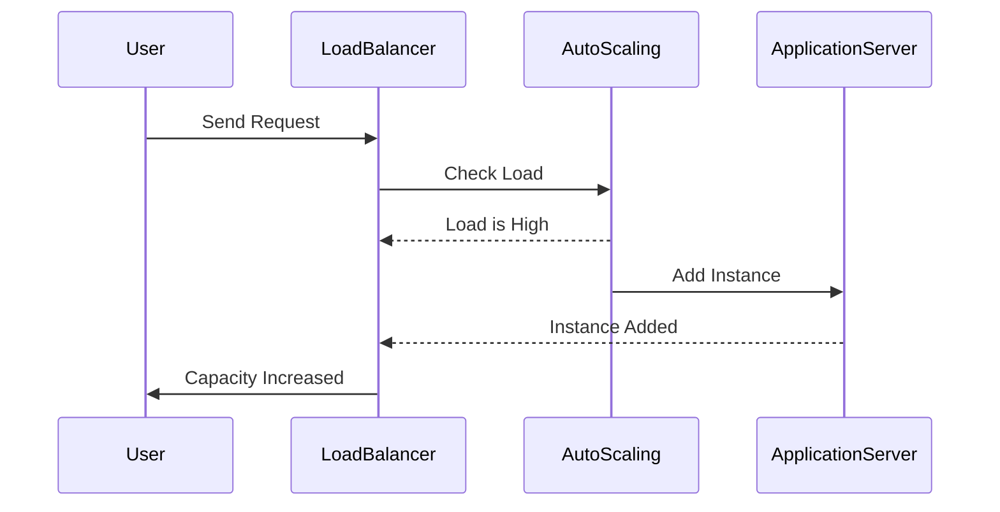

## Introduction

In today's cloud-centric world, organizations are increasingly focused on optimizing their resources to improve cost efficiency. Cost-Aware Application Design is an architectural approach that incorporates cost management into the software design process from the outset. By understanding cloud pricing models and using best practices for resource allocation, this approach enables organizations to reduce unnecessary expenditures while maintaining performance and scalability.

## Design Pattern Overview

Cost-Aware Application Design is about aligning application architecture with cost management strategies. This involves:

- Understanding the pricing models of cloud service providers.
- Designing for elasticity to adjust resources based on demand.
- Utilizing cost-efficient services and storage options.
- Monitoring resource usage and costs continuously.
- Implementing automated scaling and resource optimization.

## Architectural Approaches

### Understanding Cloud Pricing Models

Different cloud providers have various pricing models that include pay-as-you-go, reserved instances, and spot instances. Understanding these models and their implications on cost is crucial for making cost-aware decisions. 

### Designing for Elasticity

Incorporating elasticity ensures that applications can scale up during peak demand periods and scale down when demand decreases. This dynamic adjustment helps in controlling costs effectively.

### Utilizing Cost-Efficient Services

Select services that provide similar functionalities at lower costs. For example, using serverless computing like AWS Lambda or Azure Functions can reduce costs as you pay only for the compute time you consume.

### Monitoring and Optimization

Regularly monitor usage patterns and associated costs. Use tools provided by cloud providers (like AWS Cost Explorer, GCP's Cost Management, or Azure Cost Management) to track costs and optimize resource allocation accordingly.

### Automated Scaling and Resource Optimization

Implement automated scaling policies to ensure resources are provisioned as needed without manual intervention. Use machine learning algorithms to predict usage patterns and optimize resources effectively.

## Example Code

Consider a simple example using AWS Auto Scaling:

```yaml
Resources:
  WebServerGroup:
    Type: AWS::AutoScaling::AutoScalingGroup
    Properties: 
      MaxSize: 5
      MinSize: 1
      DesiredCapacity: 2
      LaunchConfigurationName: "LaunchConfig"
      VPCZoneIdentifier:
        - "subnet-abcde123"
    Tags:
      - Key: "Environment"
        Value: "Development"
        PropagateAtLaunch: "true"
```

The above code snippet defines an Auto Scaling group that adjusts its size between 1 and 5 instances, automatically scaling based on demand, and therefore optimizing costs.

## Diagrams

Below is a simplified sequence diagram illustrating dynamic resource scaling:



## Related Patterns

- **Elasticity Management**: Focuses on dynamically adjusting resources in response to varying loads.
- **Serverless Architecture**: Maximizes resource efficiency by using serverless computing.
- **Resource Tagging**: Involves tagging resources to maximize cost visibility and management.

## Additional Resources

- [AWS Cost Explorer](https://aws.amazon.com/aws-cost-management/aws-cost-explorer/)
- [Google Cloud Cost Management](https://cloud.google.com/cost-management)
- [Azure Cost Management](https://azure.microsoft.com/en-us/services/cost-management/)

## Summary

Cost-Aware Application Design is essential for organizations aiming to optimize their cloud spending. By integrating cost management strategies into the application design process, organizations can ensure efficient resource utilization, improve budget management, and maintain application performance. This approach not only saves costs but also enhances the ability to scale elastically and efficiently in the cloud environment. By continuously monitoring and adapting to changing conditions, you maintain alignment with financial and operational goals.
